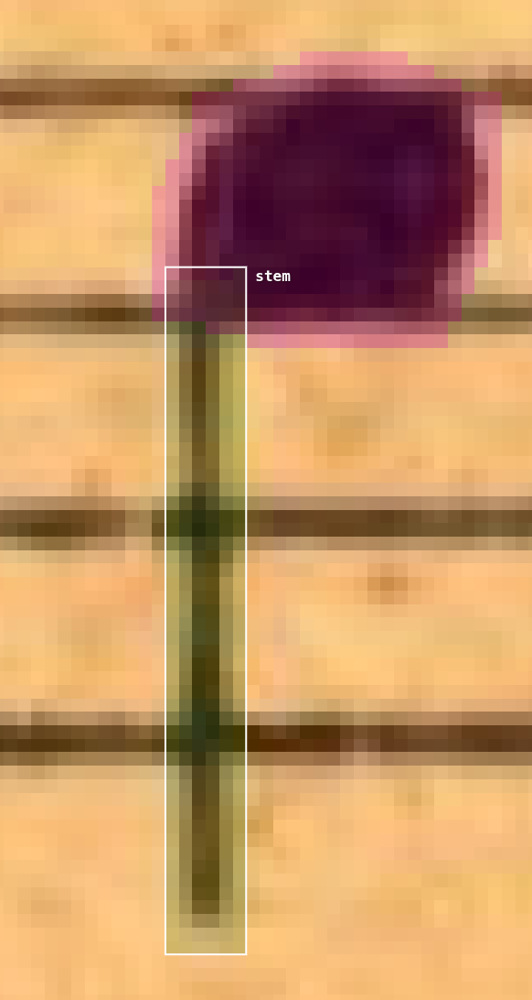

# MuNG Annotation Instructions

This document is a guide for annotators on how to annotate a new document in the MuNG format properly.

> **📖 New here?** Read the [Introduction](annotation-introduction.md) text first.

If you are starting out as a fresh annotator, then you should first read the introduction text above which describes the MuNG format in its context. This document is a reference to be used when doing routine annotation work - a companion to have on the side when annotating to remind you of how to annotate all the edge-case situations. For this reason this document tends to be rather short with words, full of images, to aid its navigation.

The recommended way to use this document is to go through the class list in order and annotate object on the page class-by-class. The classes here are ordered roughly by their frequency in documents.

It is also advised to first annotate masks for all object, and only then go through the document again and annotate the syntax and precedece links.

> **🚧 Construction work:** These instructions constantly expand. If you find yourself needing to use a section denoted with this emoji (🚧), you should wait for the construction work to be finished before using it. Same applies to situations where the notation situation you are annotating is not covered here at all. In both cases, notify the administrators, ideally by creating a question in [github discussions](https://github.com/orgs/OmniOMR/discussions) and tagging `@Jirka-Mayer`.

> **💔 Errata:** If you find a mistake in a document you are not annotating (e.g. while taking inspiration from others) and that document is supposed to be "completed" by now (i.e. is not currently being annotated by anyone), then please, report the mistake to the [Dataset Errata Repository](https://github.com/OmniOMR/dataset-errata).

## Tips

- When creating a polygon, you can go **one point back** by **right-clicking**.
- If you **finished a mask too early** but need to add more, simply **select the object** you want to modify and press `N`.
Alternatively, select the object and click the “Edit nodes” icon (⬟) in the bottom panel.

> **Note:**
> Some additional symbols that appear in the search list (in MuNG Studio) exist **only for compatibility with other datasets** - they are **not intended for annotators**.
>
> If you encounter a symbol that is **not listed in this guide**, **do not annotate it using an improvised or similar class name**.
> Instead, **ask for clarification** before proceeding.

## Classes

This is the main body of this document. Go though the classes top-to-bottom and annotate them all on the page.

### noteheadWhole

- It does not have an attached stem.
- Fill the entire notehead but **leave out the center**.

  
Why differentiate whole/half noteheads if they look identical?

  
  We differentiate `noteheadWhole` from `noteheadHalf` (below) because of downstream processing against the SMuFL standard, which does treat them as distinct symbols. While previous versions of MuNG had just a `noteheadEmpty` class, it introduces an extra step when trying to e.g. load the data for rendering with a SMuFL-compliant font, which may seem trivial (just check for a stem!), but what if there is an error in the annotation? In the end it is just better to make the MuNG data itself as close to SMuFL as possible, to make the whole dataset easier to maintain and clean. (The same logic will apply in other places in the instructions, hence why we write so much about it here.)

---

### noteheadHalf

- Always **leave out the center**. Don’t just outline the shape.

  
  

---

### noteheadBlack

*(Previously in CVAT: `notehead_full`. You may find `noteheadFull` in MuNG, but **do NOT use it.**)*

  
  

---

### augmentationDot

*(Previously in CVAT: `duration_dot`)*

  

---

### stem
- The stem mask may **pass through the notehead and extend above it**. If it looks more like an irregular notehead (and not a visible overlap), you can **end the mask just below the head**.

  

**TODO:** Zvalidovat: Jan Hajič, [6.řádek, 3.takt](https://ufallab.ms.mff.cuni.cz/~mayer/mung-studio/#/simple-backend/81c9f683-28d1-4e73-8e25-e37333408f5a_4a7de812-b895-4c1b-b785-d4c82f4e243a) - značit jako jednu nožičku? JH: ANO!

nožičky dobře disambiguují hlasy - prostě akord = společná nožička

  

---

### flag(number)th(Up/Down)

Flags are divided into separate classes according to their type and direction:

- **flag8thUp** / **flag8thDown**

  

- **flag16thUp** / **flag16thDown**  
  ⚠️ *Be careful:* If a single note has **two flags**, the outer is **8th** and the inner is **16th** (and the same for three flags - 8th, 16th, 32nd... and so on).
- **flag32ndUp** / **flag32ndDown**
- *(and so on for higher flag counts)*

⚠️ flag8thUp, flag16thUp

  
  

---

### beam
- Use the same rule as for `stem and notehead`: if the stem clearly continues past the beam, **draw it through**; if not, **end it below**. Overlaps between symbols are fine.

  

---

### legerLine

*(Not “ledger”, both variants are correct ([Wikipedia](https://en.wikipedia.org/wiki/Ledger_line)), but we use leger to stay compliant with SMuFL specification.)*

  

---

### Grace note (composite)
A grace note is composed of:
- **noteheadWholeSmall / noteheadHalfSmall / noteheadBlackSmall**

  

- Uses a standard **stem, flag(number)th(Up/Down), beam**

  

- The "slash" through the grace note is `graceNoteSlashStemUp` or `graceNoteSlashStemDown` based on the stem orientation (not the slash orientation).

  
Relevant discussions.

  - https://github.com/orgs/OmniOMR/discussions/61#discussioncomment-9843887

---

### tremolo1
- Following SMuFL notation: `tremolo1`
- Multiple tremolo strokes are labeled from **outer to inner** as `tremolo1`, `tremolo2`, `tremolo3`, etc.  (Similar to the `flag` hierarchy.)

---

### slur

- Annotate even when the slur appears at the **end of a page** and it’s unclear whether it’s a slur or a tie (see [discussion](https://github.com/orgs/OmniOMR/discussions/108#discussioncomment-13986659)).
- All annotated pages are available in the **Digital Library**, where you can browse the full document. If you want to check it yourself (for clefs or slurs), the links follow this format:

    `https://www.digitalniknihovna.cz/mzk/view/uuid:<document_id>?page=uuid:<page_id>`

  

---

### tie

  

---

### accidentalSharp
*(`sharp` in CVAT)*  
- Always **leave out the center!** Don’t just outline the shape.

  

---

### accidentalFlat
- Always **leave out the center!** Don’t just outline the shape.

  

---

### accidentalNatural

- Always **leave out the center!** Don’t just outline the shape.

  

---

### fermataAbove / fermataBelow

  
  

---

### fClef

  

---

### fClefChange
- Used when the **clef changes in the middle of the staff** to an F clef.
- These symbols are typically **smaller in size** than standard clefs.
- Make sure to annotate them as **this object**, distinct from the regular clef symbols at the beginning of the staff.

---

### gClef
- Always **leave out the center!** Don’t just outline the shape.

  
  

---

### gClefChange
- Used when the **clef changes in the middle of the staff** to a G clef.
- These symbols are typically **smaller in size** than standard clefs.
- Make sure to annotate them as **this object**, distinct from the regular clef symbols at the beginning of the staff.

---

### cClef

  

---

### cClefChange
- Used when the **clef changes in the middle of the staff** to a C clef.
- These symbols are typically **smaller in size** than standard clefs.
- Make sure to annotate them as **this object**, distinct from the regular clef symbols at the beginning of the staff.

---

### timeSig[Number 0-9]
- Represents individual **digits** in the time signature (0–9).  
- If the number is **greater than 9**, annotate each digit separately. (For example, a time signature of `10` should be split into **`timeSig1`** and **`timeSig0`**.)
- **TODO:** vyřešit graf

  

---

### timeSigFractionalSlash
- Represents the **horizontal line or slash** separating the upper and lower numbers of a time signature.

---

### timeSigFractionalEquals
- Represents the **equals sign (“=”)** used in **fractional or complex time signatures**.

---

### timeSignature
- A **container class** for grouping all elements that form a complete time signature.
- Use it to wrap **either a single object or multiple separate digits** (e.g., 3/4=6/10 as a compact symbol).
- If the time signature appears **at the end of a staff line**, still annotate it as a full `timeSignature` object:

  

---

### restWhole

  

---

### restHalf

---

### restQuarter

  

---

### rest8th

  

---

### rest16th

  

---

### artic(Something)
- previously in CVAT `articulation_mark` for every articulation mark, now separated into classes.

### articAccentAbove / articAccentBelow
- Represents an **accent mark** placed **above or below** the notehead.

### articStaccatoAbove / articStaccatoBelow
- Represents **staccato dots** placed above or below the notehead.
- **Do not use** the old class name `articulationStaccato`.

### articTenutoAbove / articTenutoBelow
### articMarcatoAbove
### articMarcatoBelow

---

### arpeggiato 
*(Previously grouped under `ornament` in CVAT.)*  
- Used for **vertical wavy lines** indicating that a chord should be **arpeggiated**.  
- Note: use the class name **`arpeggiato`**, **not** `arpeggio`.

---

### ornamentTrill
*(Previously grouped under `ornament` in CVAT.)*  
- Used for the **“tr” text** symbol marking a **short trill**.
- Do not use a simple convex hull. The annotation **must follow the exact shape** of the symbol. **TODO:** je toto pravda?

  

---

### wiggleTrill
- Represents the **wavy line** that typically **follows a trill mark**,  
indicating the continuation of the trill.

---

**TODO:** U textů bude potřeba vyřešit jestli texty přepisovat (podobně jako umožňoval CVAT - pozor na nečitelné texty).

### lyricsText
- Annotate **syllable by syllable or separate words**, so that each lyric segment can be correctly aligned with the notation graph.
- It is sufficient to use a **convex hull (rough mask)** for lyrics — precise outlining is not required.

  

### dynamicsText
- Represents a **textual region** covering one or more **dynamic marks**.
- The **specific dynamic symbol** (e.g., `p`, `f`, `ff`) should be annotated **precisely** using its respective `dynamicXXX` class.  
- The surrounding **text region** should then be annotated as `dynamicsText`, using a **convex hull** that encloses all relevant symbols.

**Examples:**
- For a single “p” (piano), mark:
  - `dynamicPiano` — exact symbol outline  
  - `dynamicsText` — convex hull enclosing it
- For “ff” (fortissimo), mark:
  - Two symbols: `dynamicForte` + `dynamicForte`
  - One `dynamicsText` area enclosing both

### `dynamic<Symbol>` (precise masks)
The following classes must be annotated **accurately (not convex)**:
- `dynamicForte`
- `dynamicMezzo`
- `dynamicNiente`
- `dynamicPiano`
- `dynamicRinforzando`
- `dynamicSforzando`
- `dynamicZ`

Also remember to add a `dynamicsText` convex hull over these symbols.

> Combined markings such as `po` or `p:` should be annotated as a **single** `dynamicPiano` object.

### tempoText
- **TODO:** Define rules for tempo markings (e.g. “Pochodem”, “Allegro”, etc.)

### metadataText

> **🚧 Under construction.**

- nadpisy, autoři (věci co souvisí s dílem, ne dokumentem (song, not doc)), jméno všech lidí (editor, etc.) (cokoliv co je zajímavé pro knihovníka)

### otherText

> **🚧 Under construction.**

Used for **non-musical text elements** such as:
- Page numbers  
- Verse numbers
- Measure number
- Rehersal marks
- text jiných slok co není pod notami (např. v kancionálu), NE když je to aligned pod notami

stakeholder = OCR systém, sebere všechno ostatní co je "čtitelné" co není už jiný text

---

### systemDivider
*(Called `system_break` in CVAT)* 

---

### brace

- Represents the **curly bracket `{`** used to connect multiple staves belonging to a single instrument (e.g., piano).
- Corresponds to `staff_bracket` in CVAT.
- Differentiate between `brace` and `bracket` based on **appearance**, not function. In older music documents, their function is often interchanged.
- Usually connects **two staves**, but can occasionally span **three** (e.g., in organ notation).

  

---

### bracket

- Represents the **square bracket `[`** used to group staves (e.g., for instrument families in orchestral scores).  
- Differentiate between `brace` and `bracket` based on **appearance**, not function. In older music documents, their function is often interchanged.
- ⚠️ **Important:** a second vertical line often appears near the bracket, but that line **is not part of the bracket**. It should be annotated separately as `barlineSingle`.

  

---

### barlineSingle
*(Called `thin_barline` in CVAT)*  
- Represents a **single thin barline**.  
- Annotate **precisely around the entire shape**.

  

---

### barlineHeavy
*(Called `barline_thick` in CVAT)*
- Represents a **thick barline**, usually used at section endings.

  

---

### staffLine
*(Called `Staff line` in CVAT)*  
- Represents a **single staff line**.
- Annotate **precisely around the entire shape**.

  

  
Why not use staff1Line class of SMuFL?

  The `staff1Line` class from SMuFL is intended for text-rendering. It is not used to actually render stafflines and thus means something slightly different semantically. Staff lines are more similar to beams, slurs, and ties, which cannot be rendered via a font, so aren't present in SMuFL. Therefore we decided to also introduce the class `staffLine` for this non-font-renderable symbol, just like we did with `beam`, `slur`, and `tie`.

---

### staff
- Groups together the **five staff lines** that form a complete staff.  
- The bounding box should **fit tightly** around the lines.  
- Ensure the box aligns **exactly with the corners** of the staff.

  

---

### staffGrouping
- An **abstract grouping class** for combining related staves or systems.

**Note:**  
If a system contains **multiple brackets, braces, and a barline**, annotate them as follows:
- Each **barline** → `barlineSingle` 
- Each **brace or bracket** → annotated individually as `brace` or `bracket`
- Then create:
  - **One long `staffGrouping`** spanning the entire barline, brace or bracket (covering all connected staves)  
  - **Several shorter `staffGrouping` boxes**, each covering one brace or bracket

- `staffGrouping` is usually annotated as a **rectangle or polygon** — not tightly around the line or brace. This means the **areas of multiple `staffGrouping` may overlap**, which is perfectly fine.

In the example below, a **long `staffGrouping`** connects all staves via the main bracket,  
while a **shorter `staffGrouping`** encloses the brace on the left side.

  

- Previous [CVAT staffGrouping rules](https://github.com/orgs/OmniOMR/discussions/91#discussion-7177410)

---

### measureSeparator
- The `staffGrouping` symbols define which staves belong to the same **system** (or **subsystem**) - for example, multi-staff instruments like piano, or sectional groupings in orchestral scores.
- ⚠️ At the **beginning of a system**, a `measureSeparator` should **not** be annotated, to avoid duplicating the final barline of the previous system.

There should always be **exactly one continuous `measureSeparator` per system**,  
regardless of how it appears visually:
- It may be drawn as several **short individual barlines**,  
- as one **long barline**,  
- or a **combination** of both.

The example below shows **four** `measureSeparator` **regions** (blue rectangles) spanning all staves, and **two** `staffGrouping` **boxes** at the start of the system.

  

Similar case below (annotated in MuNG): The **fourth** `measureSeparator` should encompass **all four barlineHeavy** symbols that make up the double barlines.

  

Previous [CVAT measureSeparator rules](https://github.com/orgs/OmniOMR/discussions/24)

---

### keySignature
- A **container (parent) symbol** representing the entire key signature.
- Annotate it as a **convex hull (rough mask)** covering all the individual accidentals.

  

---

### Repeat structure

> **🚧 Under construction.**

TODO: smufl rozlišuje kontejner classes: repeatLeft repeatRight, my to taky zavedeme

A **repetition mark** is composed of several elements:

#### repeatDot
- The **two dots** next to the barline indicating the repeat.  
  Each dot should be annotated individually as a separate `repeatDot`.

#### bracket / barlineSingle / barlineHeavy
- The **barline or bracket components** that form the vertical part of the repeat symbol.

#### repeat

- The **container mask** that encloses the entire repeat sign (as a convex hull).
- Back-to-back repeats share the two barlines, but are two distinct repeat (containers).

### TODO: když se vyskytne
podivná repetice. Jak značit šikmé dvojčárky? - když se znovu vyskytne, volat výš, tohle je potřeba dořešit

  

ODPOVĚĎ: ocasy nahoře/dole jsou barline, vlnovky jsou repeat dot, jinak barline

---

### splitBarDivider
- napojení taktu (ta vlnovka na konci)

  

---

### repeat1Bar
- in CVAT `repeat_measure_sign`
- `%`

TODO: nad tímhle může být text (stejně jako nad multi-measure rets / whole rest), ten se linkuje v precedenčním grafu (na to je nějaká diskuze někde)

TODO: někdy se používá pro repeat půl-taktu, to je v pohodě, je to pořád tento symbol

TODO: projít partitury a vychytat divnosti, je tam taky "repeat one beat", což je jen ten slash bez teček a někdy to opakuje půl-takt

---

### unclassified
*(Called `ufo` in CVAT)*

> **🚧 Under construction.**

**TODO:** Vyřešit jestli je tahle třída opravdu potřeba.

Use this class for **non-musical marks or noise** that appear on the page **only if they interfere with reading the notation**.

- Examples include: stray hairs, spilled coffee, squashed insects, or other artifacts that overlap staves or notes.  
- Do **NOT** annotate: book spines, notation on neighboring pages, symbols from previous pages, or anything you are unsure about — ask before labeling.

- Marks that appear faintly in the background (like “ghost”  bleed-through) should NOT be annotated, only if they don't look like “ghosts”. 

  
  

### figuredBassText

> **🚧 Under construction.**

- konvexní obal skupinky (NE, chceme to mít pořešené líp - SMUFL na to má třídy)
- JE to v precedenčním grafu, protože ty symboly mají trvání (e.g. víc symbolů nad jednou celou notou)
  - precedence JENOM mezi věcma co jsou u jedné noty
- prohledat diskuze, pořešit s Adamem

### TODO: figured_bass_spanner

> **🚧 Under construction.**

- zatím pro to není třída (ani SMuFL pro to nemá nic)

### TODO: “=”

> **🚧 Under construction.**

- TODO: není pro to maska - je to asi podobně rozšířené jako repeat_measure_sign (%)
- dvě čáry - Píšou se, když má nástroj hrát unisono s jiným partem
- "col viol" https://github.com/orgs/OmniOMR/discussions/124 stejná věc (stejné precedenční hrany)

nějakej "unisonoMark"

nebo "col instruction" - text nebo něco

dvě čárky = "dtto", stejně jako to předtím

"interpretační pokyny = čti noty jinde"
