# MuNG Annotation Instructions

This document is a guide for annotators on how to annotate a new document in the MuNG format properly.

> **📖 New here?** Read the [Introduction](annotation-introduction.md) text first.

If you are starting out as a fresh annotator, then you should first read the introduction text above which describes the MuNG format in its context. This document is a reference to be used when doing routine annotation work - a companion to have on the side when annotating to remind you of how to annotate all the edge-case situations. For this reason this document tends to be rather short with words, full of images, to aid its navigation.

The recommended way to use this document is to go through the class list in order and annotate object on the page class-by-class. The classes here are ordered roughly by their [frequency](class-frequencies.md) in documents.

It is also advised to first annotate masks for all object, and only then go through the document again and annotate the syntax and precedece links.

> **🚧 Construction work:** These instructions constantly expand. If you find yourself needing to use a section denoted with this emoji (🚧), you should wait for the construction work to be finished before using it. Same applies to situations where the notation situation you are annotating is not covered here at all. In both cases, notify the administrators, ideally by creating a question in [github discussions](https://github.com/orgs/OmniOMR/discussions) and tagging `@Jirka-Mayer`.

> **💔 Errata:** If you find a mistake in a document you are not annotating (e.g. while taking inspiration from others) and that document is supposed to be "completed" by now (i.e. is not currently being annotated by anyone), then please, report the mistake to the [Dataset Errata Repository](https://github.com/OmniOMR/dataset-errata).

> **📚 Library:** If you want to open the book from which you are annotating a page, simply look at the document name, it consists of `{book-uuid}_{page-uuid}`. When you tak the `{page-uuid}` portion and put it into this URL, the corresponding page will open in the Moravian Library: `https://digitalniknihovna.cz/mzk/uuid/uuid:05cb3fea-9d71-483a-b5c0-99b6e07510d0`

## Tips

- When creating a polygon, you can go **one point back** by **right-clicking**.
- If you **finished a mask too early** but need to add more, simply **select the object** you want to modify and press `N`.
Alternatively, select the object and click the “Edit nodes” icon (⬟) in the bottom panel.

> **Note:**
> Some additional symbols that appear in the search list (in MuNG Studio) exist **only for compatibility with other datasets** - they are **not intended for annotators**.
>
> If you encounter a symbol that is **not listed in this guide**, **do not annotate it using an improvised or similar class name**.
> Instead, **ask for clarification** before proceeding.

---

**⬇️ Here begins the ontology ⬇️**

---

## Noteheads

- There are many <kbd>🔴 syntax</kbd> links going from noteheads to other symbols. Because there are so many, they are mentioned at those other smybols (e.g. `stem`, accidentals, flags), instead of here.
- Noteheads participate in the <kbd>🟢 precedence</kbd> graph. See the [Precedence graph](#precedence-graph) section for more.

### `noteheadWhole`

- It does not have an attached stem.
- Fill the entire notehead but **leave out the center**.

  
🤔 Why differentiate whole/half noteheads if they look identical?

  
  We differentiate `noteheadWhole` from `noteheadHalf` (below) because of downstream processing against the SMuFL standard, which does treat them as distinct symbols. While previous versions of MuNG had just a `noteheadEmpty` class, it introduces an extra step when trying to e.g. load the data for rendering with a SMuFL-compliant font, which may seem trivial (just check for a stem!), but what if there is an error in the annotation? In the end it is just better to make the MuNG data itself as close to SMuFL as possible, to make the whole dataset easier to maintain and clean. (The same logic will apply in other places in the instructions, hence why we write so much about it here.)

---

### `noteheadHalf`

- Always **leave out the center**. Don’t just outline the shape.

  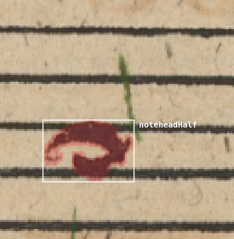
  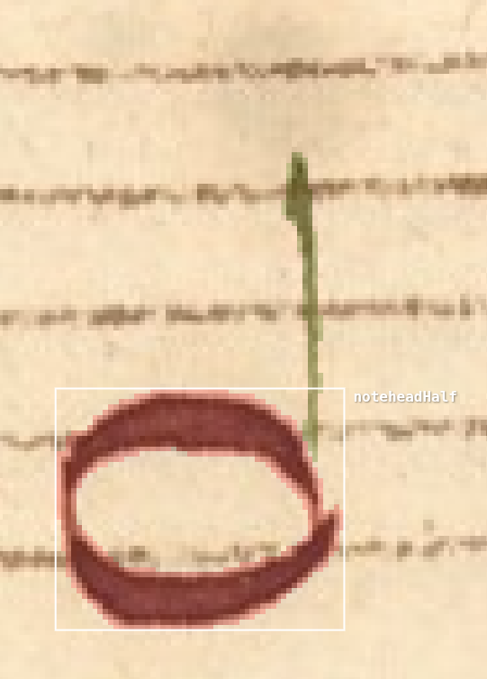

---

### `noteheadBlack`

*(Previously in CVAT: `notehead_full`. You may find `noteheadFull` in MuNG, but **do NOT use it.**)*

  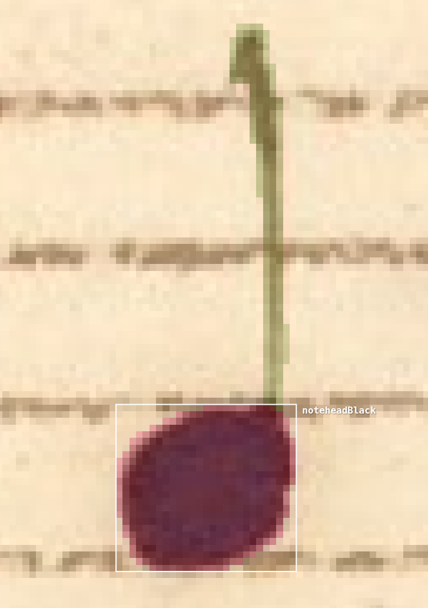
  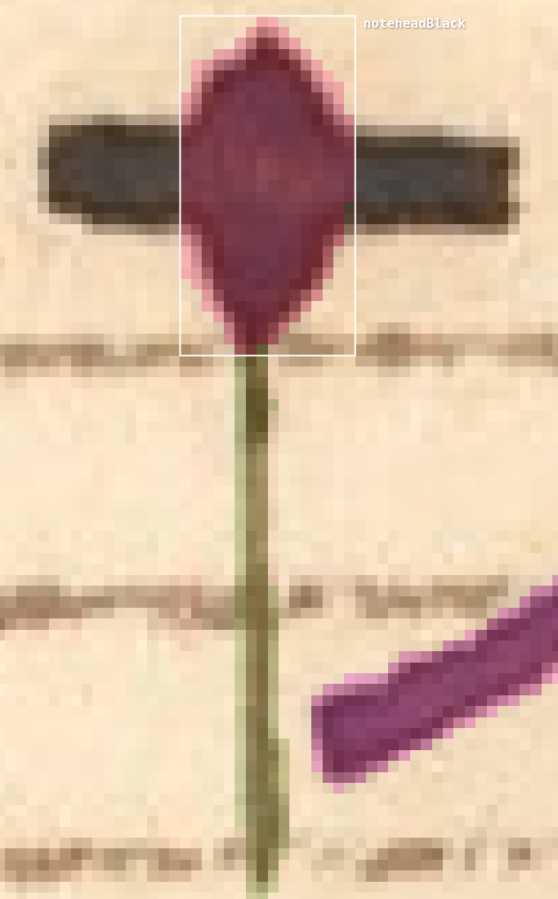

---

## `augmentationDot`

*(Previously in CVAT: `duration_dot`)*

Augmentation dot makes a note (or rest) longer by 50% (+ ½) of its natural duration. If there are two dots, it is by 75% (+ ½ + ¼) longer. More dots add an eighth, sixteenth, etc. to the duration.

- <kbd>🔴 syntax</kbd> link must lead from the notehead to the augmentation dot.
- Multiple noteheads in a chord have multiple augmentation dots, each its own with its own <kbd>🔴 syntax</kbd> link.
- Note can have multiple augmentation dots, in which case both are linked to the notehead with a <kbd>🔴 syntax</kbd> link.
- **Rests** can also have augmentation dots and behave exactly like noteheads.

  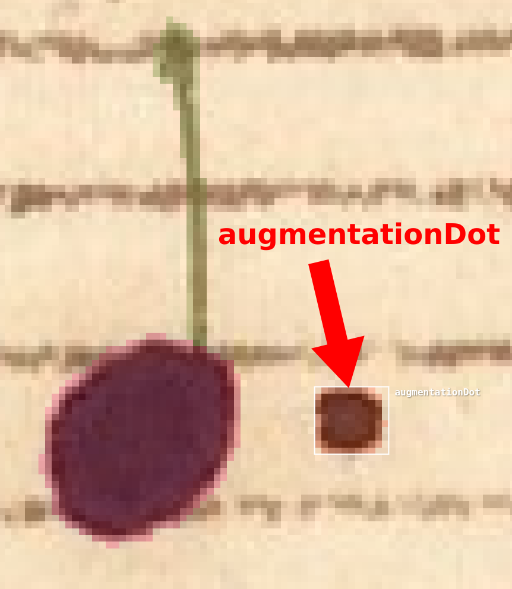
  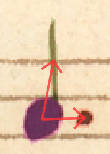
  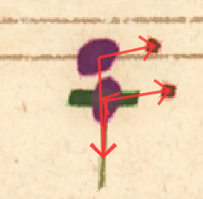
  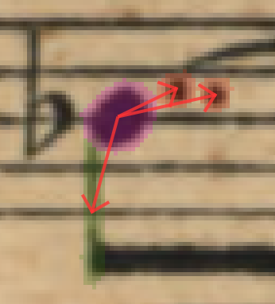

  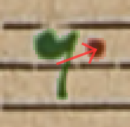

> **⚠️ Warning:** Not to be confused with a staccato dot, which looks similar, but is placed above/below the notehead and is usually slightly smaller.

TODO: what about chords with differing number of dots and noteheads?

  
🔗 Example documents

  - Simple dots & simple chords
    - https://ufallab.ms.mff.cuni.cz/~mayer/mung-studio/#/simple-backend/81c9f683-28d1-4e73-8e25-e37333408f5a_ac45624e-0846-4c6d-a079-a1f1877e1aea
  - Rest augmentation dots
    - First beat: https://ufallab.ms.mff.cuni.cz/~mayer/mung-studio/#/simple-backend/d9fede70-b9f0-11ea-b68c-005056827e52_2f8490c5-7e84-426e-8628-2bc938f47260
  - Multiple augmentation dots per note
    - First system, first measure: https://ufallab.ms.mff.cuni.cz/~mayer/mung-studio/#/simple-backend/30d6c780-c8fe-11e7-9c14-005056827e51_36058ae0-f593-11e7-b30f-5ef3fc9ae867

---

## `stem`

*(`stem` is not part of SMuFL, because music notation tools cannot render stems via a music notation font - and SMuFL is a font-layout (FL) standard)*

  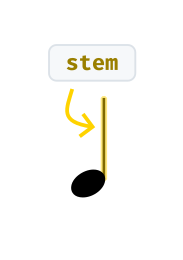
  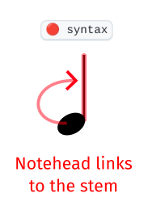

- Stem is the line attached to all notes shorter than the whole note.
- Stem can be pointing up or down, but it has no effect on the annotation (no difference in class name, no difference in the graph).
- <kbd>🔴 syntax</kbd> link must lead from the notehead to the stem.

  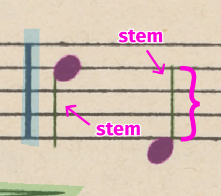
  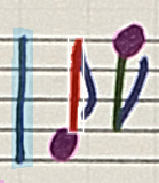
  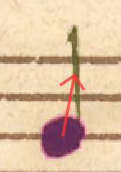

  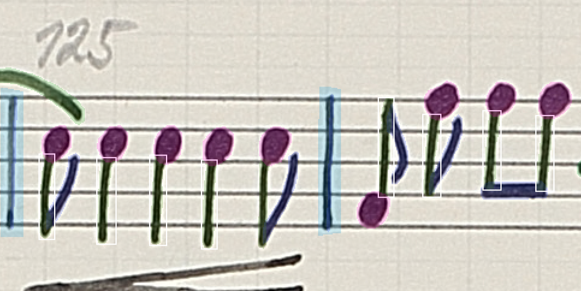
  

- Stem can have multiple noteheads attached, forming a **chord**.
- All noteheads in the chord have a <kbd>🔴 syntax</kbd> link from the notehead to the stem.

  
🤔 What is a chord?

  Musically speaking, chord is a group of notes played at the same time to form harmony. But that's too vague for us. Also, we annotate **music notation**, not the sound. So for us, *chord* is a group of *noteheads* that share a *stem*.

  This definition is still not complete and does not cover some edge-cases. For example, a chord composed entirely of whole notes does not have a stem, but is still considered a chord (as opposed to 4 or 6 separate voices).

  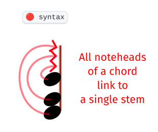
  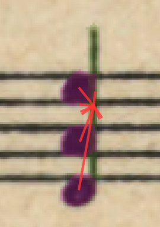
  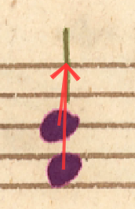
  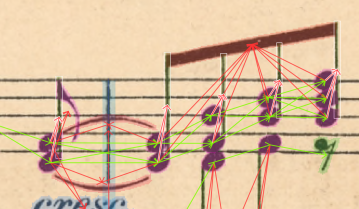

- When the notes are **one chord**, the **stem is one object** to indicate that it is in fact one chord. Even when it's drawn with mulitple strokes:

  
🤔 Isn't it weird that one stem consists of multiple separate lines?

  Yes, but it's the lesser evil and the problems this poses for object detectors and the synthesizer can be resolved:

  1. Splitting the stem into many parts poses way more problems for the MuNG to MusicXML converter. We get explosion of voices, incorrect chord semantics etc...
  2. These weird cases can be filtered out via connected-component analysis and omited from the synthesizer and object detector training if needed.
  3. Split-stem chords below are even more weird, but still form a single object.
  4. F-clefs are also disjoint, yet form a singular symbol.
  5. Some stylistic variants of the `accidentalNatural` are also disjoint.

  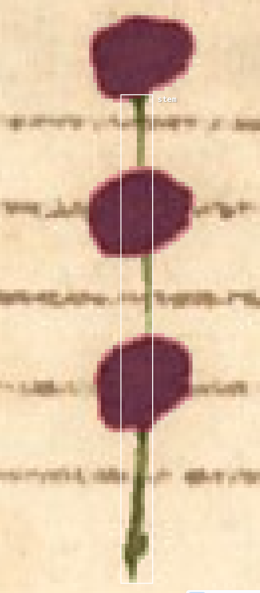
  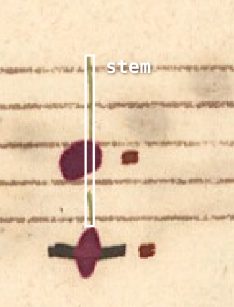
  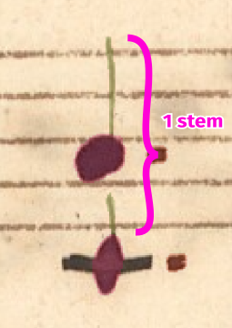

- The stem mask may **pass through another object and extend above it** (beam, notehead, etc.). In this case, annotate the stem through the crossed object:

  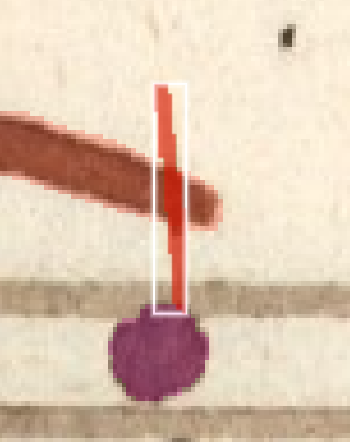
  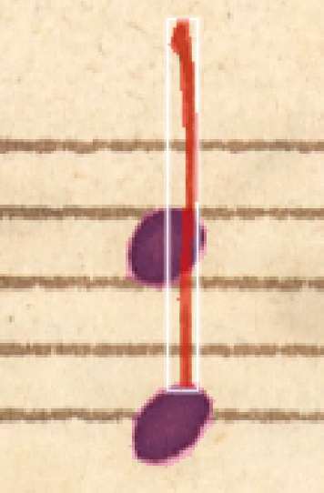

- A single notehead can have **two stems**. This is a situation, when two voices play the same note at the same time. The notehead should have two <kbd>🔴 syntax</kbd> links, one to each stem.
- If the stem is drawn as a single stroke, is still **must be split into two**, otherwise the presence of the second voice is lost (it is neccessary for proper interpretation of the graph).

  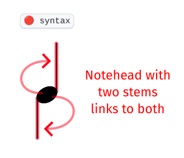
  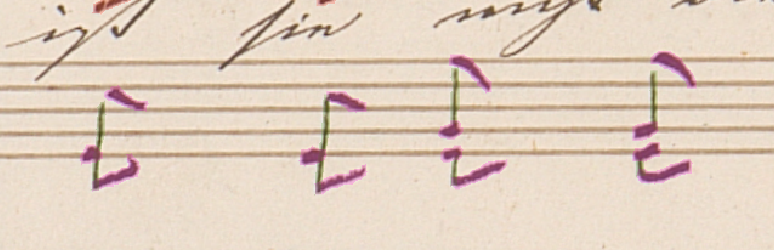
  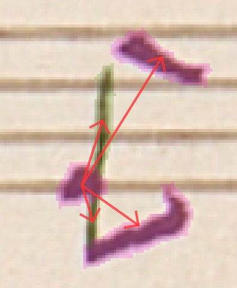

  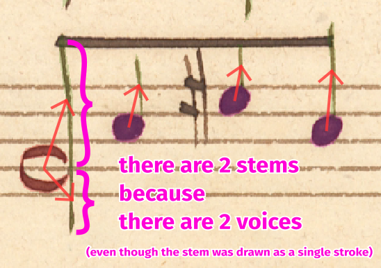

- Stems often disambiguate between a chord with two notes and two separate voices:

  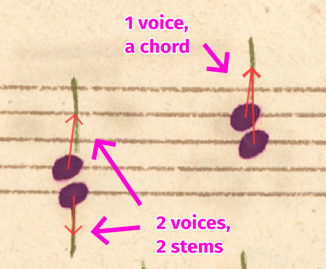

- In split-stem chords, the split stem is still just a single stem (just like in disjoint stems in chords above):

  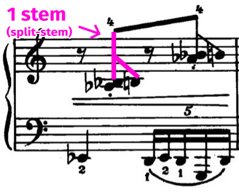

- Sometimes, the writer is very sloppy with writing chords. The image could be understood as either two voices or one chord. Here, consider the rest of the document and what the author meant in the situation:

  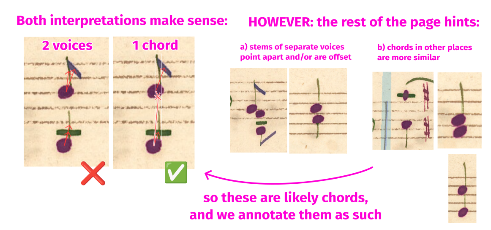

  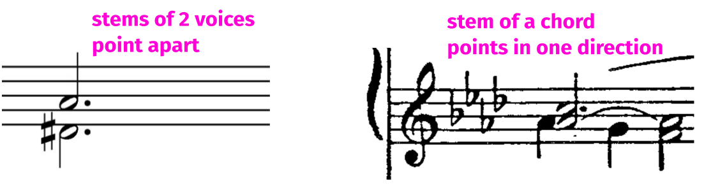

- ⚠️ The rule with stem directions (above) is a good guideline, but breaks down in situations where you have 3 or more voices. There, use your best judgement. Imagine how you would transcribe the piece to MuseScore and define voices/chords in that way.

- Sometimes it is hard to tell, to which voice (which stem) a notehead belongs. Below are few examples of 3 noteheads and 2 voices. Use hints, such as duration, stems, or ties. When there are no further hints (e.g. the first image), look at the voices around the noteheads and decide to which voice the center notehead likely belongs.

  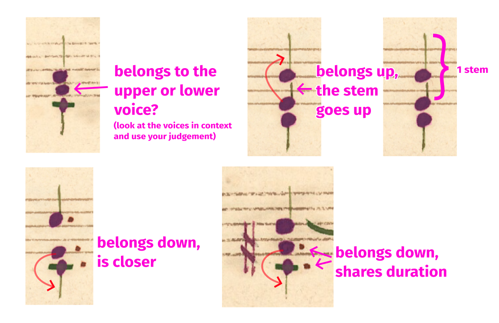

  
🔗 Example documents

  - Simple stems
    - Typeset: https://ufallab.ms.mff.cuni.cz/~mayer/mung-studio/#/simple-backend/82ab6fe0-ea75-11ed-9f31-5ef3fc9bb22f_689af144-8232-4e60-af78-eb04fa023656
    - Sharpie: https://ufallab.ms.mff.cuni.cz/~mayer/mung-studio/#/simple-backend/ca625f33-b4e1-49a9-bbc4-63130ba0fe70_010e98cc-eab8-47d9-8424-1cfc8d3c1c1a
  - Chords
    - Last system, first staff: https://ufallab.ms.mff.cuni.cz/~mayer/mung-studio/#/simple-backend/30d6c780-c8fe-11e7-9c14-005056827e51_375c6850-f593-11e7-b30f-5ef3fc9ae867
    - Piano bass: https://ufallab.ms.mff.cuni.cz/~mayer/mung-studio/#/simple-backend/81c9f683-28d1-4e73-8e25-e37333408f5a_5b6164cc-5653-494b-b43f-946fbb64d440
    - System 3, last measure: https://ufallab.ms.mff.cuni.cz/~mayer/mung-studio/#/simple-backend/bf061840-2322-11eb-979b-005056827e52_61b8fc9e-39f2-4783-876f-9d15fa63ddc2
  - Two voices with one notehead
    - Alto part (12th staff): https://ufallab.ms.mff.cuni.cz/~mayer/mung-studio/#/simple-backend/bf5ef9ce-00ba-4c9f-bbb3-57e542354222_f749c3aa-d105-4da2-a7af-64dc80b30a83
    - Last system, piano bass: https://ufallab.ms.mff.cuni.cz/~mayer/mung-studio/#/simple-backend/81c9f683-28d1-4e73-8e25-e37333408f5a_ac45624e-0846-4c6d-a079-a1f1877e1aea
  - Voices and chords intermingling complicatedly
    - Second system, first measure, piano: https://ufallab.ms.mff.cuni.cz/~mayer/mung-studio/#/simple-backend/81c9f683-28d1-4e73-8e25-e37333408f5a_d3de8b4f-5d39-4445-9a37-23ee474a4ff5

---

## Flags

`flag(number)th(Up/Down)`

  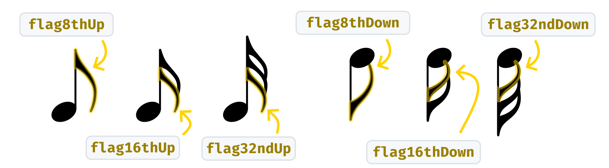

  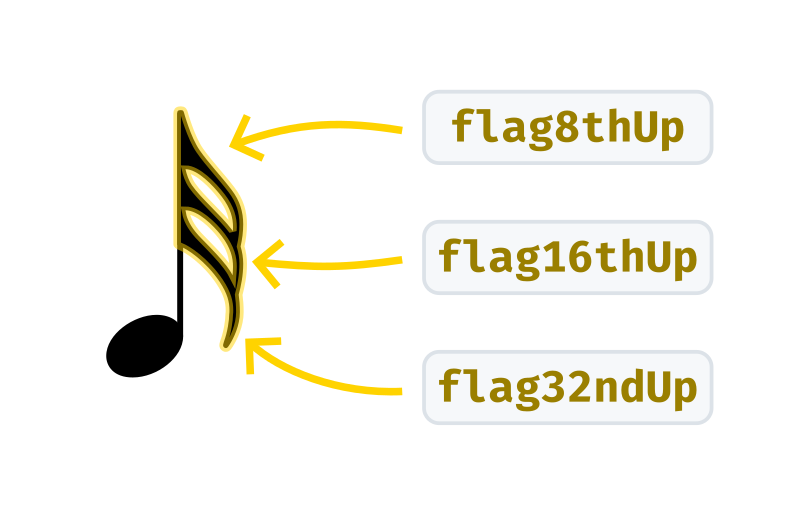
  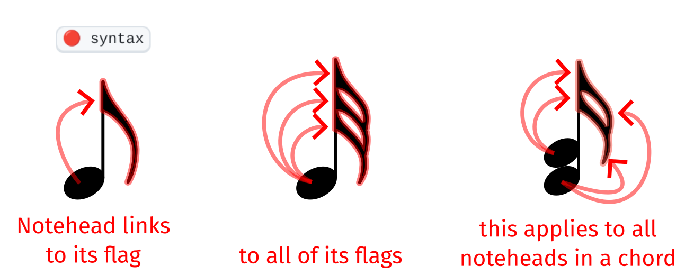

Flags are divided into separate classes according to their type and direction:

- **`flag8thUp`** / **`flag8thDown`**

  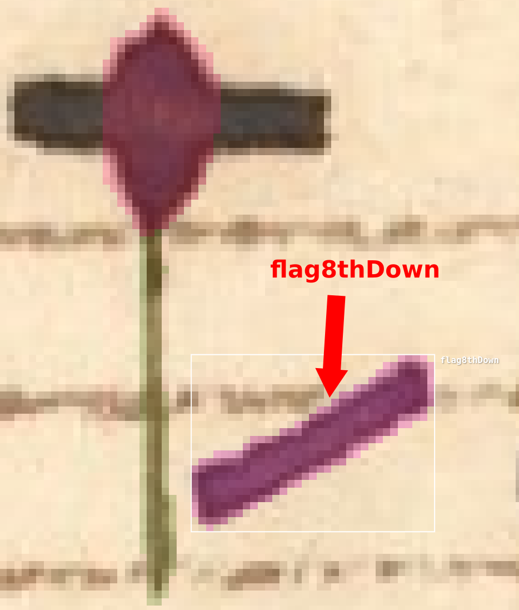

- **`flag16thUp`** / **`flag16thDown`**  
  ⚠️ *Be careful:* If a single note has **two flags**, the outer is **8th** and the inner is **16th** (and the same for three flags - 8th, 16th, 32nd... and so on).
- **`flag32ndUp`** / **`flag32ndDown`**
- *(and so on for higher flag counts)*

⚠️ flag8thUp, flag16thUp

  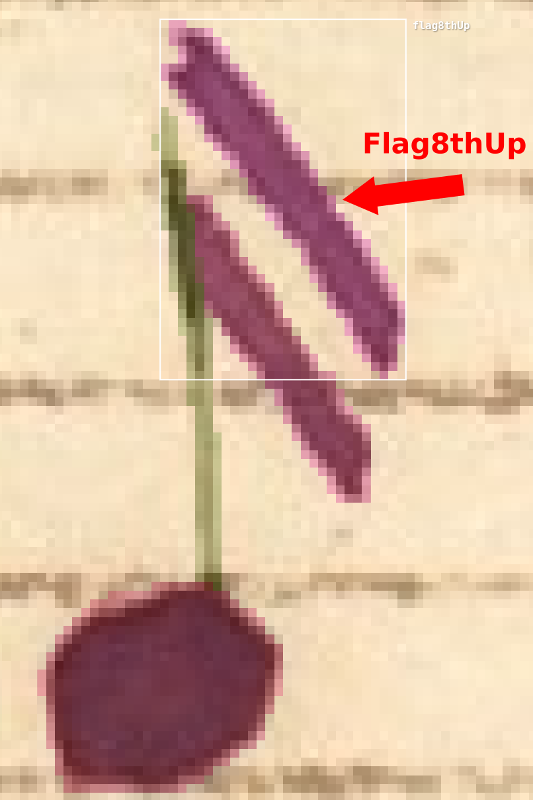
  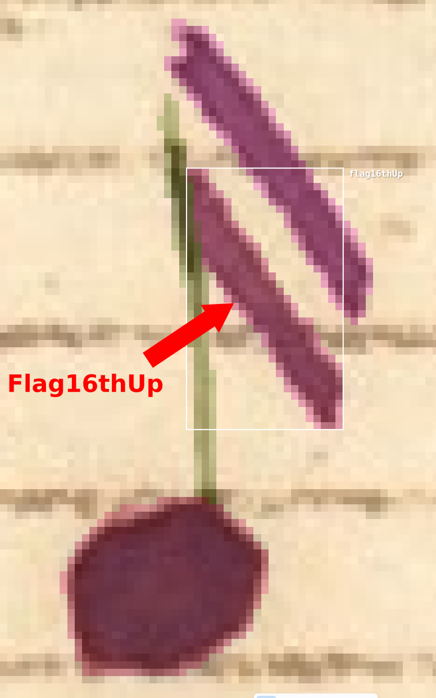

---

## `beam`

  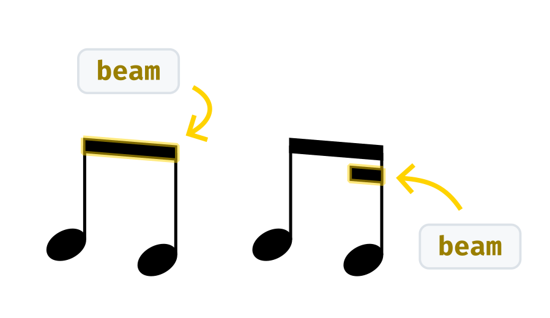

  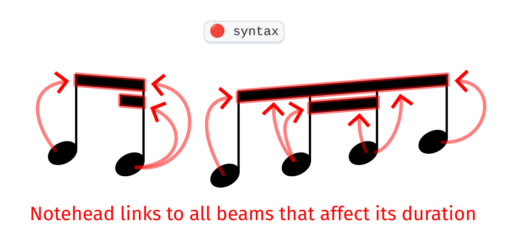

  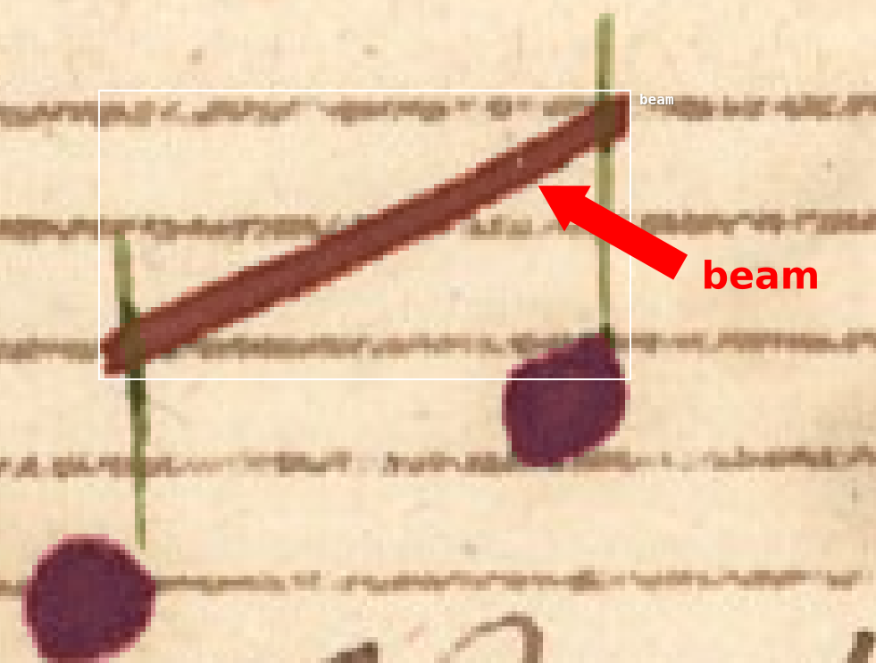

- If the beams intersects other symbols (e.g. stems), mark the mask through the intersected section. Pixels can be shared between multiple objects.
- ⚠️ If the **noteheads are empty** you might be looking at a **tremolo beam**, check out the annotation instructions on tremolos (TODO: add link) to make sure you don't accidentally annotate multi-note tremolos as beams.

---

## `legerLine`

*(Not “ledger”, both variants are correct ([Wikipedia](https://en.wikipedia.org/wiki/Ledger_line)), but we use leger to stay compliant with SMuFL specification.)*

  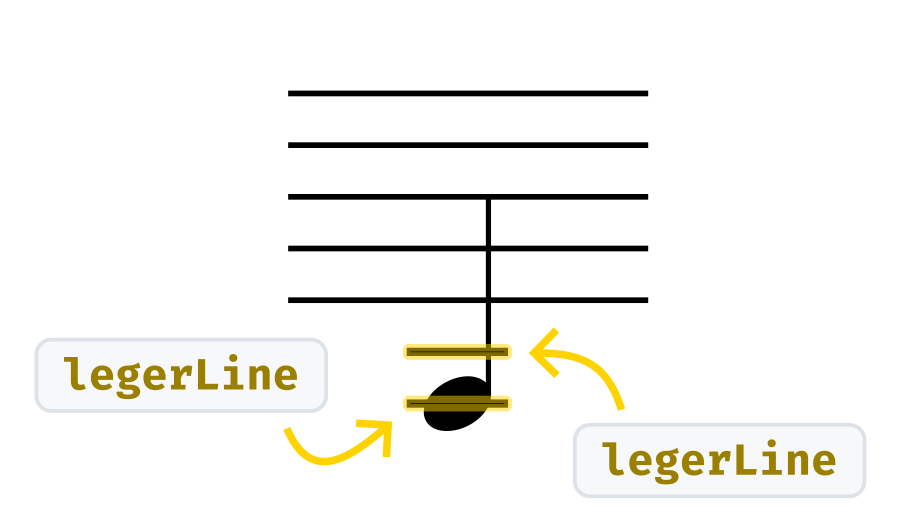

  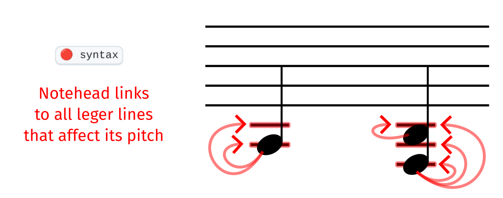

  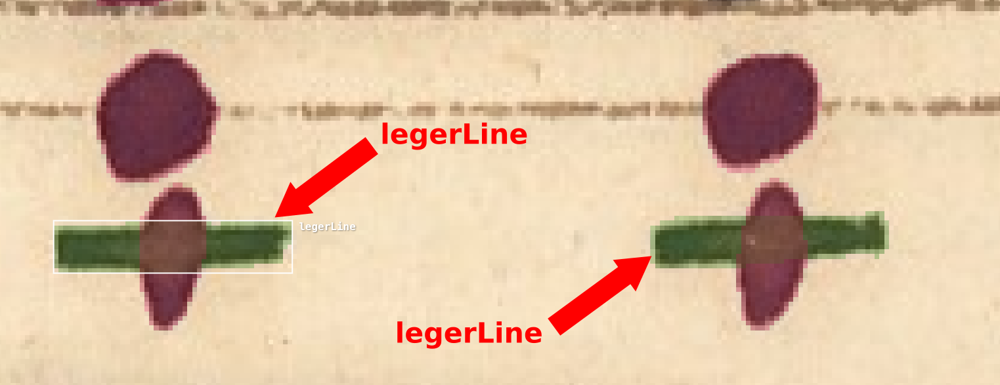

---

## `slur`

  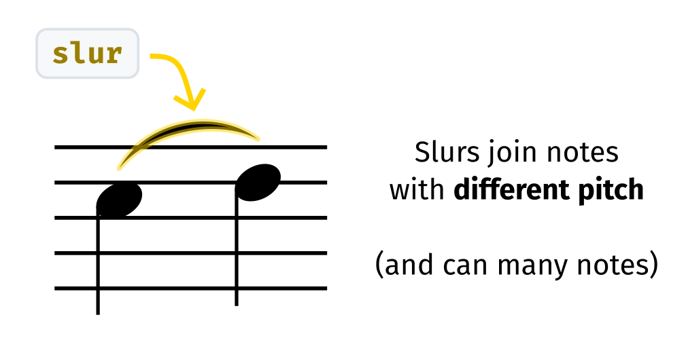
  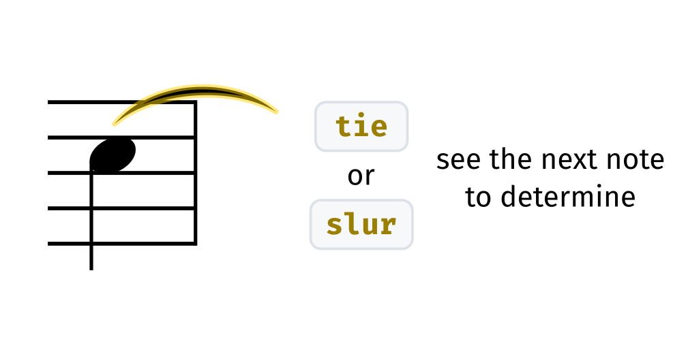

  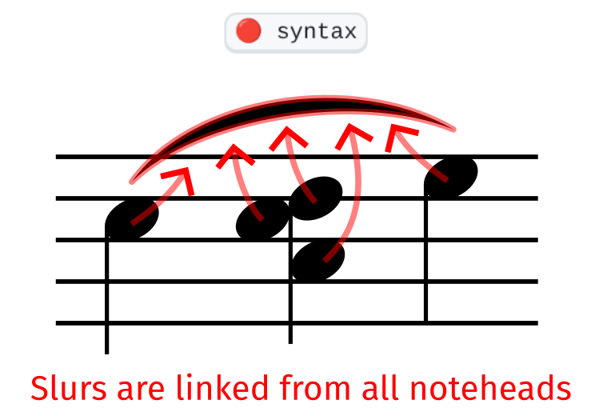
  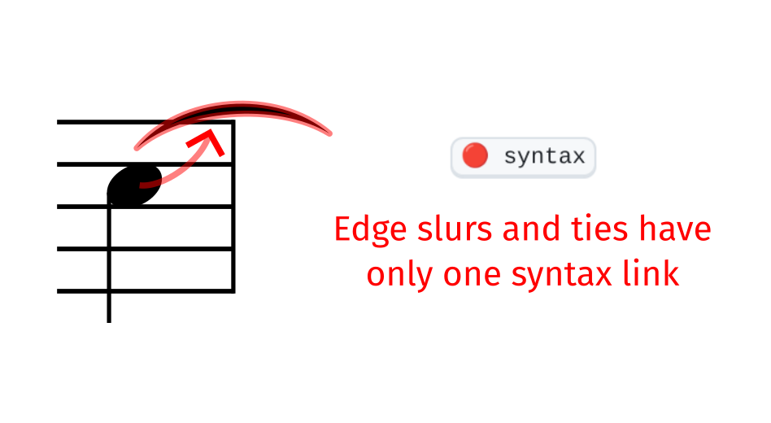

- Annotate even when the slur appears at the **end of a page** and it’s unclear whether it’s a slur or a tie (see [discussion](https://github.com/orgs/OmniOMR/discussions/108#discussioncomment-13986659)).
- All annotated pages are available in the **Digital Library**, where you can browse the full document. If you want to check it yourself (for clefs or slurs), the links follow this format:

    `https://www.digitalniknihovna.cz/mzk/view/uuid:<document_id>?page=uuid:<page_id>`

  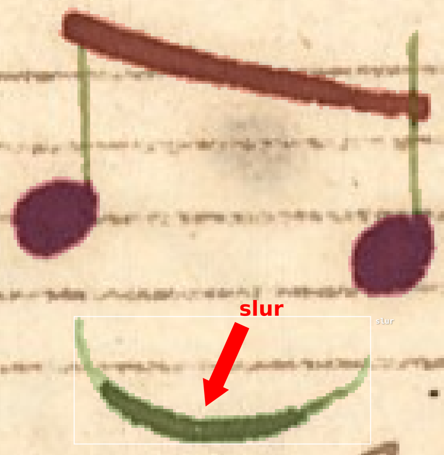

TODO: How do I tell apart (in MuNG) an edge slur (continuing to the next line) from a slur that ends on the last note of the system?

---

## `tie`

  
  

  
  
  

  

TODO: ties between chords? Syntax? Is that correct? What if notes not add up?

---

## Rests

### `restWhole`

*(Previously in CVAT `rest_whole`)*

  

---

### `restHalf`

*(Previously in CVAT `rest_half`)*

  

---

### `restQuarter`

*(Previously in CVAT `rest_quarter`)*

  

---

### `rest8th`

*(Previously in CVAT `rest_8th`)*

  

---

### `rest16th`

*(Previously in CVAT `rest_16th`)*

  

---

### `rest32nd`

*(Previously in CVAT `rest_32-and-shorter`)*

TODO: image

---

### `restLonga`

*(Previously in CVAT `rest_longa`)*

TODO: image

---

### `restBreve`

*(Previously in CVAT `rest_breve`)*

TODO: image

---

### `restHBar`

*(Previously in CVAT `rest_multimeasure` and `multiMeasureRest` in MuNG)*

> **🚧 Under construction.**

TODO: image

TODO: how to assign numbers to these + numbers can also be for longa and breve

  
🔗 Example documents

  - 7th staff: https://ufallab.ms.mff.cuni.cz/~mayer/mung-studio/#/simple-backend/ca625f33-b4e1-49a9-bbc4-63130ba0fe70_010e98cc-eab8-47d9-8424-1cfc8d3c1c1a
  - https://ufallab.ms.mff.cuni.cz/~mayer/mung-studio/#/simple-backend/13abc7f9-5e3f-4e85-b753-0dab090728fe_da0e8022-a312-432a-b825-d66c024aa816

---

## Accidentals

  
  

### `accidentalSharp`

*(Previously in CVAT `sharp`)*

- Always **leave out the center!** Don’t just outline the shape.

  

---

### `accidentalFlat`

*(Previously in CVAT `flat`)*

- Always **leave out the center!** Don’t just outline the shape.

  

---

### `accidentalNatural`

*(Previously in CVAT `natural`)*

- Always **leave out the center!** Don’t just outline the shape.

  

---

### `accidentalDoubleSharp`

*(Previously in CVAT `double_sharp`)*

TODO: image

---

### `accidentalDoubleFlat`

*(Previously in CVAT `double_flat`)*

TODO: image

---

## Clefs

### `gClef`

*(Previously in CVAT `clef_g`)*

- Always **leave out the center!** Don’t just outline the shape.

  
  

---

### `gClefChange`

- Used when the **clef changes in the middle of the staff** to a G clef.
- These symbols are typically **smaller in size** than standard clefs.
- Make sure to annotate them as **this object**, distinct from the regular clef symbols at the beginning of the staff.

TODO: image - https://ufallab.ms.mff.cuni.cz/~mayer/mung-studio/#/simple-backend/30d6c780-c8fe-11e7-9c14-005056827e51_36058ae0-f593-11e7-b30f-5ef3fc9ae867

---

### `fClef`

*(Previously in CVAT `clef_f`)*

  

---

### `fClefChange`

- Used when the **clef changes in the middle of the staff** to an F clef.
- These symbols are typically **smaller in size** than standard clefs.
- Make sure to annotate them as **this object**, distinct from the regular clef symbols at the beginning of the staff.

  

  
🔗 Example documents

  - https://ufallab.ms.mff.cuni.cz/~mayer/mung-studio/#/simple-backend/93736ae0-d1c5-11ec-8264-005056827e51_f824ce8b-a273-4bd3-a70c-9d6381d69806
  - https://ufallab.ms.mff.cuni.cz/~mayer/mung-studio/#/simple-backend/bf061840-2322-11eb-979b-005056827e52_3f8e002f-e26c-499c-b3f7-8114fae278f0

---

### `cClef`

*(Previously in CVAT `clef_c`)*

  

---

### `cClefChange`

- Used when the **clef changes in the middle of the staff** to a C clef.
- These symbols are typically **smaller in size** than standard clefs.
- Make sure to annotate them as **this object**, distinct from the regular clef symbols at the beginning of the staff.

  

  
🔗 Example documents

  - https://ufallab.ms.mff.cuni.cz/~mayer/mung-studio/#/simple-backend/93736ae0-d1c5-11ec-8264-005056827e51_f824ce8b-a273-4bd3-a70c-9d6381d69806

---

## Time Signatures

### `timeSig[0..9]`

*(Previously in CVAT `time_signature_element` and `numeral0..9` in MuNG)*

Classes: `timeSig0`, `timeSig1`, `timeSig2`, ... `timeSig9`

- Represents individual **digits** in the time signature (0–9).  
- If the number is **greater than 9**, annotate each digit separately. (For example, a time signature of `10` should be split into **`timeSig1`** and **`timeSig0`**.)
- **TODO:** vyřešit graf

  

---

### `timeSigCommon`

*(Previously in CVAT `time_signature_element`)*

- The **C** symbol, meaning common time, i.e. 4/4

TODO: image

---

### `timeSigCutCommon`

*(Previously in CVAT `time_signature_element`)*

- The slashed **C/** symbol, meaning cut-common time, i.e. 2/2

TODO: image

---

### `timeSigFractionalSlash`

> **🚧 Under construction.**

- Represents the **horizontal line or slash** separating the upper and lower numbers of a time signature.

TODO: image

  
🔗 Example documents

  - https://ufallab.ms.mff.cuni.cz/~mayer/mung-studio/#/simple-backend/13abc7f9-5e3f-4e85-b753-0dab090728fe_da0e8022-a312-432a-b825-d66c024aa816

---

### `timeSigFractionalEquals`

> **🚧 Under construction.**

- Represents the **equals sign (“=”)** used in **fractional or complex time signatures**.

TODO: image

---

### `timeSignature`

> **🚧 Under construction.** (describe the notation graph)

- A **container class** for grouping all elements that form a complete time signature.
- Use it to wrap **either a single object or multiple separate digits** (e.g., 3/4=6/10 as a compact symbol).
- If the time signature appears **at the end of a staff line**, still annotate it as a full `timeSignature` object:

  

---

## `keySignature`

- A **container (parent) symbol** representing the entire key signature.
- Annotate it as a **convex hull (rough mask)** covering all the individual accidentals.
- <kbd>🔴 syntax</kbd> links lead from `keySignature` to all accidentals within it

  

---

## Text

> **🚧 Under construction.**

**TODO:** U textů bude potřeba vyřešit jestli texty přepisovat (podobně jako umožňoval CVAT - pozor na nečitelné texty).

## `lyricsText`

> **🚧 Under construction.**

- Annotate **syllable by syllable or separate words**, so that each lyric segment can be correctly aligned with the notation graph.
- It is sufficient to use a **convex hull (rough mask)** for lyrics — precise outlining is not required.

  

---

### `tempoText`

- **TODO:** Define rules for tempo markings (e.g. “Pochodem”, “Allegro”, etc.)

---

### `metadataText`

> **🚧 Under construction.**

- nadpisy, autoři (věci co souvisí s dílem, ne dokumentem (song, not doc)), jméno všech lidí (editor, etc.) (cokoliv co je zajímavé pro knihovníka)

---

### `otherText`

> **🚧 Under construction.**

Used for **non-musical text elements** such as:
- Page numbers  
- Verse numbers
- Measure number
- Rehersal marks
- text jiných slok co není pod notami (např. v kancionálu), NE když je to aligned pod notami

stakeholder = OCR systém, sebere všechno ostatní co je "čtitelné" co není už jiný text

---

## Staves

### `staffLine`

*(Called `Staff line` in CVAT)*  

- Represents a **single staff line**.
- Annotate **precisely around the entire shape**.

  

  
🤔 Why not use staff1Line class of SMuFL?

  The `staff1Line` class from SMuFL is intended for text-rendering. It is not used to actually render stafflines and thus means something slightly different semantically. Staff lines are more similar to beams, slurs, and ties, which cannot be rendered via a font, so aren't present in SMuFL. Therefore we decided to also introduce the class `staffLine` for this non-font-renderable symbol, just like we did with `beam`, `slur`, and `tie`.

---

### `staff`

*(Called `Staff` in CVAT)*  

- Groups together the **five staff lines** that form a complete staff.  
- The bounding box should **fit tightly** around the lines.  
- Ensure the box aligns **exactly with the corners** of the staff.

  

---

## Barlines

### `barlineSingle`

*(Called `thin_barline` in CVAT)*  

- Represents a **single thin barline**.  
- Annotate **precisely around the entire shape**.

  

---

### `barlineHeavy`

*(Called `barline_thick` in CVAT)*

- Represents a **thick barline**, usually used at section endings.

  

---

### `measureSeparator`

*(Called `measure_separator` in CVAT)*

- The `staffGrouping` symbols define which staves belong to the same **system** (or **subsystem**) - for example, multi-staff instruments like piano, or sectional groupings in orchestral scores.
- ⚠️ At the **beginning of a system**, a `measureSeparator` should **not** be annotated, to avoid duplicating the final barline of the previous system.

There should always be **exactly one continuous `measureSeparator` per system**,  
regardless of how it appears visually:

- It may be drawn as several **short individual barlines**,  
- as one **long barline**,  
- or a **combination** of both.

The example below shows **four** `measureSeparator` **regions** (blue rectangles) spanning all staves, and **two** `staffGrouping` **boxes** at the start of the system.

  

Similar case below (annotated in MuNG): The **fourth** `measureSeparator` should encompass **all four barlineHeavy** symbols that make up the double barlines.

  

Previous [CVAT measureSeparator rules](https://github.com/orgs/OmniOMR/discussions/24)

---

## Staff Grouping (brackets and braces)

### `brace`

*(Previously `staff_bracket` in CVAT, together with bracket)*

- Represents the **curly brace `{`** used to connect multiple staves belonging to a single instrument (e.g., piano).
- Differentiate between `brace` and `bracket` based on **appearance**, not function. In older music documents, their function is often interchanged.
- Usually connects **two staves**, but can occasionally span **three** (e.g., in organ notation).

  

---

### `bracket`

*(Previously `staff_bracket` in CVAT, together with brace)*

- Represents the **square bracket `[`** used to group staves (e.g., for instrument families in orchestral scores).  
- Differentiate between `brace` and `bracket` based on **appearance**, not function. In older music documents, their function is often interchanged.
- ⚠️ **Important:** a second vertical line often appears near the bracket, but that line **is not part of the bracket**. It should be annotated separately as `barlineSingle`.

  

---

### `staffGrouping`

- An **abstract grouping class** for combining related staves or systems.

**Note:**  
If a system contains **multiple brackets, braces, and a barline**, annotate them as follows:
- Each **barline** → `barlineSingle` 
- Each **brace or bracket** → annotated individually as `brace` or `bracket`
- Then create:
  - **One long `staffGrouping`** spanning the entire barline, brace or bracket (covering all connected staves)  
  - **Several shorter `staffGrouping` boxes**, each covering one brace or bracket

- `staffGrouping` is usually annotated as a **rectangle or polygon** — not tightly around the line or brace. This means the **areas of multiple `staffGrouping` may overlap**, which is perfectly fine.

In the example below, a **long `staffGrouping`** connects all staves via the main bracket,  
while a **shorter `staffGrouping`** encloses the brace on the left side.

  

- Previous [CVAT staffGrouping rules](https://github.com/orgs/OmniOMR/discussions/91#discussion-7177410)

---

## Articulation

*(see the corresponding [SMuFL Group](https://w3c.github.io/smufl/latest/tables/articulation.html))*

*(previously in CVAT `articulation_mark` for every articulation mark, now separated into classes)*

### `articAccentAbove` / `articAccentBelow`

- Represents an **accent mark** placed **above or below** the notehead.
- <kbd>🔴 syntax</kbd> link from the notehead to the accent.

### `articStaccatoAbove` / `articStaccatoBelow`

- Represents **staccato dots** placed **above or below** the notehead.
- **Do not use** the old class name `articulationStaccato`.
- <kbd>🔴 syntax</kbd> link from the notehead to the staccato.

### `articTenutoAbove` / `articTenutoBelow`

- Represents **tenuto line** placed **above or below** the notehead.
- <kbd>🔴 syntax</kbd> link from the notehead to the tenuto.

### `articStaccatissimoAbove`

- Represent the **staccatissimo stroke** placed **above** the notehead.
- <kbd>🔴 syntax</kbd> link from the notehead to the staccatissimo.

  
  
  

  
🔗 Example documents

  - https://ufallab.ms.mff.cuni.cz/~mayer/mung-studio/#/simple-backend/93736ae0-d1c5-11ec-8264-005056827e51_f824ce8b-a273-4bd3-a70c-9d6381d69806

### `articStaccatissimoBelow`

- Represent the **staccatissimo stroke** placed **below** the notehead.
- <kbd>🔴 syntax</kbd> link from the notehead to the staccatissimo.

  

### `articMarcatoAbove`

- Represents **marcato hat** placed **above** the notehead.
- <kbd>🔴 syntax</kbd> link from the notehead to the marcato.

### `articMarcatoBelow`

- Represents **marcato hat** placed **below** the notehead.
- <kbd>🔴 syntax</kbd> link from the notehead to the marcato.

---

## Dynamics

> **🚧 Under construction.**

### `dynamic[Symbol]` (precise masks)

The following classes must be annotated **accurately (not convex)**:
- `dynamicForte`
- `dynamicMezzo`
- `dynamicNiente`
- `dynamicPiano`
- `dynamicRinforzando`
- `dynamicSforzando`
- `dynamicZ`

Also remember to add a `dynamicsText` convex hull over these symbols.

> Combined markings such as `po` or `p:` should be annotated as a **single** `dynamicPiano` object.

  
🔗 Example documents

  - https://ufallab.ms.mff.cuni.cz/~mayer/mung-studio/#/simple-backend/93736ae0-d1c5-11ec-8264-005056827e51_f824ce8b-a273-4bd3-a70c-9d6381d69806

---

### `dynamicsText`

- Represents a **textual region** covering one or more **dynamic marks**.
- The **specific dynamic symbol** (e.g., `p`, `f`, `ff`) should be annotated **precisely** using its respective `dynamicXXX` class.  
- The surrounding **text region** should then be annotated as `dynamicsText`, using a **convex hull** that encloses all relevant symbols.

**Examples:**
- For a single “p” (piano), mark:
  - `dynamicPiano` — exact symbol outline  
  - `dynamicsText` — convex hull enclosing it
- For “ff” (fortissimo), mark:
  - Two symbols: `dynamicForte` + `dynamicForte`
  - One `dynamicsText` area enclosing both

---

## Repeats

> **🚧 Under construction.**

TODO: smufl rozlišuje kontejner classes: repeatLeft repeatRight, my to taky zavedeme

A **repetition mark** is composed of several elements:

### repeatDot

- The **two dots** next to the barline indicating the repeat.  
  Each dot should be annotated individually as a separate `repeatDot`.

### bracket / barlineSingle / barlineHeavy

- The **barline or bracket components** that form the vertical part of the repeat symbol.

### repeat

- The **container mask** that encloses the entire repeat sign (as a convex hull).
- Back-to-back repeats share the two barlines, but are two distinct repeat (containers).

### TODO: když se vyskytne

podivná repetice. Jak značit šikmé dvojčárky? - když se znovu vyskytne, volat výš, tohle je potřeba dořešit

  

ODPOVĚĎ: ocasy nahoře/dole jsou barline, vlnovky jsou repeat dot, jinak barline

---

### repeat1Bar

- in CVAT `repeat_measure_sign`
- `%`

TODO: nad tímhle může být text (stejně jako nad multi-measure rets / whole rest), ten se linkuje v precedenčním grafu (na to je nějaká diskuze někde)

TODO: někdy se používá pro repeat půl-taktu, to je v pohodě, je to pořád tento symbol

TODO: projít partitury a vychytat divnosti, je tam taky "repeat one beat", což je jen ten slash bez teček a někdy to opakuje půl-takt

---

## Col violino unisono

> **🚧 Under construction.**

- TODO: není pro to maska - je to asi podobně rozšířené jako repeat_measure_sign (%)
- dvě čáry - Píšou se, když má nástroj hrát unisono s jiným partem (note: to je pokračování unisona)
- "col viol" https://github.com/orgs/OmniOMR/discussions/124 stejná věc (stejné precedenční hrany) (note: tohle je začátek unisona)

nějakej "unisonoMark"

nebo "col instruction" - text nebo něco

dvě čárky = "dtto", stejně jako to předtím

"interpretační pokyny = čti noty jinde"

---

## Tuples

> **🚧 Under construction.**

TODO: tuples

---

## Tremolo

*(Previously `tremolo_beam` in CVAT)*

- Following SMuFL notation: `tremolo1`
- Multiple tremolo strokes are labeled from **outer to inner** as `tremolo1`, `tremolo2`, `tremolo3`, etc.  (Similar to the `flag` hierarchy.)

TODO: we still want to annotate tremolo beams (proper beams between notes) as something like `multipleNoteTremolo` or `tremoloBeam`. Must be defined here.

  
🔗 Example documents

  - https://ufallab.ms.mff.cuni.cz/~mayer/mung-studio/#/simple-backend/93736ae0-d1c5-11ec-8264-005056827e51_f824ce8b-a273-4bd3-a70c-9d6381d69806
  - Second staff in the middle: https://ufallab.ms.mff.cuni.cz/~mayer/mung-studio/#/simple-backend/ca625f33-b4e1-49a9-bbc4-63130ba0fe70_010e98cc-eab8-47d9-8424-1cfc8d3c1c1a

---

## Figured bass

> **🚧 Under construction.**

### `figuredBassText`

> **🚧 Under construction.**

- konvexní obal skupinky (NE, chceme to mít pořešené líp - SMUFL na to má třídy)
- JE to v precedenčním grafu, protože ty symboly mají trvání (e.g. víc symbolů nad jednou celou notou)
  - precedence JENOM mezi věcma co jsou u jedné noty
- prohledat diskuze, pořešit s Adamem

### TODO: `figured_bass_spanner`

> **🚧 Under construction.**

- zatím pro to není třída (ani SMuFL pro to nemá nic)

---

## Grace notes

*(see the corresponding [SMuFL Group](https://w3c.github.io/smufl/latest/tables/common-ornaments.html))*

A grace note is composed of:

- `noteheadWholeSmall` / `noteheadHalfSmall` / `noteheadBlackSmall`

  

- Uses a standard `stem`, `flag(number)th(Up/Down)`, `beam`

  

- The "slash" through the grace note is `graceNoteSlashStemUp` or `graceNoteSlashStemDown` based on the stem orientation (not the slash orientation).

  
Relevant discussions.

  - https://github.com/orgs/OmniOMR/discussions/61#discussioncomment-9843887

  
🔗 Example documents

  - Last system, middle measure, top staff: https://ufallab.ms.mff.cuni.cz/~mayer/mung-studio/#/simple-backend/81c9f683-28d1-4e73-8e25-e37333408f5a_5b6164cc-5653-494b-b43f-946fbb64d440

---

## `fermataAbove` / `fermataBelow`

  
  

---

## Ornaments

*(see the corresponding [SMuFL Group](https://w3c.github.io/smufl/latest/tables/common-ornaments.html))*

### `ornamentTrill`

*(Previously grouped under `ornament` in CVAT.)*

- Used for the **“tr” text** symbol marking a **short trill**.
- Do not use a simple convex hull. The annotation **must follow the exact shape** of the symbol. **TODO:** je toto pravda?

  

---

### `wiggleTrill`

*(see the corresponding [SMuFL Group](https://w3c.github.io/smufl/latest/tables/multi-segment-lines.html))*

- Represents the **wavy line** that typically **follows a trill mark**,  
indicating the continuation of the trill.

---

### `ornamentTurn`

*(Previously grouped under `ornament` in CVAT.)*

- <kbd>🔴 syntax</kbd> link from the notehead to the ornament.

  

---

### `ornamentTurnInverted`

*(Previously grouped under `ornament` in CVAT.)*

- <kbd>🔴 syntax</kbd> link from the notehead to the ornament.

  
  
  

  
🔗 Example documents

  - https://ufallab.ms.mff.cuni.cz/~mayer/mung-studio/#/simple-backend/93736ae0-d1c5-11ec-8264-005056827e51_f824ce8b-a273-4bd3-a70c-9d6381d69806

---

## `systemDivider`

*(Called `system_break` in CVAT)* 

TODO: image

---

## `splitBarDivider`

- napojení taktu (ta vlnovka na konci)

  

---

## Octaves

> **🚧 Under construction.**

*(see the corresponding [SMuFL Group](https://w3c.github.io/smufl/latest/tables/octaves.html))*

TODO: the `horizontalSpanner` for ottava marking belongs here (but there's another one for figured bass sharing the class name)

TODO: the first example document below also contains pedal markings

  
🔗 Example documents

  - https://ufallab.ms.mff.cuni.cz/~mayer/mung-studio/#/simple-backend/1d507bc2-87e7-4b61-8bea-6126616c4851_2c51b8ce-49e1-4343-82b3-97a210f61897

---

## `arpeggiato`

*(Previously grouped under `ornament` in CVAT.)*  

- Used for **vertical wavy lines** indicating that a chord should be **arpeggiated**.  
- Note: use the class name **`arpeggiato`**, **not** `arpeggio`.

---

## `unclassified` / UFO

*(Called `ufo` in CVAT)*

> **🚧 Under construction.**

**TODO:** Vyřešit jestli je tahle třída opravdu potřeba.

Use this class for **non-musical marks or noise** that appear on the page **only if they interfere with reading the notation**.

- Examples include: stray hairs, spilled coffee, squashed insects, or other artifacts that overlap staves or notes.  
- Do **NOT** annotate: book spines, notation on neighboring pages, symbols from previous pages, or anything you are unsure about — ask before labeling.

- Marks that appear faintly in the background (like “ghost”  bleed-through) should NOT be annotated, only if they don't look like “ghosts”. 

  
  

---

## Precedence graph

TODO ...

- primary rule: when two durables meet (end-start), link is there
- secondary rule: minimize links in-between separate voices (staffs, parts)
- lemma: between chords, it's all-to-all connections

Here, there is a missing eighth rest, first system, last measure, bottom staff, onset 1.5 beats: https://ufallab.ms.mff.cuni.cz/~mayer/mung-studio/#/simple-backend/81c9f683-28d1-4e73-8e25-e37333408f5a_d3de8b4f-5d39-4445-9a37-23ee474a4ff5
(this breaks the central assumption for precedence links, what to do about it?)
