# MuNG Annotation Instructions

This document is a guide for annotators on how to annotate a new document in the MuNG format properly.

> **📖 New here?** Read the [Introduction](annotation-introduction.md) text first.

If you are starting out as a fresh annotator, then you should first read the introduction text above which describes the MuNG format in its context. This document is a reference to be used when doing routine annotation work - a companion to have on the side when annotating to remind you of how to annotate all the edge-case situations. For this reason this document tends to be rather short with words, full of images, to aid its navigation.

The recommended way to use this document is to go through the class list in order and annotate object on the page class-by-class. The classes here are ordered roughly by their [frequency](class-frequencies.md) in documents.

It is also advised to first annotate masks for all objects, and only then go through the document again and annotate the syntax and precedece links.

> **🚧 Construction work:** These instructions constantly expand. If you find yourself needing to use a section denoted with this emoji (🚧), you should wait for the construction work to be finished before using it. Same applies to situations where the notation situation you are annotating is not covered here at all. In both cases, notify the administrators, ideally by creating a question in [github discussions](https://github.com/orgs/OmniOMR/discussions) and tagging `@Jirka-Mayer`.

> **💔 Errata:** If you find a mistake in a document you are not annotating (e.g. while taking inspiration from others) and that document is supposed to be "completed" by now (i.e. is not currently being annotated by anyone), then please, report the mistake to the [Dataset Errata Repository](https://github.com/OmniOMR/dataset-errata).

> **📚 Library:** If you want to open the book from which you are annotating a page, simply look at the document name, it consists of `{book-uuid}_{page-uuid}`. When you tak the `{page-uuid}` portion and put it into this URL, the corresponding page will open in the Moravian Library:<br>`https://digitalniknihovna.cz/mzk/uuid/uuid:05cb3fea-9d71-483a-b5c0-99b6e07510d0`


## Tips

- When creating a polygon, you can go **one point back** by **right-clicking**.
- If you **finished a mask too early** but need to add more, simply **select the object** you want to modify and press `N`.
Alternatively, select the object and click the “Edit nodes” icon (⬟) in the bottom panel.

> **Note:**
> Some additional symbols that appear in the search list (in MuNG Studio) exist **only for compatibility with other datasets** - they are **not intended for annotators**.
>
> If you encounter a symbol that is **not listed in this guide**, **do not annotate it using an improvised or similar class name**.
> Instead, **ask for clarification** before proceeding.

---

**⬇️ Here begins the ontology ⬇️**

---


## Noteheads

- There are many <kbd>🔴 syntax</kbd> links going from noteheads to other symbols. Because there are so many, they are mentioned at those other smybols (e.g. `stem`, accidentals, flags), instead of here.
- Noteheads participate in the <kbd>🟢 precedence</kbd> graph. See the [Precedence graph](#precedence-graph) section for more.


### `noteheadWhole`

<p>
  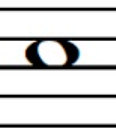
  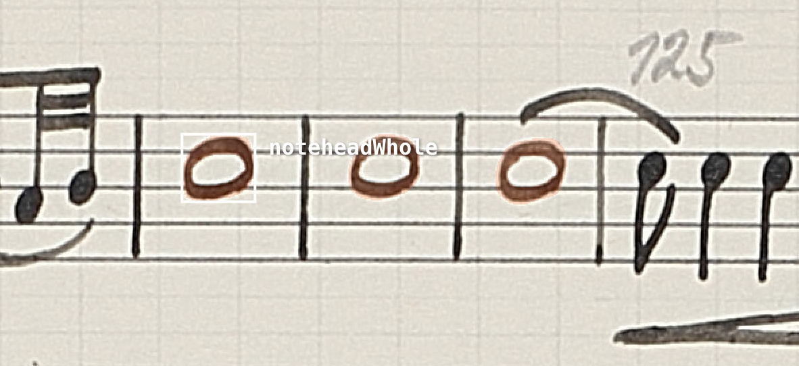
</p>

- It does not have an attached stem.
- Fill the entire notehead but **leave out the center**.

<details>
  <summary>🤔 Why differentiate whole/half noteheads if they look identical?</summary>
  
  We differentiate `noteheadWhole` from `noteheadHalf` (below) because of downstream processing against the SMuFL standard, which does treat them as distinct symbols. While previous versions of MuNG had just a `noteheadEmpty` class, it introduces an extra step when trying to e.g. load the data for rendering with a SMuFL-compliant font, which may seem trivial (just check for a stem!), but what if there is an error in the annotation? In the end it is just better to make the MuNG data itself as close to SMuFL as possible, to make the whole dataset easier to maintain and clean. (The same logic will apply in other places in the instructions, hence why we write so much about it here.)
</details>

<details>
  <summary>🔗 Example documents</summary>

  - https://ufallab.ms.mff.cuni.cz/~mayer/mung-studio/#/simple-backend/ca625f33-b4e1-49a9-bbc4-63130ba0fe70_010e98cc-eab8-47d9-8424-1cfc8d3c1c1a
</details>

---


### `noteheadHalf`

- Always **leave out the center**. Don’t just outline the shape.

<p>
  
  
</p>

---


### `noteheadBlack`

*(Previously in CVAT: `notehead_full`. You may find `noteheadFull` in MuNG, but **do NOT use it.**)*

<p>
  
  
</p>

---


## `augmentationDot`

*(Previously in CVAT: `duration_dot`)*

Augmentation dot makes a note (or rest) longer by 50% (+ ½) of its natural duration. If there are two dots, it is by 75% (+ ½ + ¼) longer. More dots add an eighth, sixteenth, etc. to the duration.

- <kbd>🔴 syntax</kbd> link must lead from the notehead to the augmentation dot.
- Multiple noteheads in a chord have multiple augmentation dots, each its own with its own <kbd>🔴 syntax</kbd> link.
- Note can have multiple augmentation dots, in which case both are linked to the notehead with a <kbd>🔴 syntax</kbd> link.
- **Rests** can also have augmentation dots and behave exactly like noteheads.

<p>
  
  
  
  
</p>

<p>
  
</p>

> **⚠️ Warning:** Not to be confused with a staccato dot, which looks similar, but is placed above/below the notehead and is usually slightly smaller.

TODO: what about chords with differing number of dots and noteheads?

<details>
  <summary>🔗 Example documents</summary>

  - Simple dots & simple chords
    - https://ufallab.ms.mff.cuni.cz/~mayer/mung-studio/#/simple-backend/81c9f683-28d1-4e73-8e25-e37333408f5a_ac45624e-0846-4c6d-a079-a1f1877e1aea
  - Rest augmentation dots
    - First beat: https://ufallab.ms.mff.cuni.cz/~mayer/mung-studio/#/simple-backend/d9fede70-b9f0-11ea-b68c-005056827e52_2f8490c5-7e84-426e-8628-2bc938f47260
  - Multiple augmentation dots per note
    - First system, first measure: https://ufallab.ms.mff.cuni.cz/~mayer/mung-studio/#/simple-backend/30d6c780-c8fe-11e7-9c14-005056827e51_36058ae0-f593-11e7-b30f-5ef3fc9ae867
</details>

---


## `stem`

*(`stem` is not part of SMuFL, because it cannot be rendered using a notation font)*

<p>
  
  
</p>

- Stem is the line attached to all notes shorter than the whole note.
- Stem can be pointing up or down, but it has no effect on the annotation (no difference in class name, no difference in the graph).
- <kbd>🔴 syntax</kbd> link must lead from the notehead to the stem.

<p>
  
  
  
</p>
<p>
  
  
</p>

- Stem can have multiple noteheads attached, forming a **chord**.
- All noteheads in the chord have a <kbd>🔴 syntax</kbd> link from the notehead to the stem.

<details>
  <summary>🤔 What is a chord?</summary>

  Musically speaking, chord is a group of notes played at the same time to form harmony. But that's too vague for us. Also, we annotate **music notation**, not the sound. So for us, *chord* is a group of *noteheads* that share a *stem*.

  This definition is still not complete and does not cover some edge-cases. For example, a chord composed entirely of whole notes does not have a stem, but is still considered a chord (as opposed to 4 or 6 separate voices).
</details>

<p>
  
  
  
  
</p>

- When the notes are **one chord**, the **stem is one object** to indicate that it is in fact one chord. Even when it's drawn with mulitple strokes:

<details>
  <summary>🤔 Isn't it weird that one stem consists of multiple separate lines?</summary>

  Yes, but it's the lesser evil and the problems this poses for object detectors and the synthesizer can be resolved:

  1. Splitting the stem into many parts poses way more problems for the MuNG to MusicXML converter. We get explosion of voices, incorrect chord semantics etc...
  2. These weird cases can be filtered out via connected-component analysis and omited from the synthesizer and object detector training if needed.
  3. Split-stem chords below are even more weird, but still form a single object.
  4. F-clefs are also disjoint, yet form a singular symbol.
  5. Some stylistic variants of the `accidentalNatural` are also disjoint.
</details>

<p>
  
  
  
</p>

- The stem mask may **pass through another object and extend above it** (beam, notehead, etc.). In this case, annotate the stem through the crossed object:

<p>
  
  
</p>

- A single notehead can have **two stems**. This is a situation, when two voices play the same note at the same time. The notehead should have two <kbd>🔴 syntax</kbd> links, one to each stem.
- If the stem is drawn as a single stroke, is still **must be split into two**, otherwise the presence of the second voice is lost (it is neccessary for proper interpretation of the graph).

<p>
  
  
  
</p>
<p>
  
</p>

- Stems often disambiguate between a chord with two notes and two separate voices:

<p>
  
</p>

- In split-stem chords, the split stem is still just a single stem (just like in disjoint stems in chords above):

<p>
  
</p>

- Sometimes, the writer is very sloppy with writing chords. The image could be understood as either two voices or one chord. Here, consider the rest of the document and what the author meant in the situation:

<p>
  
</p>

<p>
  
</p>

- ⚠️ The rule with stem directions (above) is a good guideline, but breaks down in situations where you have 3 or more voices. There, use your best judgement. Imagine how you would transcribe the piece to MuseScore and define voices/chords in that way.

- Sometimes it is hard to tell, to which voice (which stem) a notehead belongs. Below are few examples of 3 noteheads and 2 voices. Use hints, such as duration, stems, or ties. When there are no further hints (e.g. the first image), look at the voices around the noteheads and decide to which voice the center notehead likely belongs.

<p>
  
</p>

<details>
  <summary>🔗 Example documents</summary>

  - Simple stems
    - Typeset: https://ufallab.ms.mff.cuni.cz/~mayer/mung-studio/#/simple-backend/82ab6fe0-ea75-11ed-9f31-5ef3fc9bb22f_689af144-8232-4e60-af78-eb04fa023656
    - Sharpie: https://ufallab.ms.mff.cuni.cz/~mayer/mung-studio/#/simple-backend/ca625f33-b4e1-49a9-bbc4-63130ba0fe70_010e98cc-eab8-47d9-8424-1cfc8d3c1c1a
  - Chords
    - Last system, first staff: https://ufallab.ms.mff.cuni.cz/~mayer/mung-studio/#/simple-backend/30d6c780-c8fe-11e7-9c14-005056827e51_375c6850-f593-11e7-b30f-5ef3fc9ae867
    - Piano bass: https://ufallab.ms.mff.cuni.cz/~mayer/mung-studio/#/simple-backend/81c9f683-28d1-4e73-8e25-e37333408f5a_5b6164cc-5653-494b-b43f-946fbb64d440
    - System 3, last measure: https://ufallab.ms.mff.cuni.cz/~mayer/mung-studio/#/simple-backend/bf061840-2322-11eb-979b-005056827e52_61b8fc9e-39f2-4783-876f-9d15fa63ddc2
  - Two voices with one notehead
    - Alto part (12th staff): https://ufallab.ms.mff.cuni.cz/~mayer/mung-studio/#/simple-backend/bf5ef9ce-00ba-4c9f-bbb3-57e542354222_f749c3aa-d105-4da2-a7af-64dc80b30a83
    - Last system, piano bass: https://ufallab.ms.mff.cuni.cz/~mayer/mung-studio/#/simple-backend/81c9f683-28d1-4e73-8e25-e37333408f5a_ac45624e-0846-4c6d-a079-a1f1877e1aea
  - Voices and chords intermingling complicatedly
    - Second system, first measure, piano: https://ufallab.ms.mff.cuni.cz/~mayer/mung-studio/#/simple-backend/81c9f683-28d1-4e73-8e25-e37333408f5a_d3de8b4f-5d39-4445-9a37-23ee474a4ff5
</details>

---


## Flags

`flag(number)th(Up/Down)`

<p>
  
</p>
<p>
  
  
</p>

Flags are divided into separate classes according to their type and direction:

- **`flag8thUp`** / **`flag8thDown`**
<p>
  
</p>

- **`flag16thUp`** / **`flag16thDown`**  
  ⚠️ *Be careful:* If a single note has **two flags**, the outer is **8th** and the inner is **16th** (and the same for three flags - 8th, 16th, 32nd... and so on).
- **`flag32ndUp`** / **`flag32ndDown`**
- *(and so on for higher flag counts)*

⚠️ flag8thUp, flag16thUp
<p>
  
  
</p>

---


## `beam`

*(`beam` is not part of SMuFL, because it cannot be rendered using a notation font)*

<p>
  
</p>
<p>
  
</p>
<p>
  
</p>

- If the beams intersects other symbols (e.g. stems), mark the mask through the intersected section. Pixels can be shared between multiple objects.
- ⚠️ If the **noteheads are empty** you might be looking at a **tremolo beam**, check out the annotation instructions on tremolos (TODO: add link) to make sure you don't accidentally annotate multi-note tremolos as beams.

---


## `legerLine`

*(Not “ledger”, both variants are correct ([Wikipedia](https://en.wikipedia.org/wiki/Ledger_line)), but we use leger to stay compliant with SMuFL specification.)*

<p>
  
</p>
<p>
  
</p>
<p>
  
</p>

---


## `slur`

<p>
  
  
</p>
<p>
  
  
</p>

- Annotate even when the slur appears at the **end of a page** and it’s unclear whether it’s a slur or a tie (see [discussion](https://github.com/orgs/OmniOMR/discussions/108#discussioncomment-13986659)).
- All annotated pages are available in the **Digital Library**, where you can browse the full document. If you want to check it yourself (for clefs or slurs), the links follow this format:

    `https://www.digitalniknihovna.cz/mzk/view/uuid:<document_id>?page=uuid:<page_id>`

<p>
  
</p>

TODO: How do I tell apart (in MuNG) an edge slur (continuing to the next line) from a slur that ends on the last note of the system?

---


## `tie`

<p>
  
  
</p>
<p>
  
  
  
</p>

<p>
  
</p>

TODO: ties between chords? Syntax? Is that correct? What if notes not add up?

TODO: ties between bar repeats: https://ufallab.ms.mff.cuni.cz/~mayer/mung-studio/#/simple-backend/f0eb92d3-24ff-4aa8-bb21-cdebb709a276_6f750072-273e-487e-abd9-d9e8afdb767e

---


## Rests

*(See the corresponding [SMuFL group](https://w3c.github.io/smufl/latest/tables/rests.html))*

- Rests participate in the <kbd>🟢 precedence</kbd> graph. See the [Precedence graph](#precedence-graph) section for more.


### `restWhole`

*(Previously in CVAT `rest_whole`)*

*(See the corresponding [SMuFL group](https://w3c.github.io/smufl/latest/tables/rests.html))*

<p>
  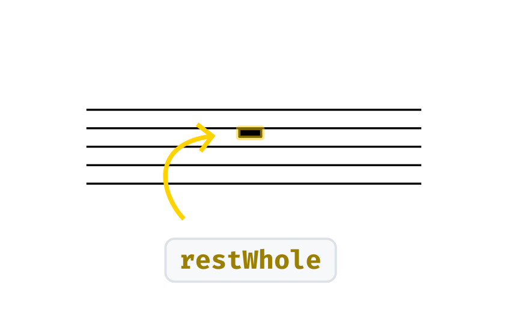
</p>

- Represents a pause for 4 beats.
- Even if it does not hang from a line precisely, if it takes up 4 beats, annotate it as a whole rest.
- When there are multiple voices, it can be placed outside of the staff on a leger line. Annotate the leger line as a separate `legerLine` object and add <kbd>🔴 syntax</kbd> links from the rest to all leger lines affecting its position, including the one it hangs from. 
- Can be part of a rest cluster, see [`restText`](#resttext) for more info.

<p>
  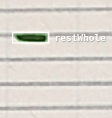
</p>

---


### `restHalf`

*(Previously in CVAT `rest_half`)*

*(See the corresponding [SMuFL group](https://w3c.github.io/smufl/latest/tables/rests.html))*

<p>
  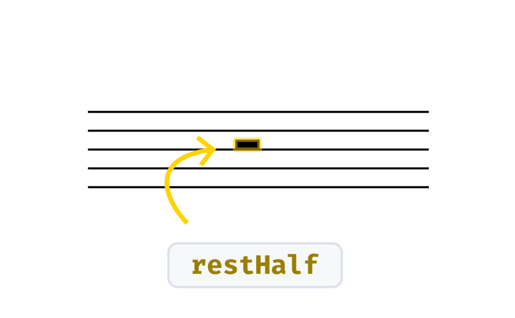
</p>

- Represents a pause for 2 beats.
- Even if it does not sit on a line precisely, if it takes up 2 beats, annotate it as a whole rest.
- When there are multiple voices, it can be placed outside of the staff on a leger line. Annotate the leger line as a separate `legerLine` object and add <kbd>🔴 syntax</kbd> links from the rest to all leger lines affecting its position, including the one it sits on. 

<p>
  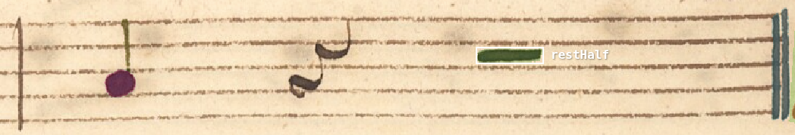
</p>

---


### `restQuarter`

*(Previously in CVAT `rest_quarter`)*

*(See the corresponding [SMuFL group](https://w3c.github.io/smufl/latest/tables/rests.html))*

<p>
  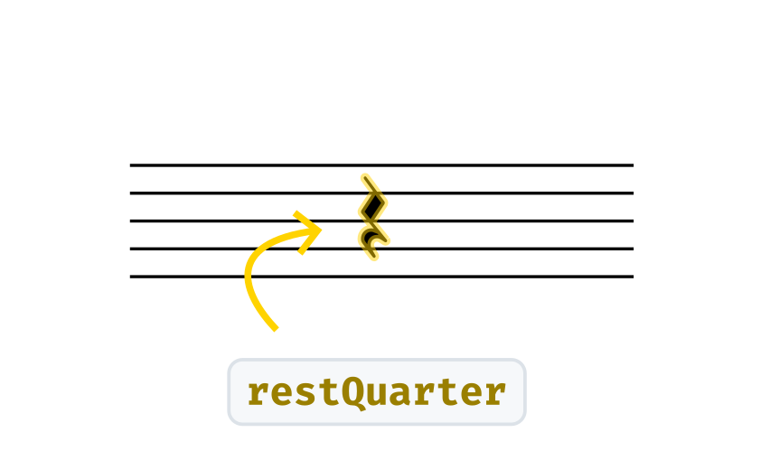
</p>

- Represents a pause for 1 beat.
- Has a large number of appearances and styles. If there's a rest and you're unsure what it is, it likely is a quarter rest.

<p>
  
  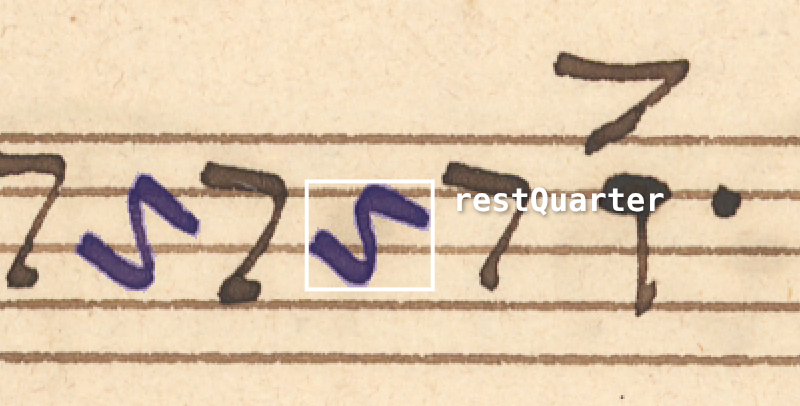
  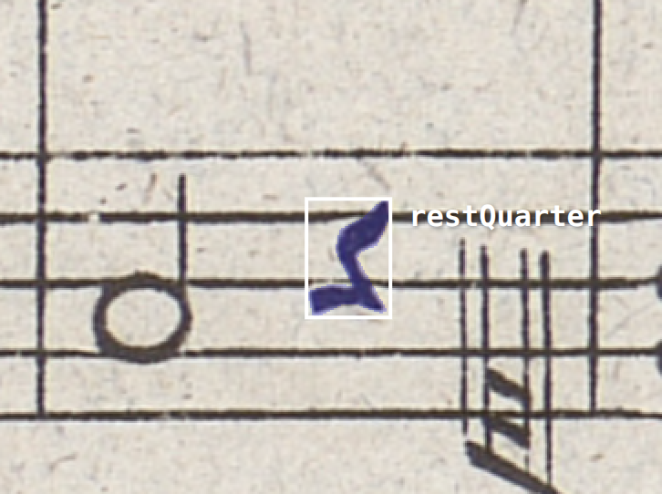
  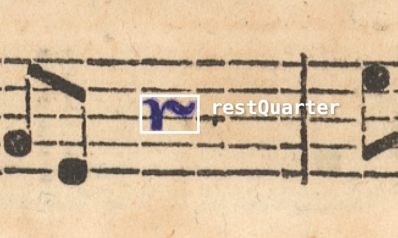
</p>

<details>
  <summary>🔗 Example documents</summary>

  - https://ufallab.ms.mff.cuni.cz/~mayer/mung-studio/#/simple-backend/13abc7f9-5e3f-4e85-b753-0dab090728fe_da0e8022-a312-432a-b825-d66c024aa816
  - https://ufallab.ms.mff.cuni.cz/~mayer/mung-studio/#/simple-backend/93736ae0-d1c5-11ec-8264-005056827e51_f824ce8b-a273-4bd3-a70c-9d6381d69806
  - https://ufallab.ms.mff.cuni.cz/~mayer/mung-studio/#/simple-backend/ae6834fa-f241-4c24-8a11-a025281b6112_7ad6c7df-d12b-4bdd-b53a-49a3e8c1799d
</details>

---


### `rest8th`

*(Previously in CVAT `rest_8th`)*

*(See the corresponding [SMuFL group](https://w3c.github.io/smufl/latest/tables/rests.html))*

<p>
  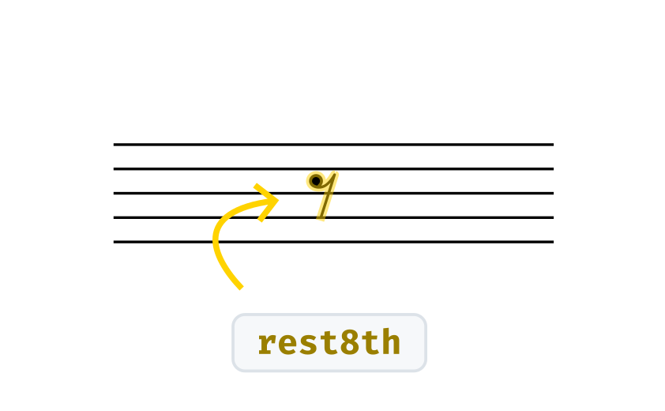
</p>

- Represents a pause for 1/2 beat.

<p>
  
</p>


---

### `rest16th`

*(Previously in CVAT `rest_16th`)*

*(See the corresponding [SMuFL group](https://w3c.github.io/smufl/latest/tables/rests.html))*

<p>
  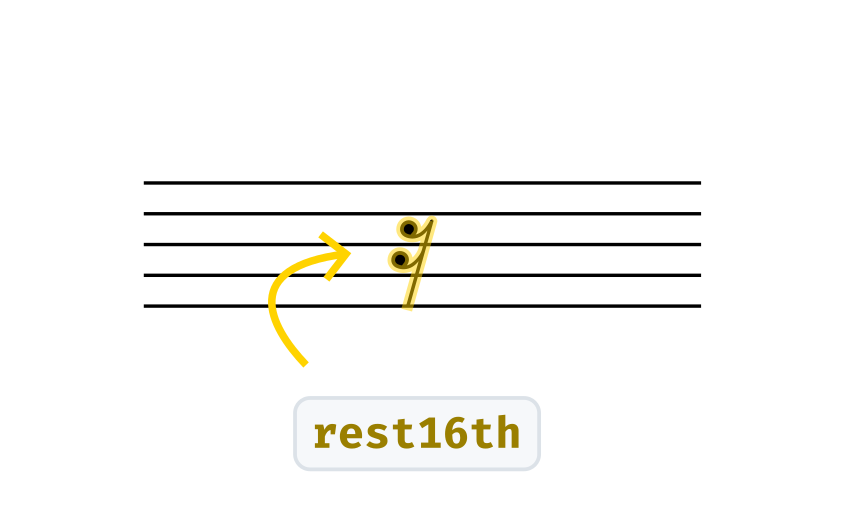
</p>

- Represents a pause for 1/4 beat.

<p>
  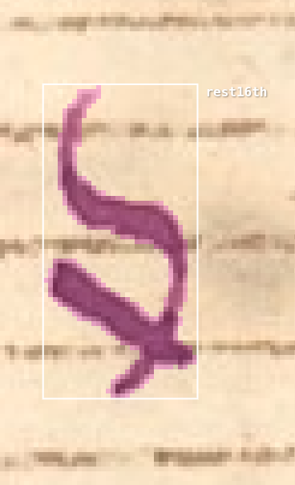
</p>

---


### `rest32nd`

*(Previously in CVAT `rest_32-and-shorter`)*

*(See the corresponding [SMuFL group](https://w3c.github.io/smufl/latest/tables/rests.html))*

<p>
  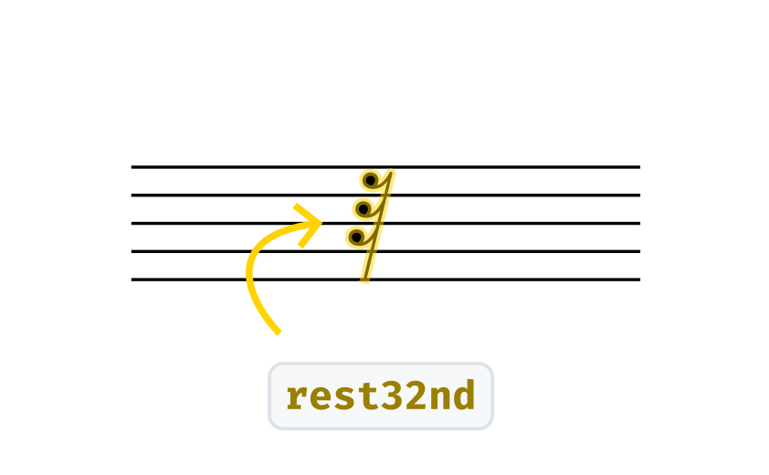
</p>

- Represents a pause for 1/8 beat.

---


### `restLonga`

*(Previously in CVAT `rest_longa`)*

*(See the corresponding [SMuFL group](https://w3c.github.io/smufl/latest/tables/rests.html))*

<p>
  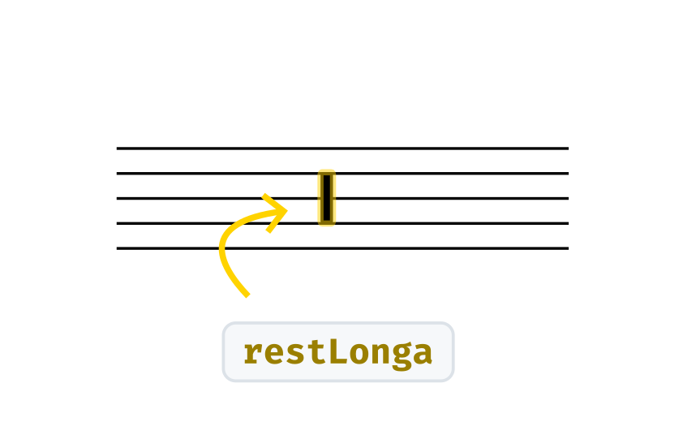
</p>

- Represents a pause for 16 beats (4 whole rests).
- Often represents a rest longer than one measure.
- Can be part of a rest cluster, see [`restText`](#resttext) for more info.

<p>
  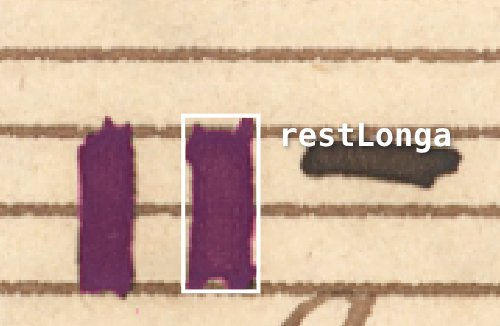
  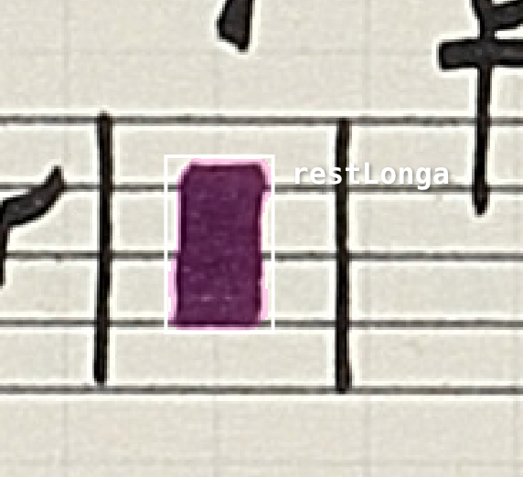
</p>

<details>
  <summary>🔗 Example documents</summary>

  - https://ufallab.ms.mff.cuni.cz/~mayer/mung-studio/#/simple-backend/ca625f33-b4e1-49a9-bbc4-63130ba0fe70_010e98cc-eab8-47d9-8424-1cfc8d3c1c1a
  - https://ufallab.ms.mff.cuni.cz/~mayer/mung-studio/#/simple-backend/13abc7f9-5e3f-4e85-b753-0dab090728fe_da0e8022-a312-432a-b825-d66c024aa816
</details>

---


### `restDoubleWhole`

*(Previously in CVAT `rest_breve` and `restBreve` in MuNG)*

*(See the corresponding [SMuFL group](https://w3c.github.io/smufl/latest/tables/rests.html))*

<p>
  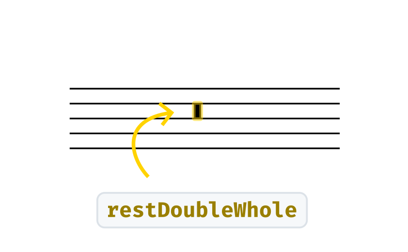
</p>

- Represents a pause for 8 beats (2 whole rests).
- Often represents a rest longer than one measure.
- Can be part of a rest cluster, see [`restText`](#resttext) for more info.

<p>
  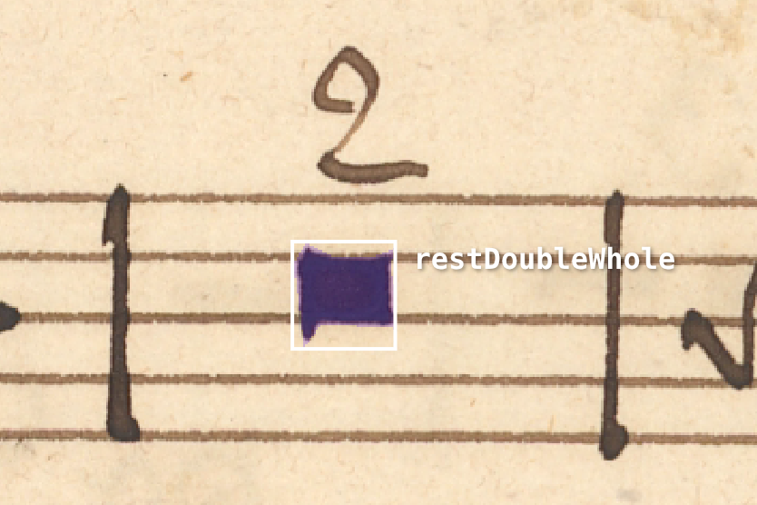
  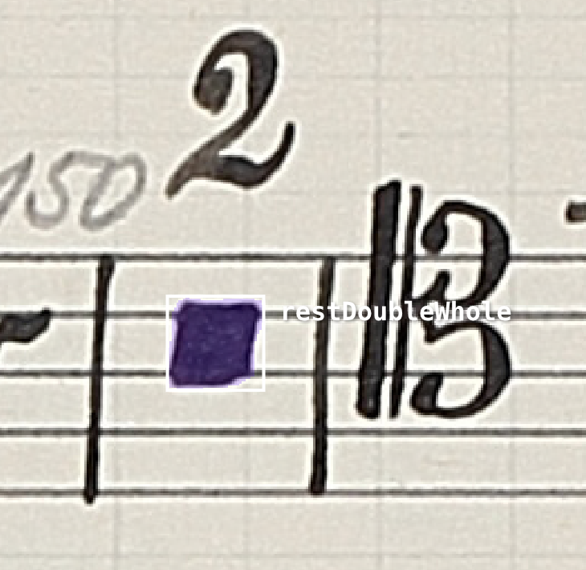
</p>

<details>
  <summary>🤔 Why `restDoubleWhole` and not `restBreve`?</summary>

  Because [SMuFL](https://w3c.github.io/smufl/latest/tables/rests.html). I don't like it either, but it's the standard.
</details>

<details>
  <summary>🔗 Example documents</summary>

  - https://ufallab.ms.mff.cuni.cz/~mayer/mung-studio/#/simple-backend/ca625f33-b4e1-49a9-bbc4-63130ba0fe70_010e98cc-eab8-47d9-8424-1cfc8d3c1c1a
  - https://ufallab.ms.mff.cuni.cz/~mayer/mung-studio/#/simple-backend/13abc7f9-5e3f-4e85-b753-0dab090728fe_da0e8022-a312-432a-b825-d66c024aa816
</details>

---


### `restHBar`

*(Previously in CVAT `rest_multimeasure` and `multiMeasureRest` in MuNG)*

*(See the corresponding [SMuFL group](https://w3c.github.io/smufl/latest/tables/rests.html))*

<p>
  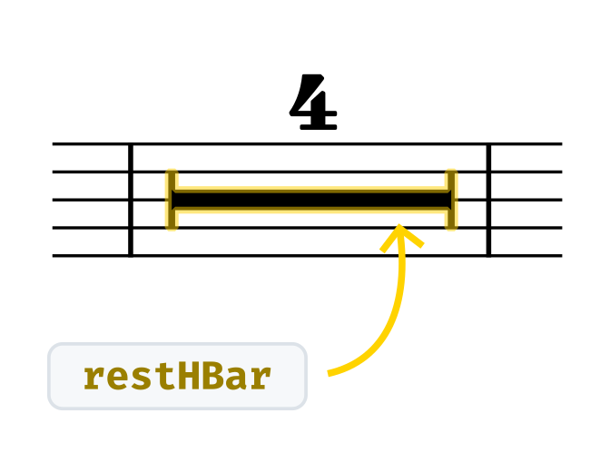
  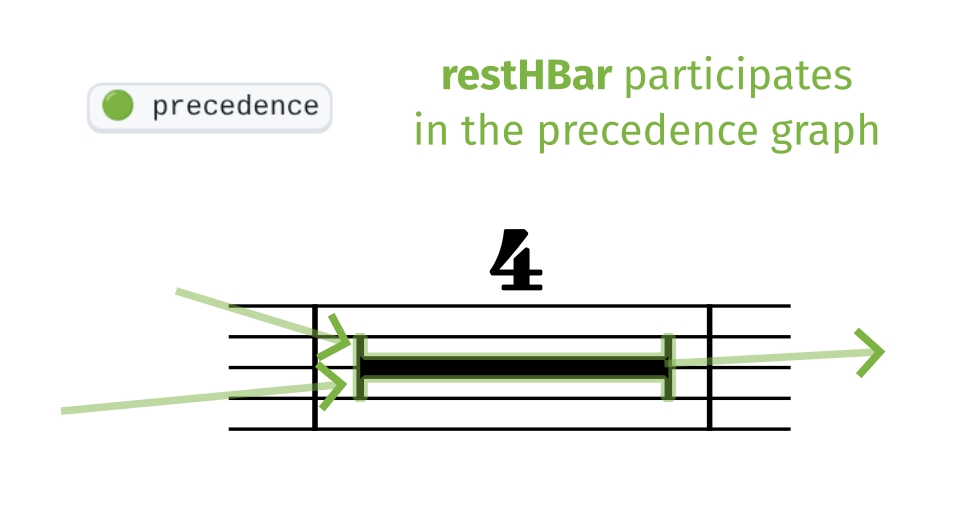
</p>

- Represents a rest for a given number of measures (the number of measures is written above)
- The number above the HBar is a `restText`, [see below](#resttext).
- The HBar symbol participates in the <kbd>🟢 precedence</kbd> graph like any other rest.

<p>
  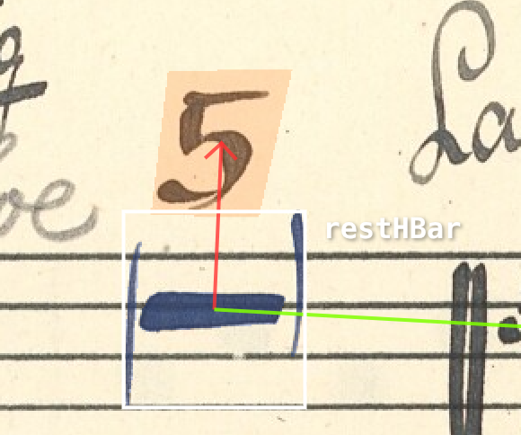
  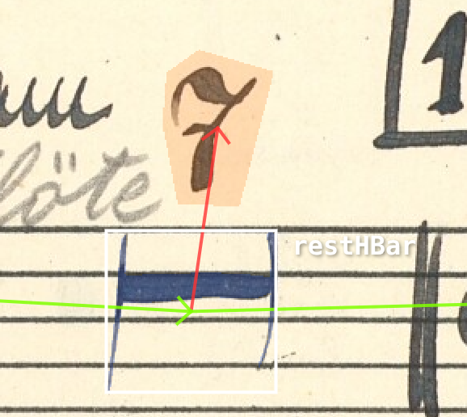
</p>

<details>
  <summary>🔗 Example documents</summary>

  - https://ufallab.ms.mff.cuni.cz/~mayer/mung-studio/#/simple-backend/02636110-aad4-4118-bc5f-da8c4bcef115_d3767b0a-a554-4a3b-bee1-85a021c29010
</details>

---


### `restText`

*(`restText` is not part of SMuFL, because it is a text class)*

<p>
  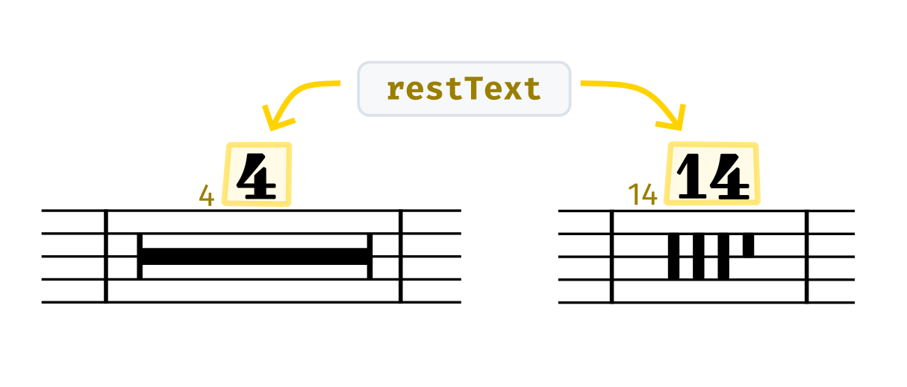
  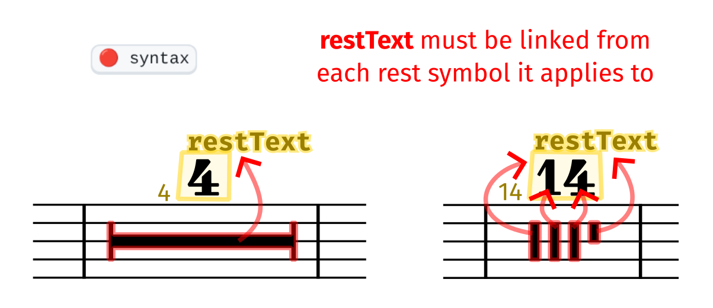
  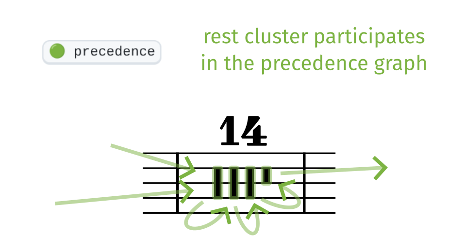
</p>

- Represents the numbers written above or below a longer rest. This rest may either be a **HBar** or a **rest cluster**. The number indicates the number of measures the pause takes. For HBars, this number must be present, for rest clusters it's optional and is only used for faster reading of the rest cluster.
- Use a **convex hull** mask.
- It is a **text node** so the text inside the node must be [transcribed](https://github.com/OmniOMR/mung-studio/blob/main/docs/user-manual/user-manual.md#transcribing-text).
- The text sometimes contains a dot, e.g. `6.`, transcribe the dot as well.
- The individual digits are NOT annotated as separate object, only transcribed.
- Add a <kbd>🔴 syntax</kbd> link from each rest (or HBar) to the `restText` object.
- The rest cluster consists of individual rest objects, which participate in the <kbd>🟢 precedence</kbd> graph as usual.

<p>
  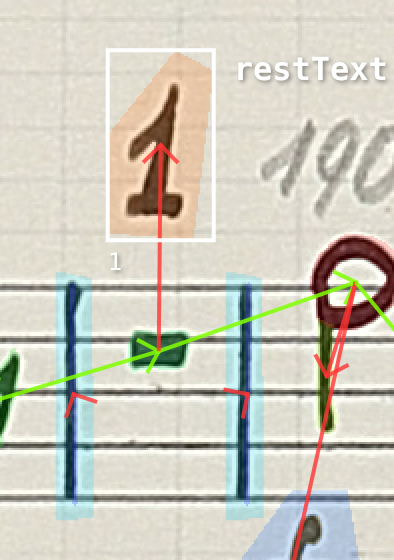
  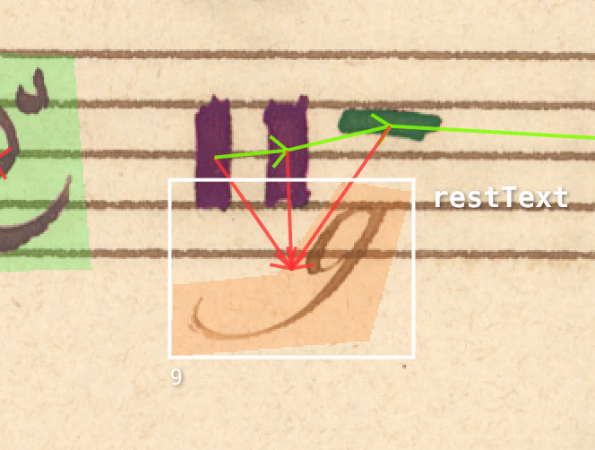
  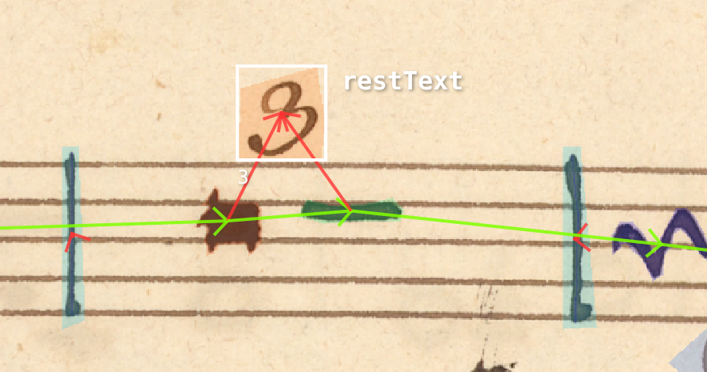
  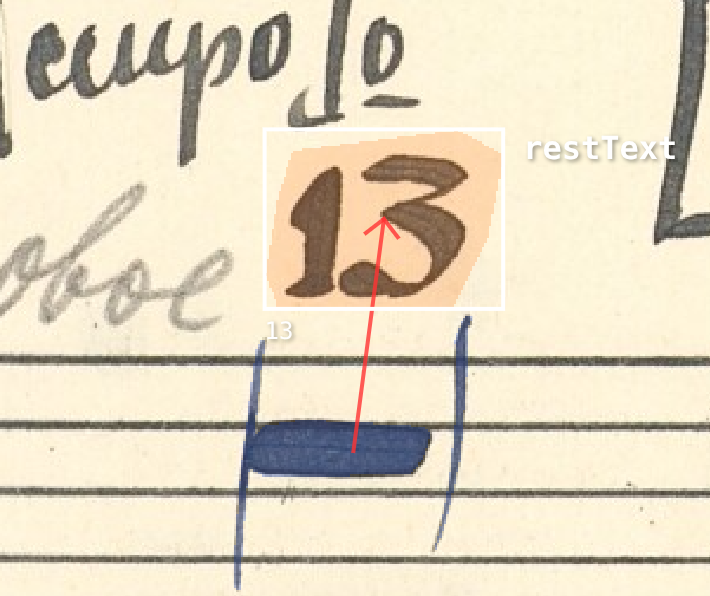
</p>

<details>
  <summary>🔗 Example documents</summary>

  - https://ufallab.ms.mff.cuni.cz/~mayer/mung-studio/#/simple-backend/02636110-aad4-4118-bc5f-da8c4bcef115_d3767b0a-a554-4a3b-bee1-85a021c29010
  - https://ufallab.ms.mff.cuni.cz/~mayer/mung-studio/#/simple-backend/ca625f33-b4e1-49a9-bbc4-63130ba0fe70_010e98cc-eab8-47d9-8424-1cfc8d3c1c1a
  - https://ufallab.ms.mff.cuni.cz/~mayer/mung-studio/#/simple-backend/13abc7f9-5e3f-4e85-b753-0dab090728fe_da0e8022-a312-432a-b825-d66c024aa816
</details>

---


## Accidentals

<p>
  
  
</p>


### `accidentalSharp`

*(Previously in CVAT `sharp`)*

- Always **leave out the center!** Don’t just outline the shape.

<p>
  
</p>

---


### `accidentalFlat`

*(Previously in CVAT `flat`)*

- Always **leave out the center!** Don’t just outline the shape.

<p>
  
</p>

---


### `accidentalNatural`

*(Previously in CVAT `natural`)*

- Always **leave out the center!** Don’t just outline the shape.

<p>
  
</p>

---


### `accidentalDoubleSharp`

*(Previously in CVAT `double_sharp`)*

TODO: image

---


### `accidentalDoubleFlat`

*(Previously in CVAT `double_flat`)*

TODO: image

---


## Clefs


### `gClef`

*(Previously in CVAT `clef_g`)*

- Always **leave out the center!** Don’t just outline the shape.

<p>
  
  
</p>

---


### `gClefChange`

- Used when the **clef changes in the middle of the staff** to a G clef.
- These symbols are typically **smaller in size** than standard clefs.
- Make sure to annotate them as **this object**, distinct from the regular clef symbols at the beginning of the staff.

TODO: image - https://ufallab.ms.mff.cuni.cz/~mayer/mung-studio/#/simple-backend/30d6c780-c8fe-11e7-9c14-005056827e51_36058ae0-f593-11e7-b30f-5ef3fc9ae867

---


### `fClef`

*(Previously in CVAT `clef_f`)*

<p>
  
</p>

---


### `fClefChange`

- Used when the **clef changes in the middle of the staff** to an F clef.
- These symbols are typically **smaller in size** than standard clefs.
- Make sure to annotate them as **this object**, distinct from the regular clef symbols at the beginning of the staff.

<p>
  
</p>

<details>
  <summary>🔗 Example documents</summary>

  - https://ufallab.ms.mff.cuni.cz/~mayer/mung-studio/#/simple-backend/93736ae0-d1c5-11ec-8264-005056827e51_f824ce8b-a273-4bd3-a70c-9d6381d69806
  - https://ufallab.ms.mff.cuni.cz/~mayer/mung-studio/#/simple-backend/bf061840-2322-11eb-979b-005056827e52_3f8e002f-e26c-499c-b3f7-8114fae278f0
</details>

---


### `cClef`

*(Previously in CVAT `clef_c`)*

<p>
  
</p>

---


### `cClefChange`

- Used when the **clef changes in the middle of the staff** to a C clef.
- These symbols are typically **smaller in size** than standard clefs.
- Make sure to annotate them as **this object**, distinct from the regular clef symbols at the beginning of the staff.

<p>
  
</p>

<details>
  <summary>🔗 Example documents</summary>

  - https://ufallab.ms.mff.cuni.cz/~mayer/mung-studio/#/simple-backend/93736ae0-d1c5-11ec-8264-005056827e51_f824ce8b-a273-4bd3-a70c-9d6381d69806
</details>

---


## `keySignature`

- A **container (parent) symbol** representing the entire key signature.
- Annotate it as a **convex hull (rough mask)** covering all the individual accidentals.
- <kbd>🔴 syntax</kbd> links lead from `keySignature` to all accidentals within it

<p>
  
</p>

---


## Time Signatures

<p>
  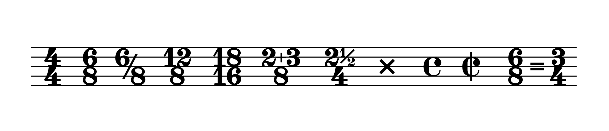
</p>

Time signature specifies how the rhythm is counted in the song. It consists of the upper number, stating how many beats there are per measure and the lower number, which specifies which note duration (half, quarter, eighth) will represent one beat.

- See the types of time signatures in [Dorico documentation](https://www.steinberg.help/r/dorico-pro/5.1/en/dorico/topics/notation_reference/notation_reference_time_signatures/notation_reference_time_signatures_types_r.html).
- And more extensive description of these on [Wikipedia](https://en.wikipedia.org/wiki/Time_signature).

Time signatures appear:

- at the beginning of the score
- at the start of a measure for which the signature changes
- at the end of a staff if the signature changes on the first measure of the next line


### `timeSig[0..9]`

*(Previously in CVAT `time_signature_element` and `numeral0..9` in MuNG)*

*(See the corresponding [SMuFL Group](https://w3c.github.io/smufl/latest/tables/time-signatures.html))*

<p>
  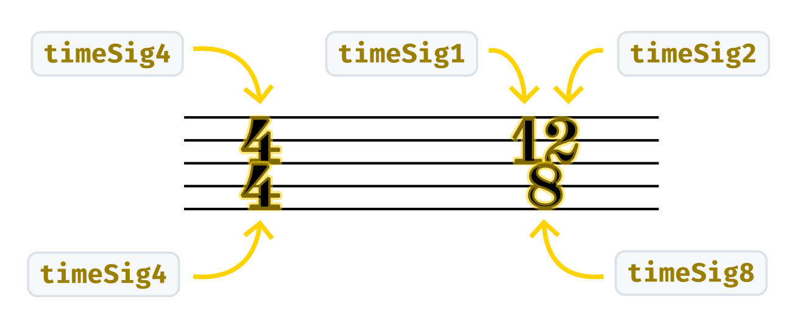
  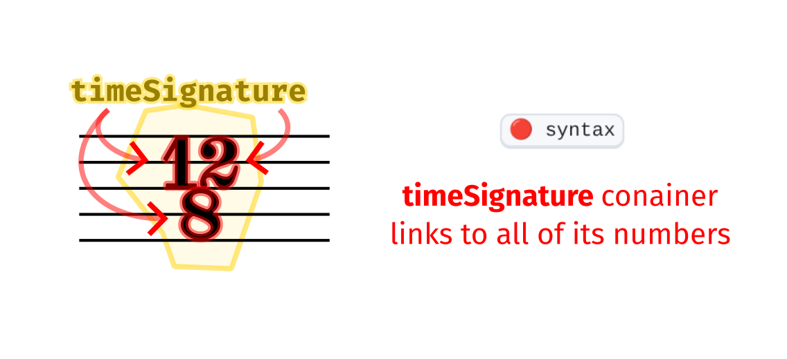
  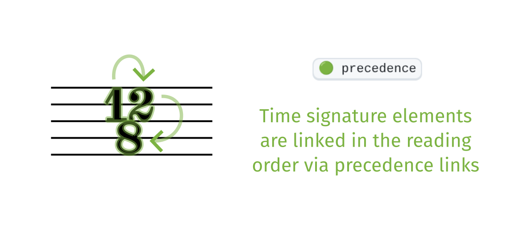
</p>

Classes: `timeSig0`, `timeSig1`, `timeSig2`, ... `timeSig9`

- Represents individual **digits** in the time signature (0-9).
- If the number is **greater than 9**, annotate each digit separately. (For example, a time signature of `10` should be split into **`timeSig1`** and **`timeSig0`**.)
- Annotate mask pixels **precisely**.
- Each number has an incomming <kbd>🔴 syntax</kbd> link from the [`timeSignature` container](#timesignature).
- Time signature elements are linked via <kbd>🟢 precedence</kbd> links in the order they are read (left-to-right, top-down).

<p>
  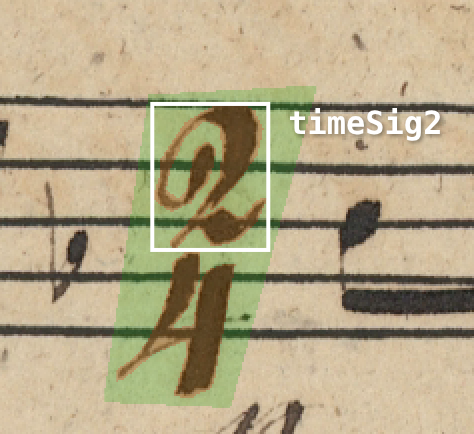
  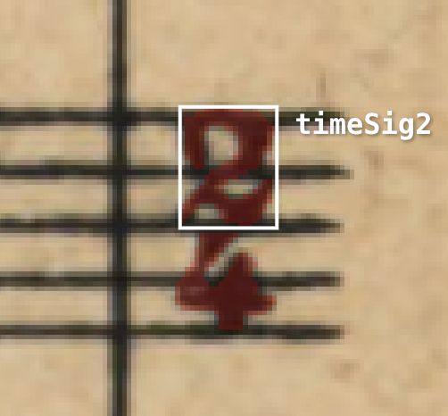
  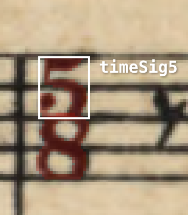
  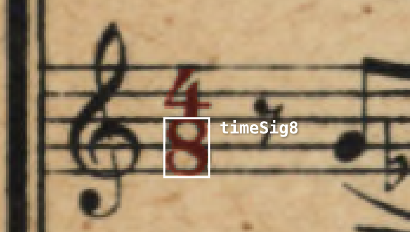
  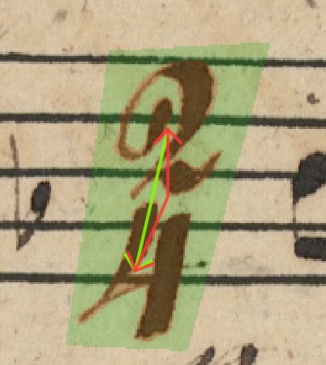
</p>

Time signature may appear at the end of a staff or even after the end:

<p>
  
</p>

Sometimes the lower number is very ornamented. This is because there aren't that many options for its value (2, 4, 8, 16, 32) and it's mostly just 4. Here we can see the first measure has 3 quarter (1/4) notes, so the lower number must be 4. We annotate it as such:

<p>
  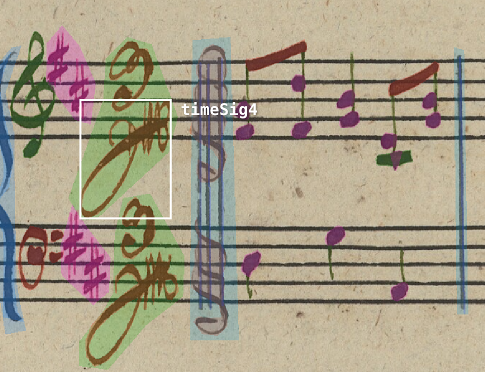
</p>


<details>
  <summary>🔗 Example documents</summary>

  - https://ufallab.ms.mff.cuni.cz/~mayer/mung-studio/#/simple-backend/028ac720-8af7-4ecc-9884-edeaf6dce2ae_5f5369b3-7629-4735-80a7-d409e218d622
  - https://ufallab.ms.mff.cuni.cz/~mayer/mung-studio/#/simple-backend/30d6c780-c8fe-11e7-9c14-005056827e51_368171a0-f593-11e7-b30f-5ef3fc9ae867
  - https://ufallab.ms.mff.cuni.cz/~mayer/mung-studio/#/simple-backend/028ac720-8af7-4ecc-9884-edeaf6dce2ae_325f277f-4747-412b-9e64-7dbc8c4ffdb9
</details>

---


### `timeSigCommon`

*(Previously in CVAT `time_signature_element`)*

*(See the corresponding [SMuFL Group](https://w3c.github.io/smufl/latest/tables/time-signatures.html))*

<p>
  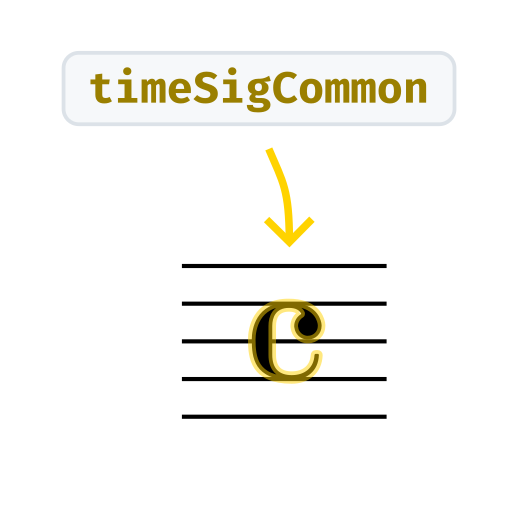
  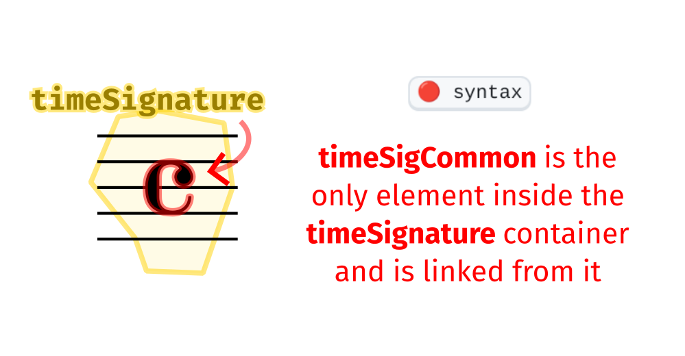
</p>

- The **C** symbol, meaning common time, i.e. 4/4
- Must be placed inside a [`timeSignature` container](#timesignature), even when it stands alone.
- Has an incomming <kbd>🔴 syntax</kbd> link from the [`timeSignature` container](#timesignature).
- Has no <kbd>🟢 precedence</kbd> links (because it's always alone).

<p>
  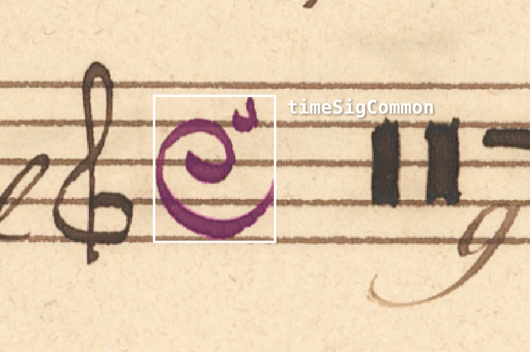
  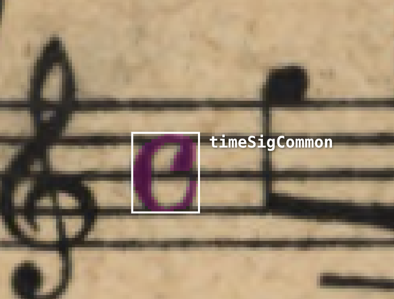
  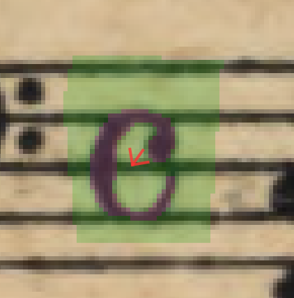
</p>

<details>
  <summary>🔗 Example documents</summary>

  - https://ufallab.ms.mff.cuni.cz/~mayer/mung-studio/#/simple-backend/13abc7f9-5e3f-4e85-b753-0dab090728fe_da0e8022-a312-432a-b825-d66c024aa816
  - https://ufallab.ms.mff.cuni.cz/~mayer/mung-studio/#/simple-backend/30d6c780-c8fe-11e7-9c14-005056827e51_36758ac0-f593-11e7-b30f-5ef3fc9ae867
</details>

---


#### `mensuralProlationCombiningDot`

*(See the corresponding [SMuFL Group](https://w3c.github.io/smufl/latest/tables/medieval-and-renaissance-prolations.html))*

<p>
  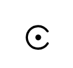
  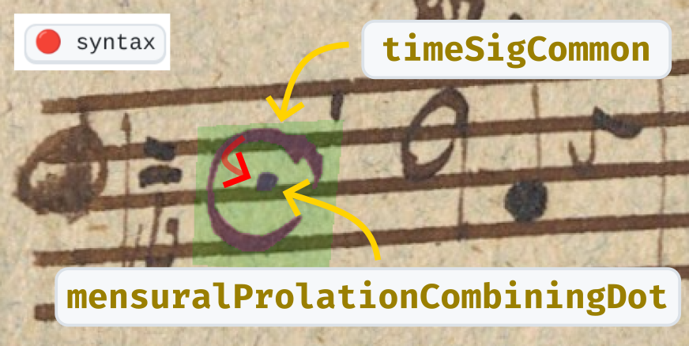
</p>

In mensural notation, there is a time signature symbol that looks like **C** with a dot inside. This symbol should not be used in modern notation, however we encountered it in one of the documents. Since in that document, the time is 4/4, we decided to annotate the **C** as `timeSigCommon` and the dot in the middle as a `mensuralProlationCombiningDot` (which does exist in SMuFL). If you come across this again and the 4/4 time will hold, annotate it the same way, otherwise notify us.

- Has an incomming <kbd>🔴 syntax</kbd> link from the `timeSigCommon`, **NOT** the `timeSignature` container.
- Has no <kbd>🟢 precedence</kbd> links.

<details>
  <summary>🔗 Example documents</summary>

  - https://ufallab.ms.mff.cuni.cz/~mayer/mung-studio/#/simple-backend/030e4212-477f-4eae-9cf7-fc2c4d918b0e_fec3ef88-8fe3-4565-a102-fcb0c7e598c1
</details>

---


### `timeSigCutCommon`

*(Previously in CVAT `time_signature_element`)*

*(See the corresponding [SMuFL Group](https://w3c.github.io/smufl/latest/tables/time-signatures.html))*

<p>
  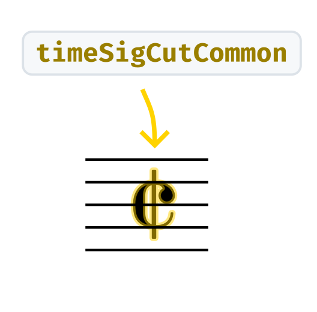
  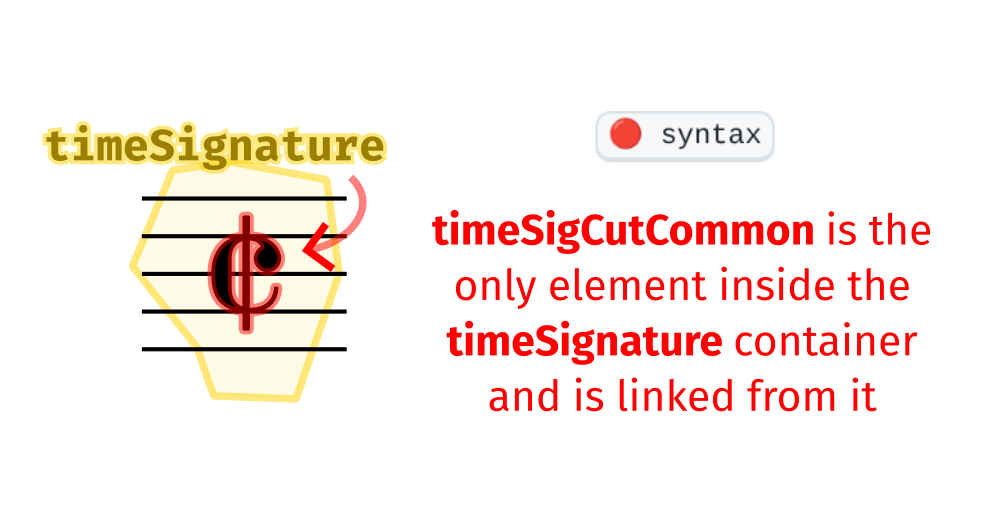
</p>

- The slashed **C/** symbol, meaning cut-common time, i.e. 2/2
- Must be placed inside a [`timeSignature` container](#timesignature), even when it stands alone.
- Has an incomming <kbd>🔴 syntax</kbd> link from the [`timeSignature` container](#timesignature).
- Has no <kbd>🟢 precedence</kbd> links (because it's always alone).

<p>
  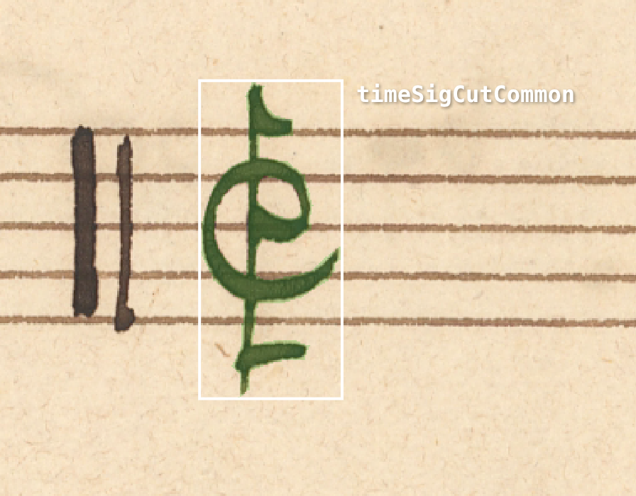
</p>

<details>
  <summary>🔗 Example documents</summary>

  - https://ufallab.ms.mff.cuni.cz/~mayer/mung-studio/#/simple-backend/13abc7f9-5e3f-4e85-b753-0dab090728fe_da0e8022-a312-432a-b825-d66c024aa816
</details>

---


### `timeSigSlash`

*(See the corresponding [SMuFL Group](https://w3c.github.io/smufl/latest/tables/time-signatures-supplement.html))*

*(previously `timeSigDivider`)*

<p>
  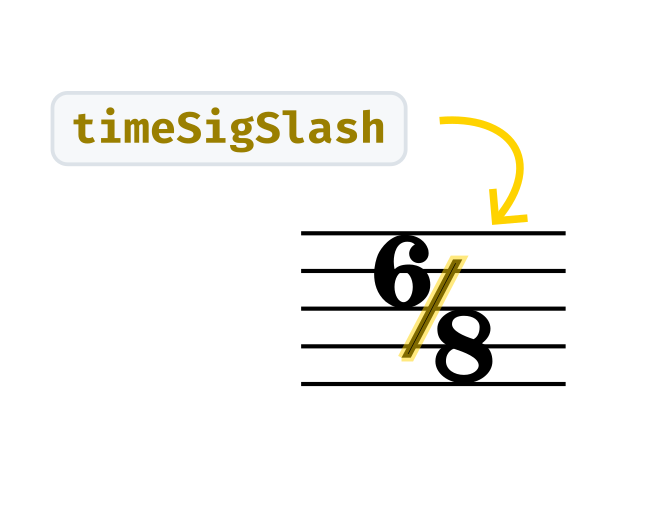
  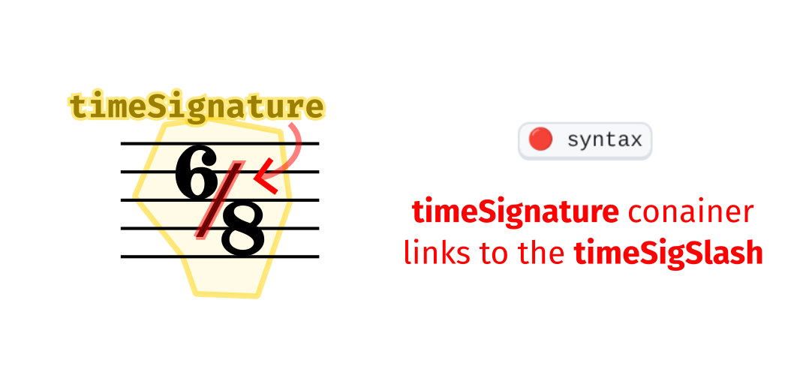
  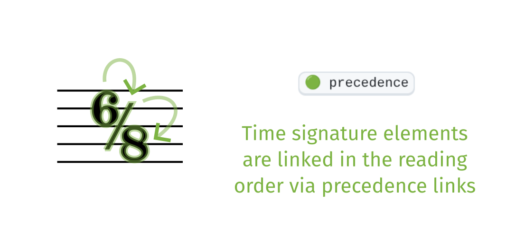
</p>

- Represents the **horizontal line or slash** separating the upper and lower numbers of a time signature.
- Not to be confused with `timeSigFractionalSlash` (see below), which represents the slash in a fraction used within the top number.
- Has an incomming <kbd>🔴 syntax</kbd> link from the [`timeSignature` container](#timesignature).
- Time signature elements are linked via <kbd>🟢 precedence</kbd> links in the order they are read (left-to-right, top-down).

<p>
  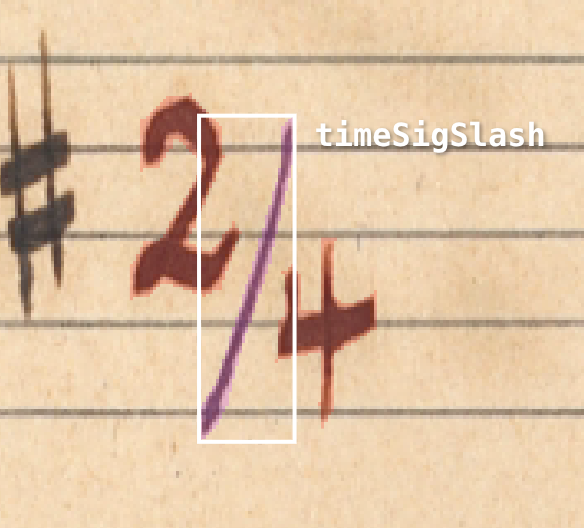
  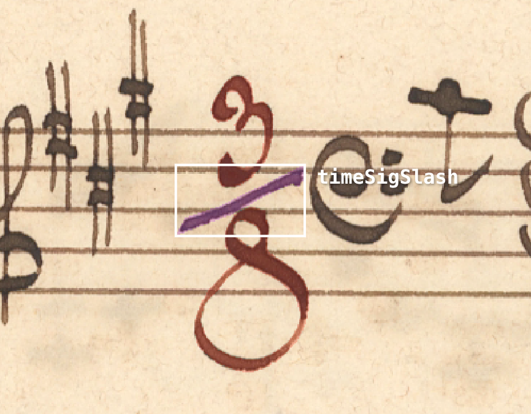
  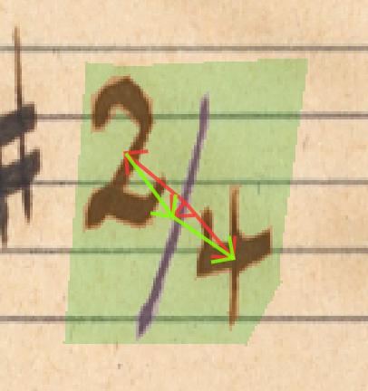
</p>

Sometimes the slash is ornamented:

<p>
  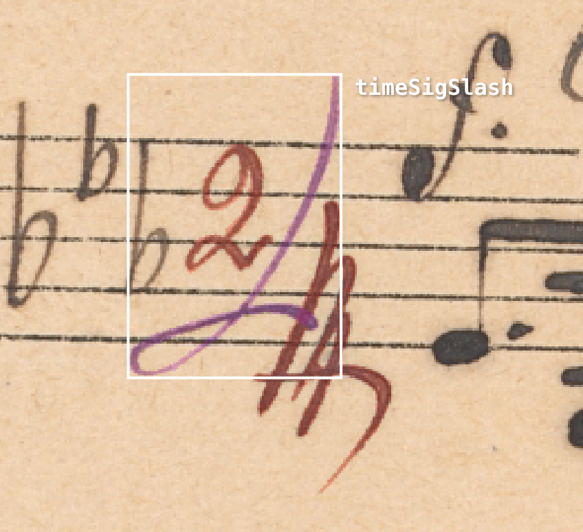
</p>

<details>
  <summary>🔗 Example documents</summary>

  - https://ufallab.ms.mff.cuni.cz/~mayer/mung-studio/#/simple-backend/1d507bc2-87e7-4b61-8bea-6126616c4851_264db484-acd2-4b06-9ed7-64c7668aa6c8
  - https://ufallab.ms.mff.cuni.cz/~mayer/mung-studio/#/simple-backend/25214fee-0e1e-4c9b-b404-b57a0599acab_02c3d6a4-8ff7-4639-8fe9-9c5c122a67bb
  - https://ufallab.ms.mff.cuni.cz/~mayer/mung-studio/#/simple-backend/13abc7f9-5e3f-4e85-b753-0dab090728fe_9d4412a1-0cf3-4475-a022-9f37984272fb
</details>

---


### `timeSigFractionalSlash`

*(See the corresponding [SMuFL Group](https://w3c.github.io/smufl/latest/tables/time-signatures.html))*

<p>
  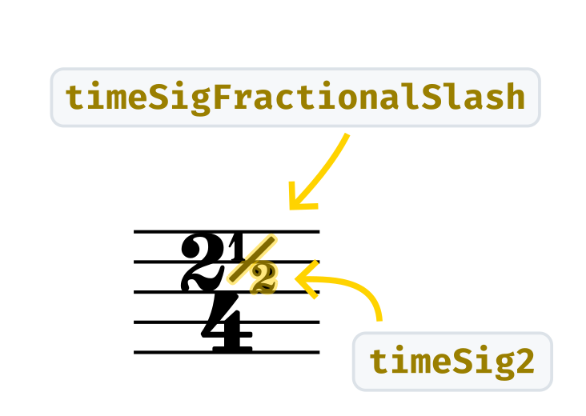
  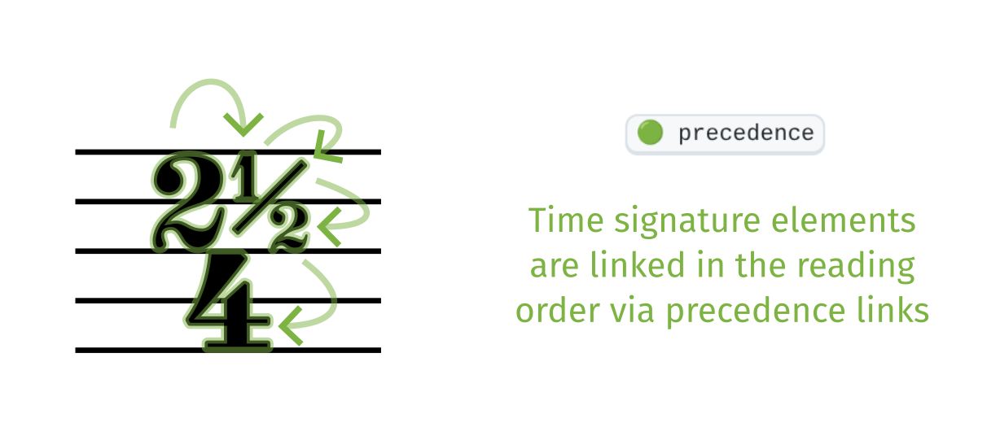
</p>

Used in non-whole measure sizes, e.g. one measure is two-and-a-half beats long.

- Represents the slash inside a fraction inside the time signature.
- Not to be confused with `timeSigSlash` (see above), which separates the two halves of the time signature.
- Has an incomming <kbd>🔴 syntax</kbd> link from the [`timeSignature` container](#timesignature).
- Time signature elements are linked via <kbd>🟢 precedence</kbd> links in the order they are read (left-to-right, top-down).

---


### `timeSigPlus`

*(See the corresponding [SMuFL Group](https://w3c.github.io/smufl/latest/tables/time-signatures.html))*

<p>
  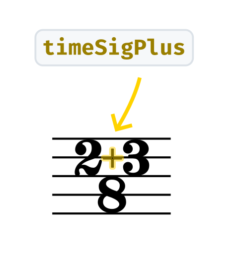
  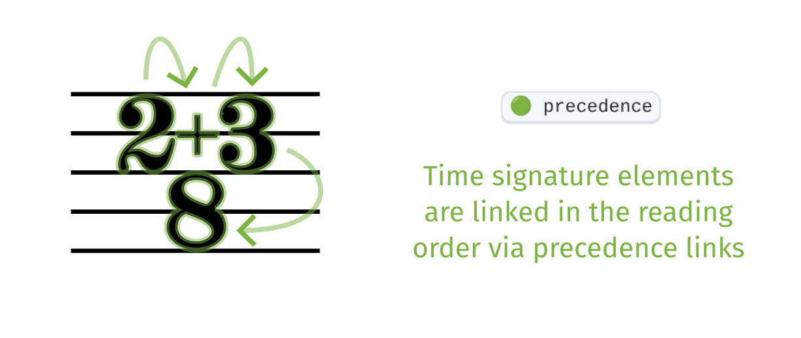
</p>

Used to communicate the semantic grouping of beats within a measure. The example above corresponds to 5/8 with 5 being understood as 2+3.

- Represents the **plus sign (“+”)** used in [additive meters](https://en.wikipedia.org/wiki/Time_signature#Additive_meters).
- Has an incomming <kbd>🔴 syntax</kbd> link from the [`timeSignature` container](#timesignature).
- Time signature elements are linked via <kbd>🟢 precedence</kbd> links in the order they are read (left-to-right, top-down).

---


### `timeSigEquals`

*(See the corresponding [SMuFL Group](https://w3c.github.io/smufl/latest/tables/time-signatures.html))*

<p>
  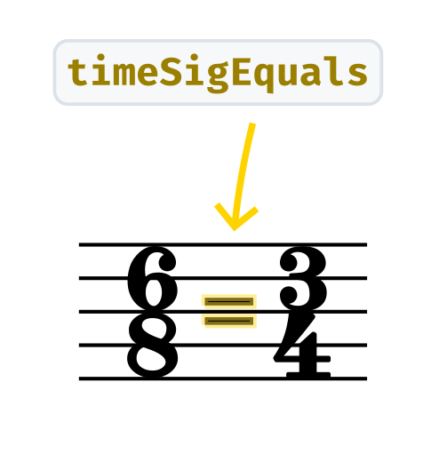
  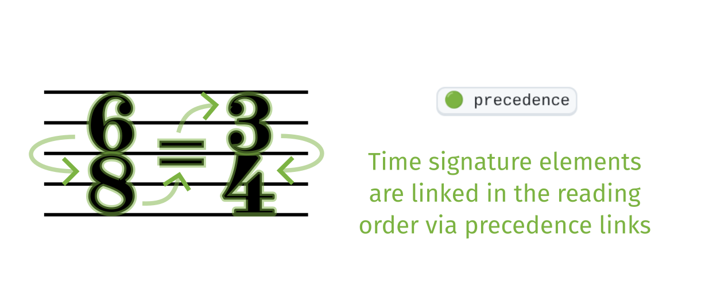
</p>

- Represents the **equals sign (“=”)** used in time signatures.
- Has an incomming <kbd>🔴 syntax</kbd> link from the [`timeSignature` container](#timesignature).
- Time signature elements are linked via <kbd>🟢 precedence</kbd> links in the order they are read (left-to-right, top-down).

---


### `timeSignature`

*(`timeSignature` is not part of SMuFL, because it is a container class)*

<p>
  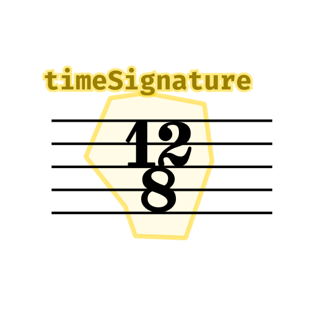
</p>

- A **container class** for grouping all elements that form a time signature (see the elements listed above).
- Create one container for the whole time signature.
- There is one <kbd>🔴 syntax</kbd> going from the container to each of the elements making up the time signature (numbers, slashes, plus, equals).
- The elements inside the time signature are linked together via <kbd>🟢 precedence</kbd> links in the order they are read (left-to-right, top-to-bottom). See the precedence diagrams above.

This is what the syntax and precerence graph hierarchy for the time signature container looks like:

<p>
  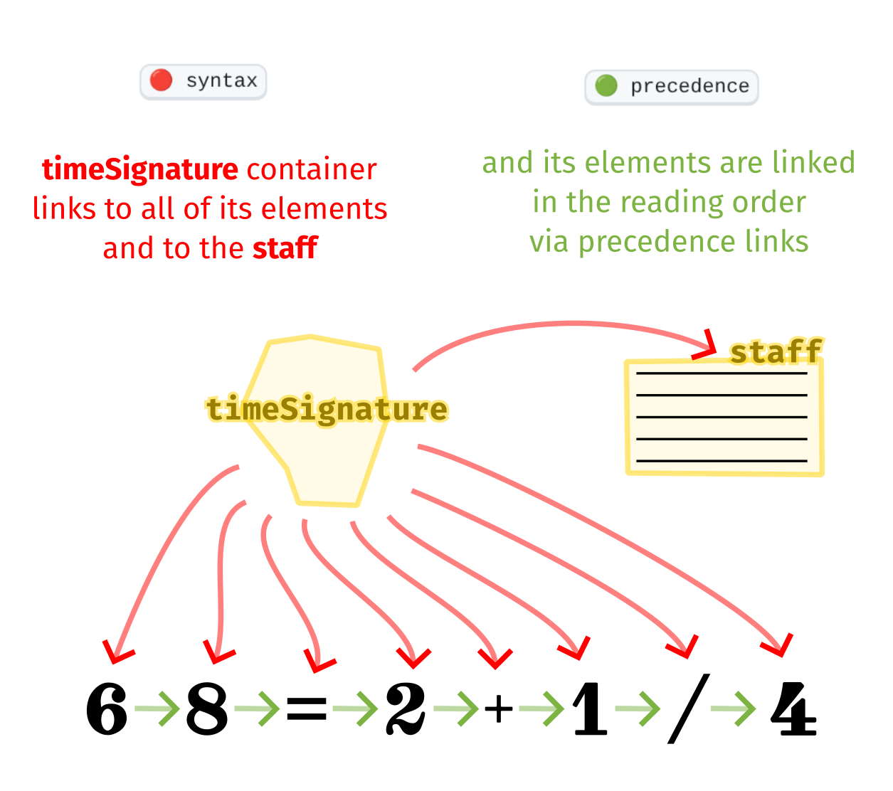
</p>

Examples:

<p>
  
  
  
</p>

When two time signatures are written next to each other, they represent an **alternating time signature**. It means that first measure uses the first signature, the second measure uses the second signature, and then it alternates measure by measure. We annotate this kind of signature as two separate `timeSignature` objects:

<p>
  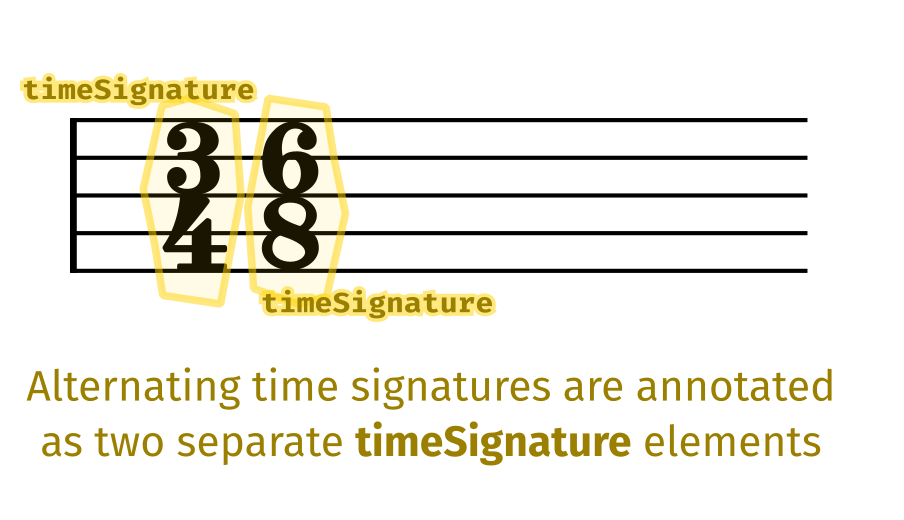
</p>

---


## Lyrics

*(See the corresponding [SMuFL Group](https://w3c.github.io/smufl/latest/tables/lyrics.html))*

- Lyrics are the text that the singer sings in the song.
- They are visually aligned with the music and situated below the staff.
- See lyrics in [MuseScore](https://musescore.org/en/handbook/3/lyrics).


### `lyricsText`

*(`lyricsText` is not part of SMuFL, because it is a text class)*

- Use **convex hull** mask.
- [Transcribe text](https://github.com/OmniOMR/mung-studio/blob/main/docs/user-manual/user-manual.md#transcribing-text) if readable, leave empty if unreadable. **When not sure, leave empty.**
- Align with noteheads via <kbd>🔴 syntax</kbd> links (see more below).
- Connect left-to-right via <kbd>🟢 precedence</kbd> links (see more below).

**In modern typeset documents:**

- Lyrics are already sliced up into syllables and aligned with noteheads.
- Annotate each syllable as a separate object.
- Syllables that **do not end the word** are terminated with a hyphen `-`. The hyphen is part of the syllable and **is transcribed**. The last syllable of the word does not have the hyphen. Do **not transcribe** the space before the hyphen, even if it is in the document.
  - Example: `biology` will be written in the score as as `bi-` `o-` `lo-` `gy`.
  - Each syllable is aligned with a note. There is a <kbd>🔴 syntax</kbd> link from the notehead to the syllable. If it's a chord, create a link from each of the noteheads.

<p>
  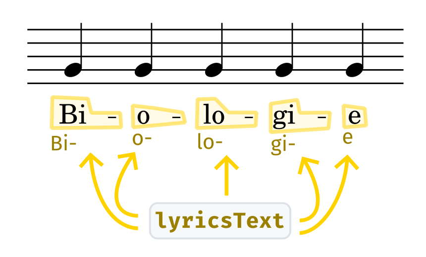
  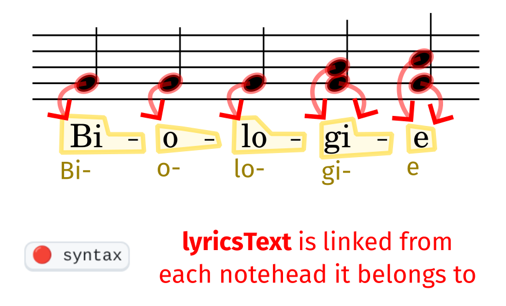
  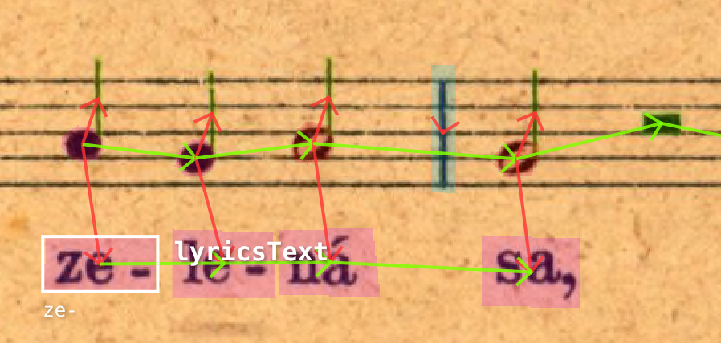
</p>

- Lyrics within one line are connected left-to-right via <kbd>🟢 precedence</kbd> links.
- Two lyrics objects are connected even when they don't follow each other immediately (when there's a rest). For lyrics, <kbd>🟢 precedence</kbd> links encode ordering, not duration.
- There are NO <kbd>🟢 precedence</kbd> links across different systems.

<p>
  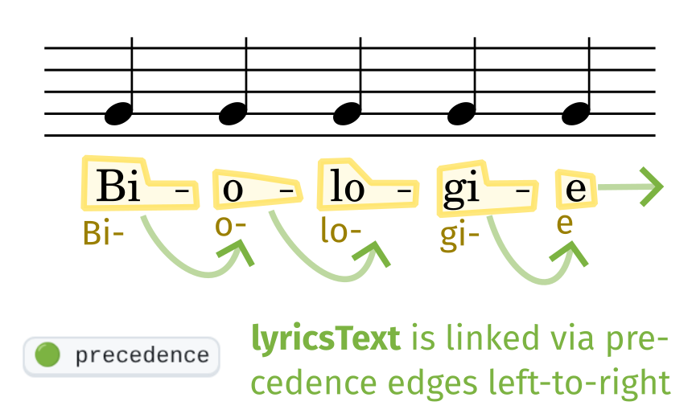
  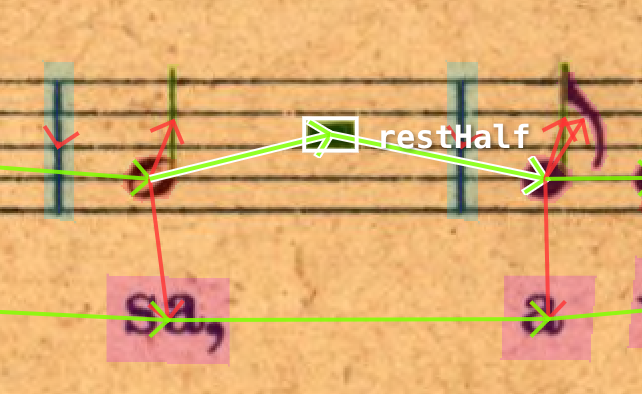
</p>

- If one syllable is sung across multiple notes (stretched), an underscore is used with its length stretching across the affected notes. This is called a **melisma**. Transcribe the underscore as one character `_`, regardless of its length.
  - Example: `pater` sung as `paaaaaaa-ter` will be written as `pa_` `ter`.
  - Add <kbd>🔴 syntax</kbd> links from all affected noteheads to the syllable.

<p>
  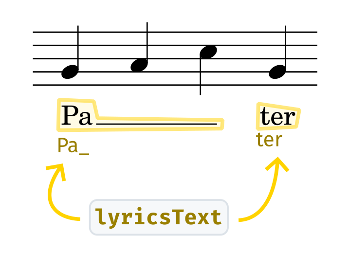
  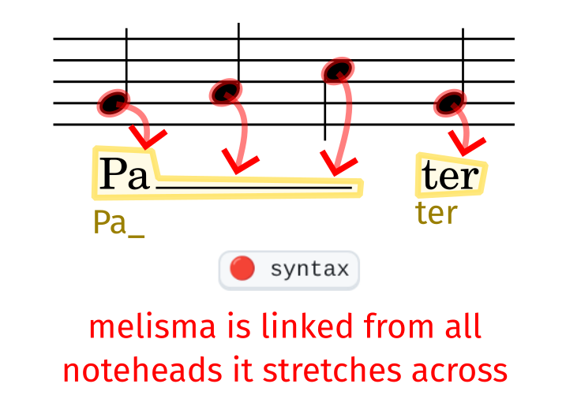
  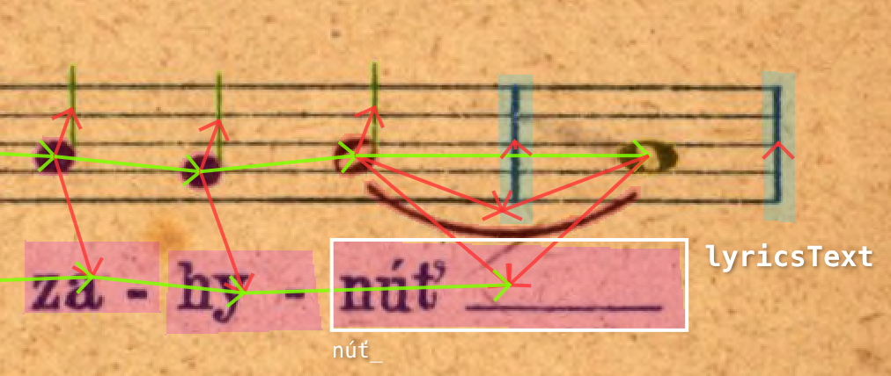
  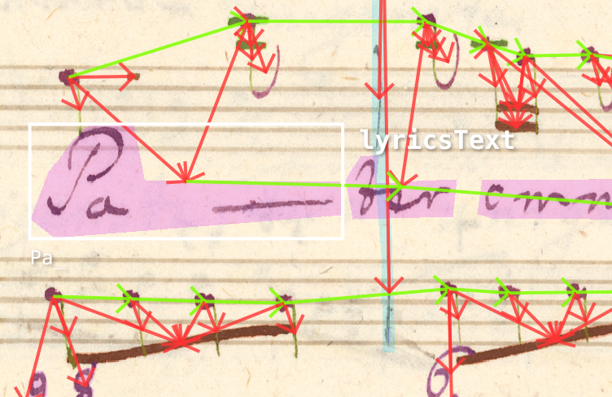
</p>

- If two syllables are sung within one note (tied together), an undertie is used to join them. This is called an **elision**. Transcribe the undertie as this undertie character `‿` ([U+203F](https://www.compart.com/en/unicode/U+203F)) and treat the whole thing as a single syllable.

> Copy the undertie character from here: `‿`

<p>
  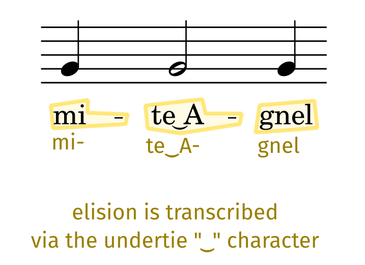
</p>

- Sometimes two words are sung as one syllable without the elision undertie being used. They are annotated as a single `lyricsText` object, since they are sung in one beat for that one note. The transcription text contains the space.

<p>
  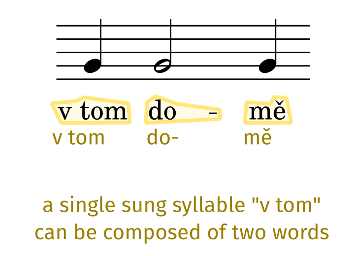
  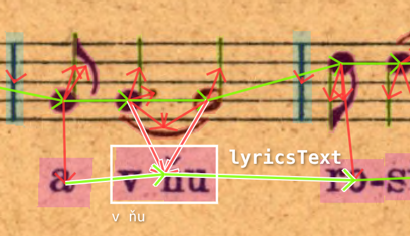
</p>

**In older typeset documents:**

- Words sometimes aren't explicitly split into syllables despite being over multiple notes. In these cases **do NOT split the word artificially**. We transcribe what is in the score, not what we want to see there. Annotate the whole word as single `lyricsText` element and <kbd>🔴 syntax</kbd> link it from both (all) notes.

<p>
  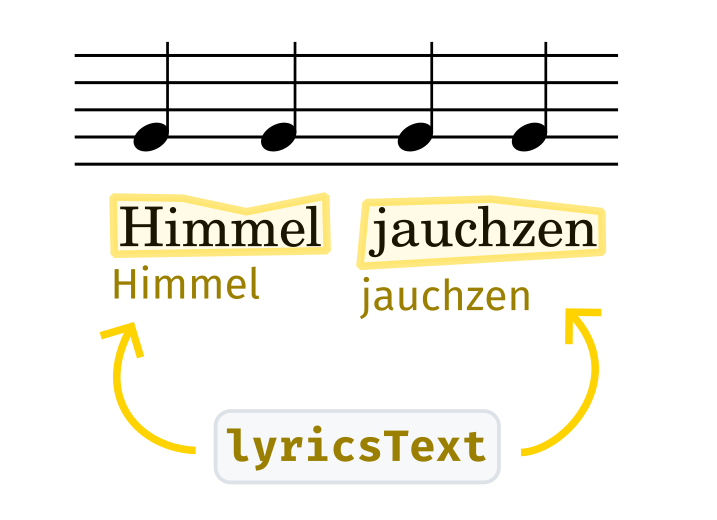
  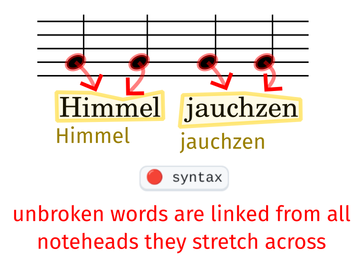
  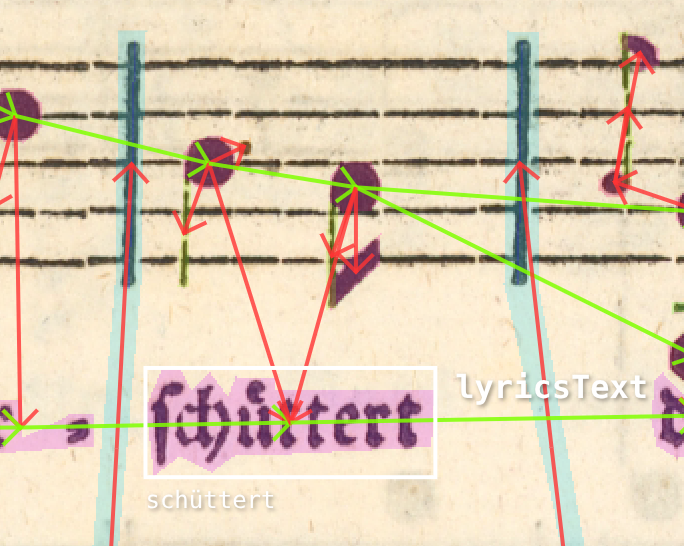
</p>

- Hyphens `-`, underscores `_` and equal signs `=` may be interchanged in their usage. **Annotate the character you see** (e.g. `=`), not the one that would be used in modern notation in that meaning (e.g. `-`).

<p>
  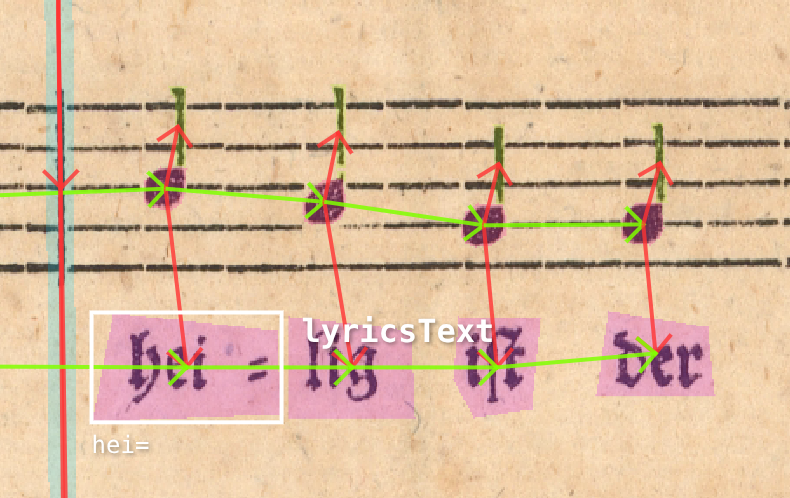
</p>

- The text is often **hard to read**. In that case, **do NOT transcribe** the text, unless you are sure what's written there.

**In handwritten documents:**

- Words have very weak alignment with notes and are almost never split up with hypehns into syllables. Annotate individual words as separate `lyricsText` objects and <kbd>🔴 syntax</kbd> link each from all of its notes.

<p>
  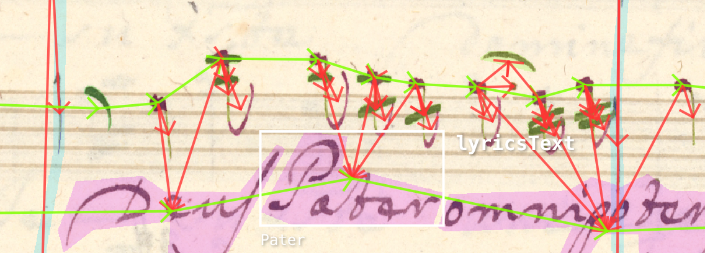
</p>

- If the handwritten word is split up, e.g. with *melisma* or hyphen, then DO split it into two `lyricsText` objects.

<p>
  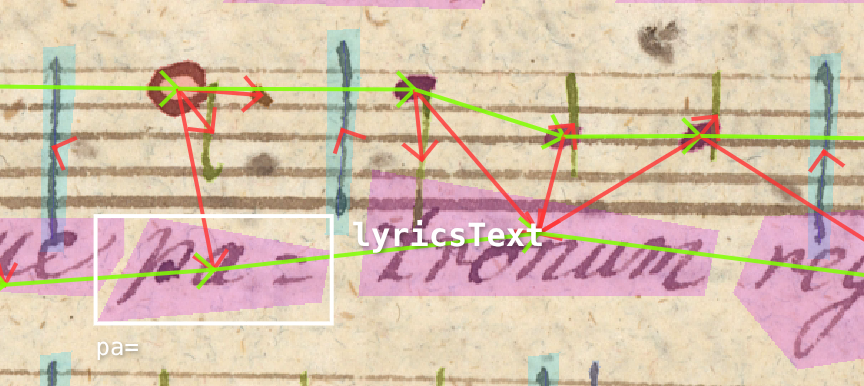
</p>

- The text is often **hard to read**. In that case, **do NOT transcribe** the text, unless you are sure what's written there.

<p>
  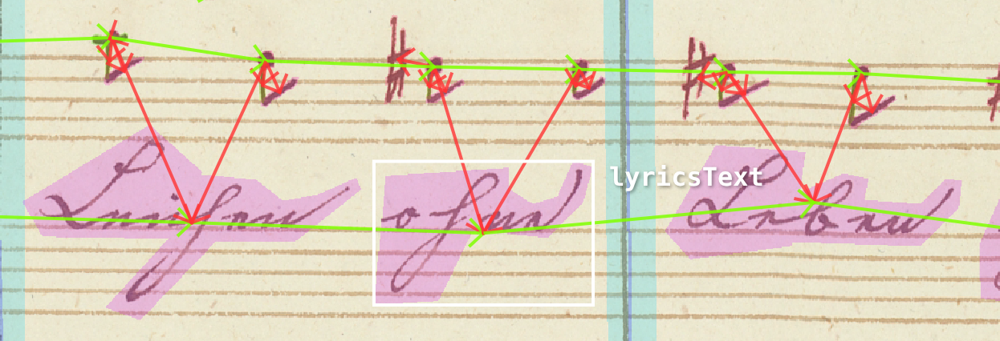
  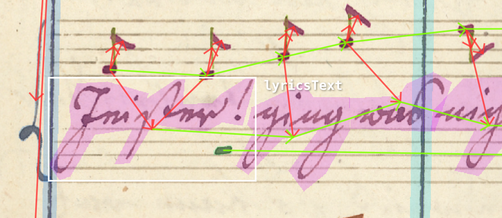
</p>

**Multiple verses:**

- Sometimes there are multiple verses underneath each other. Annotate each verse as if it was standing alone.
- The clustering of notes into `lyricsText` objects may be different between verses, based on the text phasing. See the second verse `ky-` below.
- The verse number is a [`verseNumber`](#versenumber) object (see below).

<p>
  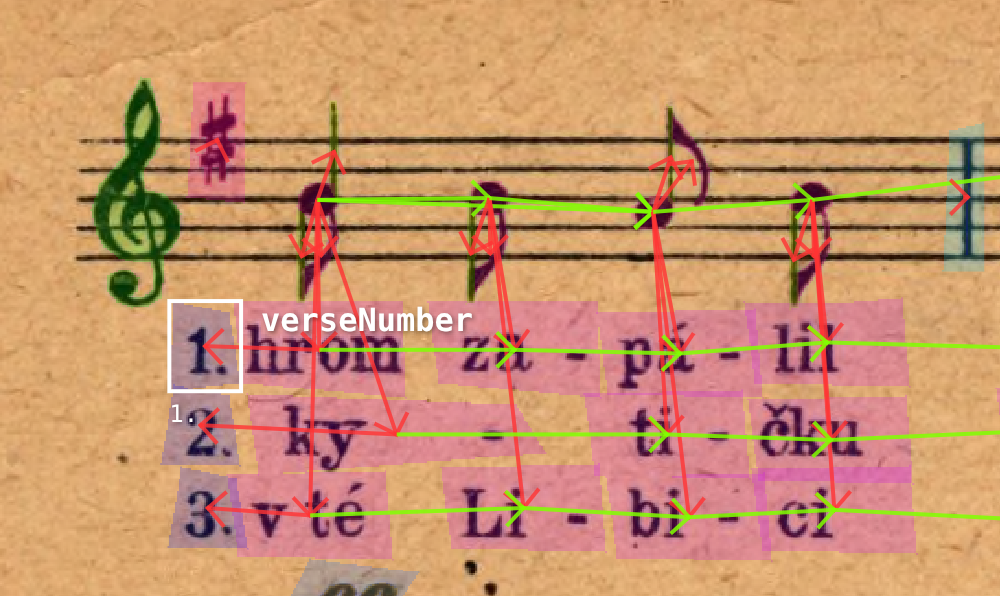
</p>

- If the text of additional verses is somewhere else on the page and not aligned with the music, annotate it as `otherText`.

**What not to do:**

- Do not annotate hyphens alone as standalone `lyricsText` objects. Hyphen always belongs to the syllable that precedes it.

<p>
  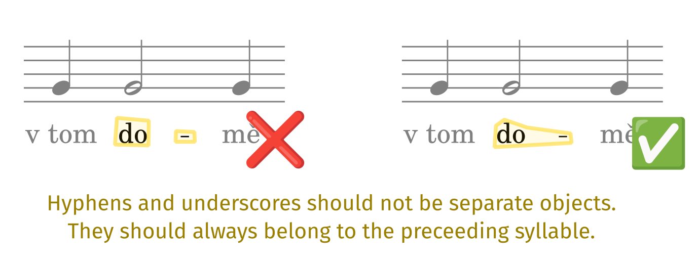
</p>

- Do not break (handwritten) words into syllables artificially. Annotate it as one object and link it from multiple noteheads instead.

<p>
  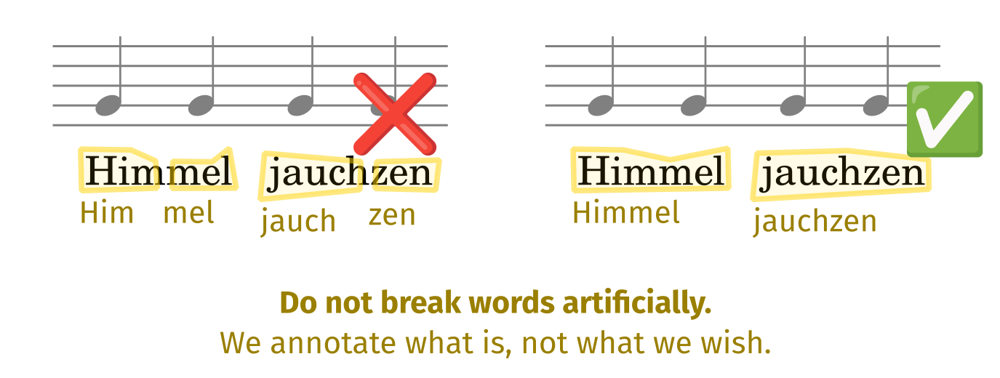
</p>

- When in doubt about the transcription, then **do NOT transcribe** the text. It's ok to leave the transcription box empty.

<p>
  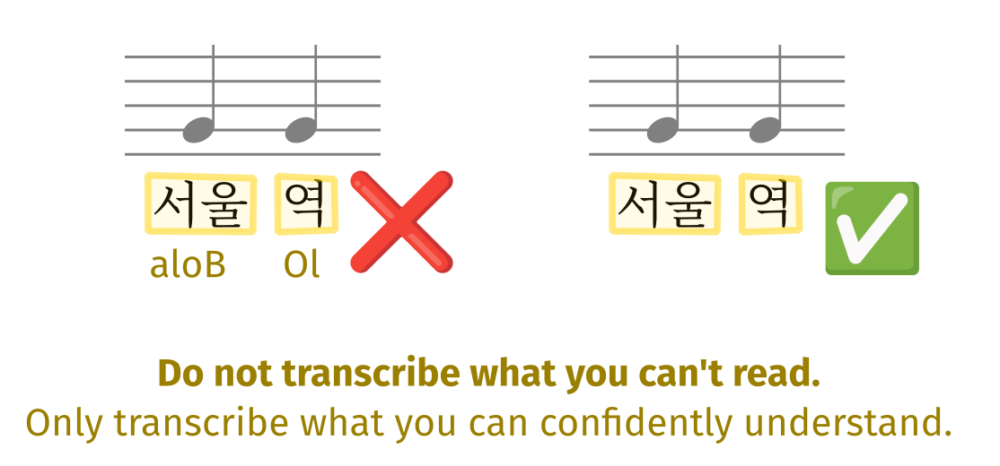
</p>

- Use convex masks to help the reviewer to see elements easily. Do not split the mask into two parts.

<p>
  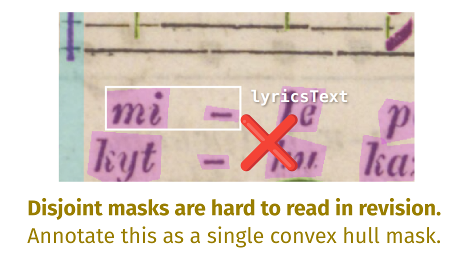
</p>

<details>
  <summary>🔗 Example documents</summary>

  - Typeset modern
    - https://ufallab.ms.mff.cuni.cz/~mayer/mung-studio/#/simple-backend/4b494e80-4cd2-11ea-a3ba-005056827e52_c98a8dd2-1141-48c8-a594-ee15db270b02
    - https://ufallab.ms.mff.cuni.cz/~mayer/mung-studio/#/simple-backend/4b494e80-4cd2-11ea-a3ba-005056827e52_89218983-dac6-4e8f-9549-05f18d613154
  - Typeset old
    - https://ufallab.ms.mff.cuni.cz/~mayer/mung-studio/#/simple-backend/3bb9e322-bc61-4307-856b-6f8fb1a640df_2d5f652c-1df0-474c-ae23-3fb699afe808
    - https://ufallab.ms.mff.cuni.cz/~mayer/mung-studio/#/simple-backend/334c2e20-cadf-4b30-8c21-8426a686b950_2405cebe-37f0-4a60-932c-f443027246e6
  - Handwritten
    - https://ufallab.ms.mff.cuni.cz/~mayer/mung-studio/#/simple-backend/16c27f86-07f5-4b34-a6ca-ec8885f2b51f_445f7cea-17d1-43cb-a08b-a0e5994f17cb
    - https://ufallab.ms.mff.cuni.cz/~mayer/mung-studio/#/simple-backend/33c9e218-519a-4e5d-8f6e-d4de89f4fc87_38de73a6-8f92-4876-bda7-c71925d04dcd
    - https://ufallab.ms.mff.cuni.cz/~mayer/mung-studio/#/simple-backend/426ae104-28f2-4e24-a334-005273a626b7_abbcaffc-f9f8-485a-8b8b-51dd261d8fc4
    - https://ufallab.ms.mff.cuni.cz/~mayer/mung-studio/#/simple-backend/43f6574c-5c31-46ce-b98b-04b0dc269ecf_47f48e77-9fbc-41bb-9fb0-8c6ed0876d04
</details>

<details>
  <summary>🧵 Relevant discussions</summary>

  - https://github.com/orgs/OmniOMR/discussions/74
</details>

---


### `verseNumber`

*(`lyricsText` is not part of SMuFL, because it is a text class)*

<p>
  
</p>

- When lyrics begin with a verse number, this text is annotated as `verseNumber`.
- Use **convex hull** mask, because it's a text node.
- Transcribe the text contained.
- Add <kbd>🔴 syntax</kbd> link from the first `lyricsText` object to the `verseNumber` object.

<details>
  <summary>🔗 Example documents</summary>

  - https://ufallab.ms.mff.cuni.cz/~mayer/mung-studio/#/simple-backend/4b494e80-4cd2-11ea-a3ba-005056827e52_89218983-dac6-4e8f-9549-05f18d613154
</details>

---


## Tempo

- This category contains text elements that determine the tempo of the song. It is analogous to [dynamics](#dynamics), which control the volume of the song.
- Read more on [Wikipedia](https://en.wikipedia.org/wiki/Tempo).


### `tempoText`

*(`tempoText` is not part of SMuFL, because it is a text class)*

- Tempo text is usually at the beginning of a song and specifies how fast the song should be played.
- Annotate with **convex hull mask** and **transcribe its content**.
- There is one <kbd>🔴 syntax</kbd> link from any notehead or rest at which the tempo starts having effect (usually the first note in the song). This is identical to how [`dynamicsText`](#dynamicstext) is linked to noteheads.
- Do not confuse it with [`interpretationText`](#interpretationtext) which says "how" the music should be played (e.g. dolce = sweet).

Here are examples of what a tempo text can say (Italian):

```
Grave Largo Lento Adagio Andante Moderato
Allegretto Allegro Vivace Presto
```

It can be altered to get variants:

```
Larghissimo
Allegro moderato
Con moto
```

It can be written in a different language (German, French, Czech):

```
Langsam Schnell Mäßig Kräftig Rasch
Moins Modéré Vif Très Vite Rapide
Rychle Volně
```

It can also contain explicit tempo BPM, in which case transcribe it as-is and copy the note character from here:

```
Allegro (𝅘𝅥 = 120)
```

Note text characters:

```
U+1D15D: 𝅝
U+1D15E: 𝅗𝅥
U+1D15F: 𝅘𝅥
U+1D160: 𝅘𝅥𝅮
U+1D161: 𝅘𝅥𝅯
```

If you see some text and are unsure whether it's a tempo text, try looking it up in the [Wikipedia page](https://en.wikipedia.org/wiki/Tempo) or on Google if it has direct tempo meaning (not some vague feeling meaning). If unsure, annotate it as `interpretationText` since it may not describe ONLY tempo, but also the feel. If still unsure about that, annotate it as `otherText`.

<p>
  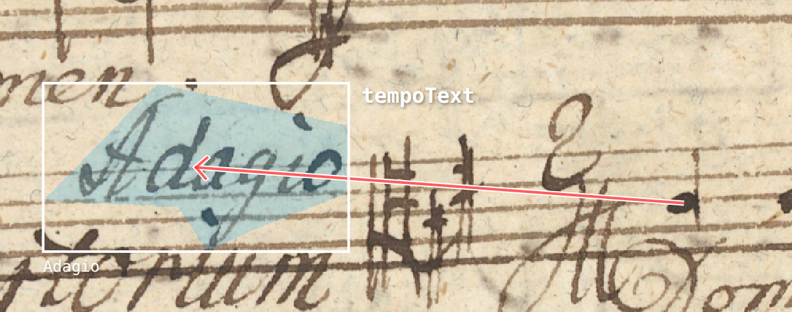
  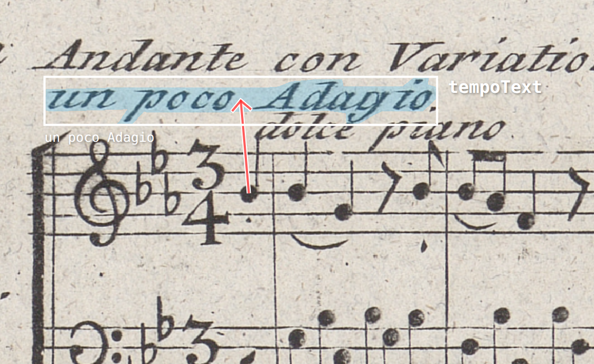
</p>

<details>
  <summary>🔗 Example documents</summary>

  - https://ufallab.ms.mff.cuni.cz/~mayer/mung-studio/#/simple-backend/426ae104-28f2-4e24-a334-005273a626b7_abbcaffc-f9f8-485a-8b8b-51dd261d8fc4
  - https://ufallab.ms.mff.cuni.cz/~mayer/mung-studio/#/simple-backend/93736ae0-d1c5-11ec-8264-005056827e51_f824ce8b-a273-4bd3-a70c-9d6381d69806
  - https://ufallab.ms.mff.cuni.cz/~mayer/mung-studio/#/simple-backend/1d507bc2-87e7-4b61-8bea-6126616c4851_319410a3-e83e-42c4-9c73-1f616d09edf6
</details>

---


### `tempoRitardando`

*(`tempoRitardando` is not part of SMuFL, because it is a text class)*

- An instruction to slow down the tempo gradually.
- Can appear in the middle of a part.
- Can have a spanner, which should be annotated as `tempoRitardandoSpanner`.
- Annotation rules are IDENTICAL to [`dynamicCrescendo`](#dynamiccrescendo), just with different clsss names. See that part of annotation instructions to learn more.

<p>
  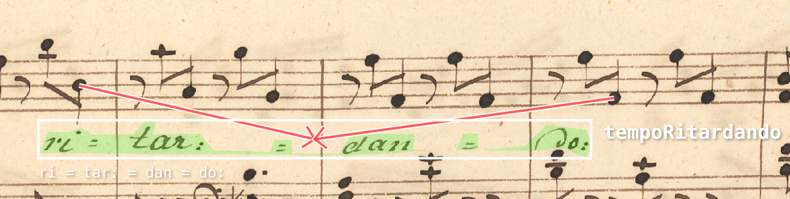
  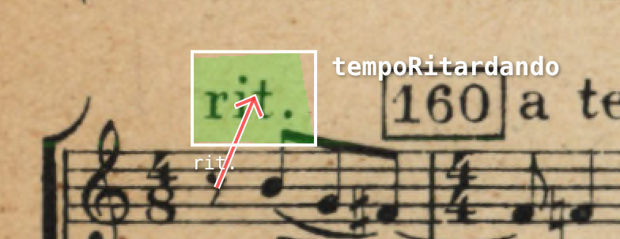
</p>

- A vaiation of ritardando is "Rallentado" often written as "rall.". Annotate it as `tempoRitardando` and transcribe the text appropriately.

<p>
  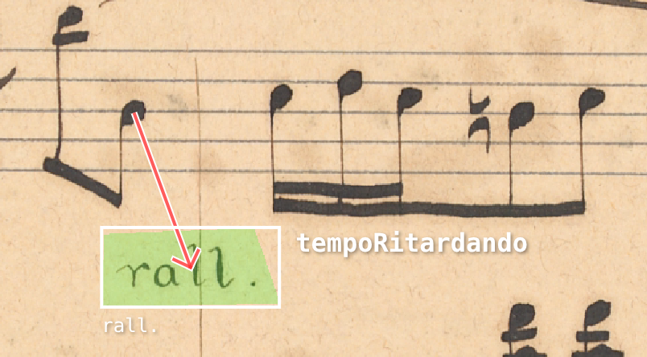
  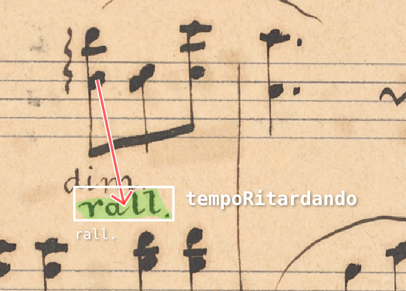
</p>

<details>
  <summary>🔗 Example documents</summary>

  - https://ufallab.ms.mff.cuni.cz/~mayer/mung-studio/#/simple-backend/81c9f683-28d1-4e73-8e25-e37333408f5a_5b6164cc-5653-494b-b43f-946fbb64d440
  - https://ufallab.ms.mff.cuni.cz/~mayer/mung-studio/#/simple-backend/30d6c780-c8fe-11e7-9c14-005056827e51_368171a0-f593-11e7-b30f-5ef3fc9ae867
  - https://ufallab.ms.mff.cuni.cz/~mayer/mung-studio/#/simple-backend/1d507bc2-87e7-4b61-8bea-6126616c4851_319410a3-e83e-42c4-9c73-1f616d09edf6
</details>

---


### `tempoAccelerando`

*(`tempoAccelerando` is not part of SMuFL, because it is a text class)*

- An instruction to speed up the tempo gradually.
- Can appear in the middle of a part.
- Can have a spanner, which should be annotated as `tempoAccelerandoSpanner`.
- Annotation rules are IDENTICAL to [`dynamicCrescendo`](#dynamiccrescendo), just with different clsss names. See that part of annotation instructions to learn more.

<p>
  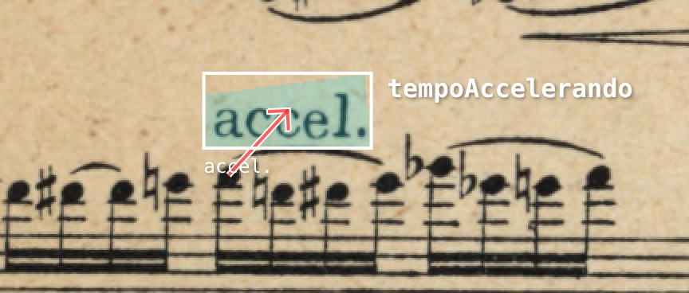
</p>

<details>
  <summary>🔗 Example documents</summary>

  - https://ufallab.ms.mff.cuni.cz/~mayer/mung-studio/#/simple-backend/30d6c780-c8fe-11e7-9c14-005056827e51_368171a0-f593-11e7-b30f-5ef3fc9ae867
</details>

---


### `tempoATempo`

*(`tempoATempo` is not part of SMuFL, because it is a text class)*

- An instruction to return back to the default tempo after a ritardando or accelerando. Means "in tempo".
- Can appear in the middle of a part.
- There is one <kbd>🔴 syntax</kbd> link from any notehead or rest at which the tempo returns to normal. This is identical to how [`dynamicsText`](#dynamicstext) is linked to noteheads.

<p>
  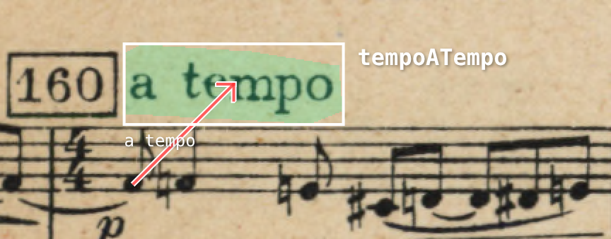
  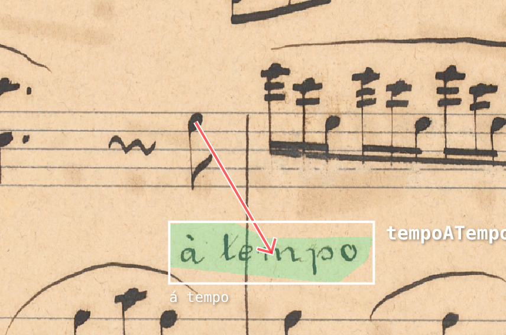
</p>

<details>
  <summary>🔗 Example documents</summary>

  - https://ufallab.ms.mff.cuni.cz/~mayer/mung-studio/#/simple-backend/30d6c780-c8fe-11e7-9c14-005056827e51_368171a0-f593-11e7-b30f-5ef3fc9ae867
  - https://ufallab.ms.mff.cuni.cz/~mayer/mung-studio/#/simple-backend/1d507bc2-87e7-4b61-8bea-6126616c4851_319410a3-e83e-42c4-9c73-1f616d09edf6
</details>

---


## Text

- This category contains texts that are present on the page, surrounding the music notation, with very weak to no connection to the music notation.

<details>
  <summary>🧵 Relevant discussions</summary>

  - https://github.com/orgs/OmniOMR/discussions/107
</details>


### `interpretationText`

*(`interpretationText` is not part of SMuFL, because it is a text class)*

- Interpretation text is usually at the beginning of a song and specifies in what feel the song should be played.
- Annotate with **convex hull mask** and **transcribe its content**.
- There is one <kbd>🔴 syntax</kbd> link from any notehead or rest at which the interpretation starts having effect (usually the first note in the song). This is identical to how [`dynamicsText`](#dynamicstext) is linked to noteheads.
- Do not confuse it with [`tempoText`](#tempo) which says "how fast" the music should be played and [`dynamicsText`](#dynamicstext) which says "how loud" the music should be played.

Here are examples of what an interpretation text can say (Italian):

```
Dolce
Zefiroso
Tranquillo
Poco appasionato
Con Brio
Con grazia
Con moto
Furioso
Lamentoso
Maestoso
Subito
```

It can also be instruction on how to play the instrument (e.g. pluck the violin or use the bow):

```
pizz
Pizzicato
arco
una corda
```

Or it can be text-written articulation instruction:

```
Staccato
Tenuto
ten ten
```

It can be in other language (English, German, Czech, French):

```
Pochodem
Pathetisch
dlouhé tahy smyčcem
Palm-muted
```

If unsure when deciding between `tempoText` and `interpretationText`, choose `interpretationText` for cases where the the tempo is not THE ONLY thing the term describes. For example, "Andante" ONLY says how fast to play so it is `tempoText`, whereas "Furioso" *may* mean to play fast, but also aggressively, so it is an `interpretationText`. Also you can imagine playing slow AND furious, which means "Furioso" does NOT really specify the tempo.

If unsure what the text means, try Googling its meaning. If still unsure about the text categorization, use `otherText`.

<p>
  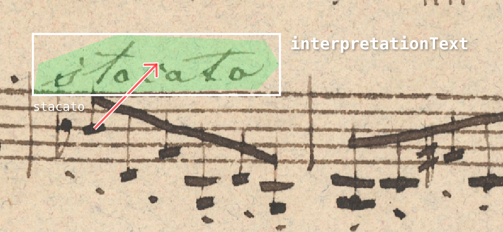
  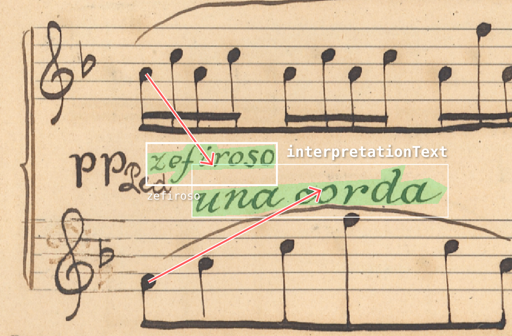
  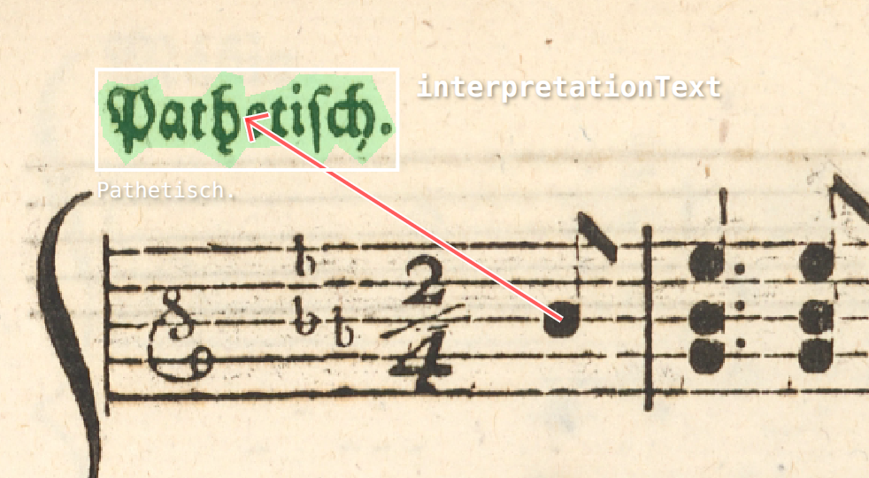
  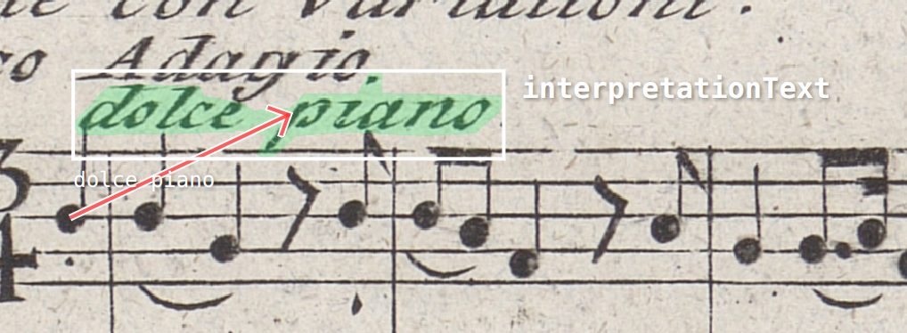
  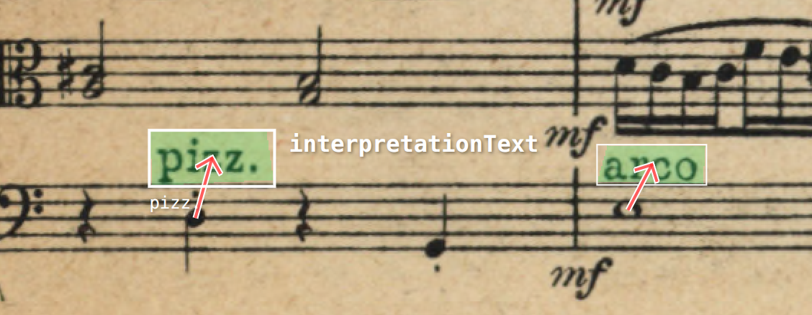
  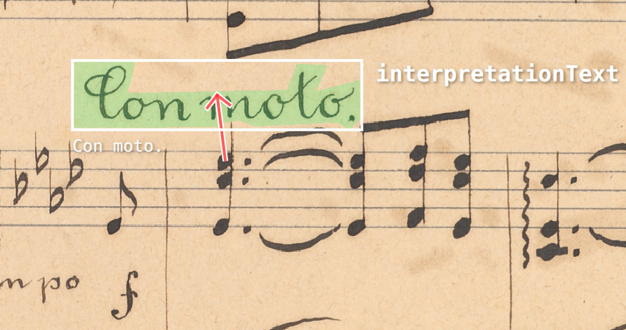
  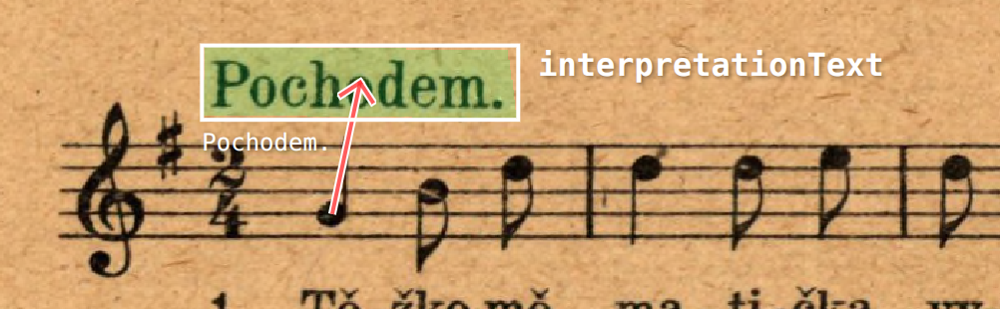
</p>

<details>
  <summary>🔗 Example documents</summary>

  - https://ufallab.ms.mff.cuni.cz/~mayer/mung-studio/#/simple-backend/86f8017f-c0c3-4d88-949e-e6f18aafd1c6_a9d78ada-642d-4a4a-b67b-12176961d7db
  - https://ufallab.ms.mff.cuni.cz/~mayer/mung-studio/#/simple-backend/1d507bc2-87e7-4b61-8bea-6126616c4851_2c51b8ce-49e1-4343-82b3-97a210f61897
  - https://ufallab.ms.mff.cuni.cz/~mayer/mung-studio/#/simple-backend/334c2e20-cadf-4b30-8c21-8426a686b950_2405cebe-37f0-4a60-932c-f443027246e6
  - https://ufallab.ms.mff.cuni.cz/~mayer/mung-studio/#/simple-backend/93736ae0-d1c5-11ec-8264-005056827e51_f824ce8b-a273-4bd3-a70c-9d6381d69806
  - https://ufallab.ms.mff.cuni.cz/~mayer/mung-studio/#/simple-backend/30d6c780-c8fe-11e7-9c14-005056827e51_368171a0-f593-11e7-b30f-5ef3fc9ae867
  - https://ufallab.ms.mff.cuni.cz/~mayer/mung-studio/#/simple-backend/1d507bc2-87e7-4b61-8bea-6126616c4851_319410a3-e83e-42c4-9c73-1f616d09edf6
  - https://ufallab.ms.mff.cuni.cz/~mayer/mung-studio/#/simple-backend/4b494e80-4cd2-11ea-a3ba-005056827e52_89218983-dac6-4e8f-9549-05f18d613154
</details>

---


### `metadataText`

*(`metadataText` is not part of SMuFL, because it is a text class)*

- Text that is interesting to the librarian, which names or classifies the song somehow.
- Annotate with **convex hull mask** and **transcribe its content**.
- If you can't read it, don't transcribe it (leave it empty).

It is typically these texts:

- Song title
- Author name
- Song type (e.g. "Folk song")
- Part name (the text before the start of a staff), may be song name, may be instrument name, may be instrument role.

<p>
  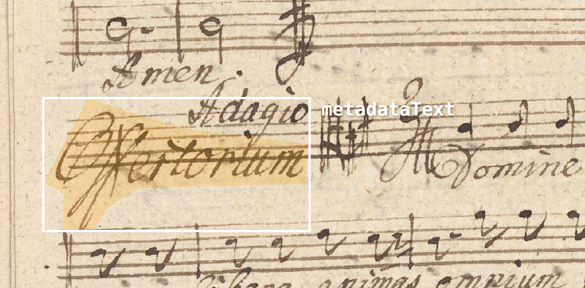
  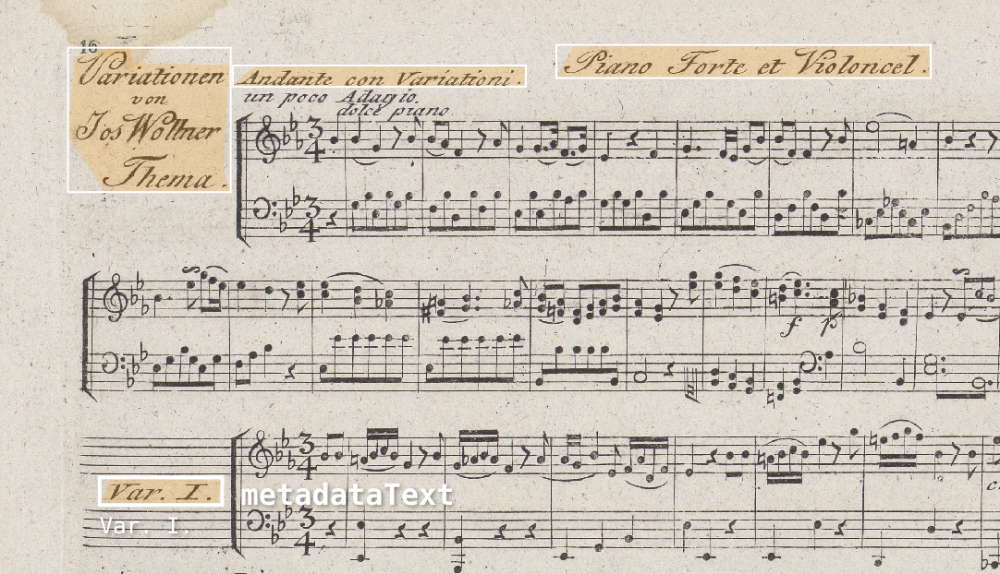
  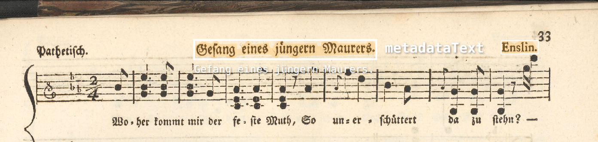
  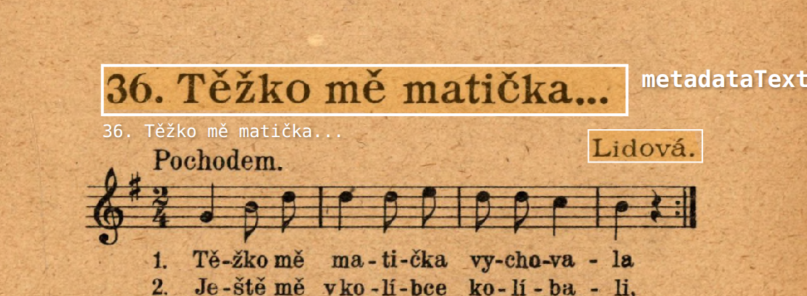
</p>

<details>
  <summary>🔗 Example documents</summary>

  - https://ufallab.ms.mff.cuni.cz/~mayer/mung-studio/#/simple-backend/426ae104-28f2-4e24-a334-005273a626b7_abbcaffc-f9f8-485a-8b8b-51dd261d8fc4
  - https://ufallab.ms.mff.cuni.cz/~mayer/mung-studio/#/simple-backend/93736ae0-d1c5-11ec-8264-005056827e51_f824ce8b-a273-4bd3-a70c-9d6381d69806
  - https://ufallab.ms.mff.cuni.cz/~mayer/mung-studio/#/simple-backend/334c2e20-cadf-4b30-8c21-8426a686b950_2405cebe-37f0-4a60-932c-f443027246e6
  - https://ufallab.ms.mff.cuni.cz/~mayer/mung-studio/#/simple-backend/4b494e80-4cd2-11ea-a3ba-005056827e52_89218983-dac6-4e8f-9549-05f18d613154
</details>

---


### `measureNumber`

*(`measureNumber` is not part of SMuFL, because it is a text class)*

- Annotate with **convex hull mask** and **transcribe its content**.
- If unsure, whether it is a measure number, use `otherText` instead.
- Rehersal marks, and other counting numbers in particella are NOT measure numbers. Measure number is only the number of the measure from the start of the song.
- There is one <kbd>🔴 syntax</kbd> link from the first notehead or rest in the measure to the `measureNumber`. If there are multiple "first" noteheads, pick any one of them.

<p>
  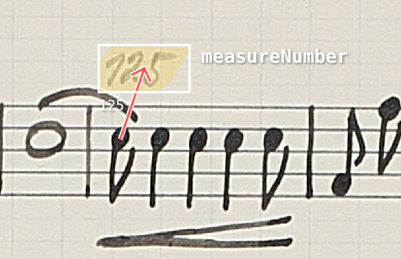
</p>

<details>
  <summary>🔗 Example documents</summary>

  - https://ufallab.ms.mff.cuni.cz/~mayer/mung-studio/#/simple-backend/ca625f33-b4e1-49a9-bbc4-63130ba0fe70_010e98cc-eab8-47d9-8424-1cfc8d3c1c1a
</details>

---


### `pageNumber`

*(`pageNumber` is not part of SMuFL, because it is a text class)*

- Annotate with **convex hull mask** and **transcribe its content**.
- If unsure, whether it is a page number, use `otherText` instead.

<p>
  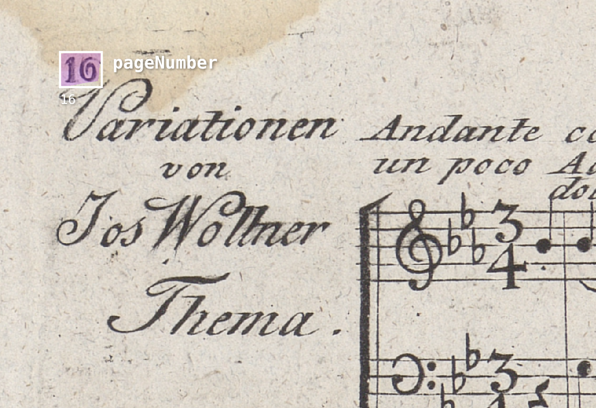
  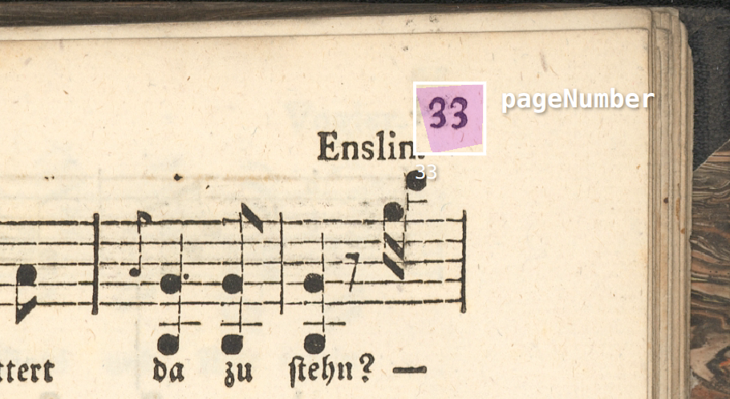
  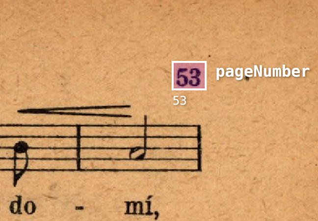
</p>

<details>
  <summary>🔗 Example documents</summary>

  - https://ufallab.ms.mff.cuni.cz/~mayer/mung-studio/#/simple-backend/93736ae0-d1c5-11ec-8264-005056827e51_f824ce8b-a273-4bd3-a70c-9d6381d69806
  - https://ufallab.ms.mff.cuni.cz/~mayer/mung-studio/#/simple-backend/334c2e20-cadf-4b30-8c21-8426a686b950_2405cebe-37f0-4a60-932c-f443027246e6
  - https://ufallab.ms.mff.cuni.cz/~mayer/mung-studio/#/simple-backend/4b494e80-4cd2-11ea-a3ba-005056827e52_89218983-dac6-4e8f-9549-05f18d613154
</details>

---


### `otherText`

*(`otherText` is not part of SMuFL, because it is a text class)*

- Any remaining text on the page.
- Annotate with **convex hull mask** and **transcribe its content**.
- If you can't read it, don't transcribe it (leave it empty).

What usually belongs here:

- Any text notes by the author or the library around the music notation.
- Measure counting numbers in particella (NOT measure numbers).
- Rehersal marks (`[A]`, `[B]`) and other "measure" numbers (`[150]`) that are not obvious measure numbers (are nowhere else on the page and are not periodic).
- Lyrics of other verses, that are NOT aligned under the music (e.g. are positioned in a text-block somewhere else)
- Stamps by the library. (You don't need to transcribe these.)

<p>
  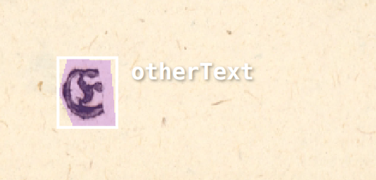
  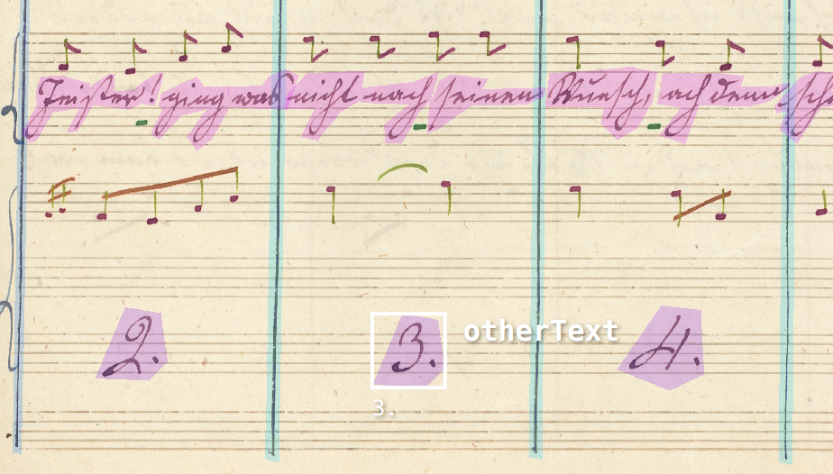
  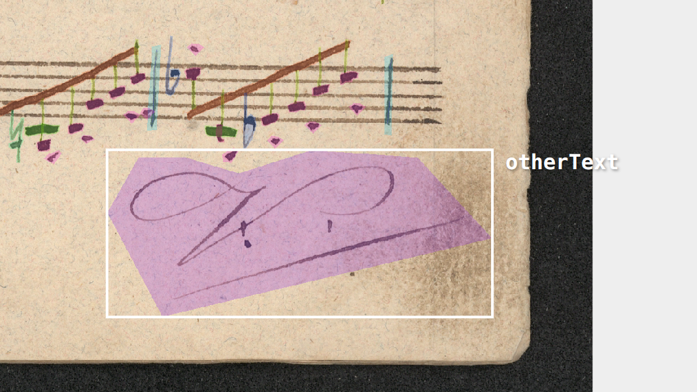
  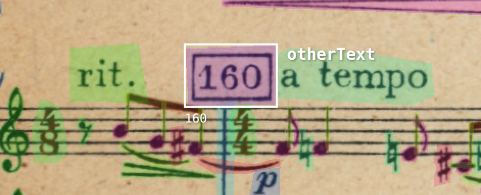
</p>

<details>
  <summary>🔗 Example documents</summary>

  - https://ufallab.ms.mff.cuni.cz/~mayer/mung-studio/#/simple-backend/334c2e20-cadf-4b30-8c21-8426a686b950_2405cebe-37f0-4a60-932c-f443027246e6
  - https://ufallab.ms.mff.cuni.cz/~mayer/mung-studio/#/simple-backend/43f6574c-5c31-46ce-b98b-04b0dc269ecf_47f48e77-9fbc-41bb-9fb0-8c6ed0876d04
  - https://ufallab.ms.mff.cuni.cz/~mayer/mung-studio/#/simple-backend/86f8017f-c0c3-4d88-949e-e6f18aafd1c6_a9d78ada-642d-4a4a-b67b-12176961d7db
  - https://ufallab.ms.mff.cuni.cz/~mayer/mung-studio/#/simple-backend/30d6c780-c8fe-11e7-9c14-005056827e51_368171a0-f593-11e7-b30f-5ef3fc9ae867
</details>

---


## Staves


### `staffLine`

*(`staffLine` is not part of SMuFL, because it cannot be rendered using a notation font)*

*(Called `Staff line` in CVAT)*  

- Represents a **single staff line**.
- Annotate **precisely around the entire shape**.

<p>
  
</p>

<details>
  <summary>🤔 Why not use staff1Line class of SMuFL?</summary>

  The `staff1Line` class from SMuFL is intended for text-rendering. It is not used to actually render stafflines and thus means something slightly different semantically. Staff lines are more similar to beams, slurs, and ties, which cannot be rendered via a font, so aren't present in SMuFL. Therefore we decided to also introduce the class `staffLine` for this non-font-renderable symbol, just like we did with `beam`, `slur`, and `tie`.
</details>

---


### `staff`

*(Called `Staff` in CVAT)*  

- Groups together the **five staff lines** that form a complete staff.  
- The bounding box should **fit tightly** around the lines.  
- Ensure the box aligns **exactly with the corners** of the staff.

<p>
  
</p>

---


## Barlines

<!--
Ornamented terminal barline:
https://ufallab.ms.mff.cuni.cz/~mayer/mung-studio/#/simple-backend/ca625f33-b4e1-49a9-bbc4-63130ba0fe70_010e98cc-eab8-47d9-8424-1cfc8d3c1c1a
-->


### `barlineSingle`

*(Called `thin_barline` in CVAT)*  

- Represents a **single thin barline**.  
- Annotate **precisely around the entire shape**.

<p>
  
</p>

---


### `barlineHeavy`

*(Called `barline_thick` in CVAT)*

- Represents a **thick barline**, usually used at section endings.

<p>
  
</p>

---


### `measureSeparator`

*(Called `measure_separator` in CVAT)*

- The `staffGrouping` symbols define which staves belong to the same **system** (or **subsystem**) - for example, multi-staff instruments like piano, or sectional groupings in orchestral scores.
- ⚠️ At the **beginning of a system**, a `measureSeparator` should **not** be annotated, to avoid duplicating the final barline of the previous system.

There should always be **exactly one continuous `measureSeparator` per system**,  
regardless of how it appears visually:

- It may be drawn as several **short individual barlines**,  
- as one **long barline**,  
- or a **combination** of both.

The example below shows **four** `measureSeparator` **regions** (blue rectangles) spanning all staves, and **two** `staffGrouping` **boxes** at the start of the system.

<p>
  
</p>

Similar case below (annotated in MuNG): The **fourth** `measureSeparator` should encompass **all four barlineHeavy** symbols that make up the double barlines.

<p>
  
</p>

Previous [CVAT measureSeparator rules](https://github.com/orgs/OmniOMR/discussions/24)

---


## Staff Grouping (brackets and braces)


### `brace`

*(Previously `staff_bracket` in CVAT, together with bracket)*

- Represents the **curly brace `{`** used to connect multiple staves belonging to a single instrument (e.g., piano).
- Differentiate between `brace` and `bracket` based on **appearance**, not function. In older music documents, their function is often interchanged.
- Usually connects **two staves**, but can occasionally span **three** (e.g., in organ notation).

<p>
  
</p>

---


### `bracket`

*(Previously `staff_bracket` in CVAT, together with brace)*

- Represents the **square bracket `[`** used to group staves (e.g., for instrument families in orchestral scores).  
- Differentiate between `brace` and `bracket` based on **appearance**, not function. In older music documents, their function is often interchanged.
- ⚠️ **Important:** a second vertical line often appears near the bracket, but that line **is not part of the bracket**. It should be annotated separately as `barlineSingle`.

<p>
  
</p>


---

### `staffGrouping`

- An **abstract grouping class** for combining related staves or systems.

**Note:**  
If a system contains **multiple brackets, braces, and a barline**, annotate them as follows:
- Each **barline** → `barlineSingle` 
- Each **brace or bracket** → annotated individually as `brace` or `bracket`
- Then create:
  - **One long `staffGrouping`** spanning the entire barline, brace or bracket (covering all connected staves)  
  - **Several shorter `staffGrouping` boxes**, each covering one brace or bracket

- `staffGrouping` is usually annotated as a **rectangle or polygon** — not tightly around the line or brace. This means the **areas of multiple `staffGrouping` may overlap**, which is perfectly fine.

In the example below, a **long `staffGrouping`** connects all staves via the main bracket,  
while a **shorter `staffGrouping`** encloses the brace on the left side.

<p>
  
</p>

- Previous [CVAT staffGrouping rules](https://github.com/orgs/OmniOMR/discussions/91#discussion-7177410)

---


## Articulation

*(see the corresponding [SMuFL Group](https://w3c.github.io/smufl/latest/tables/articulation.html))*

*(previously in CVAT `articulation_mark` for every articulation mark, now separated into classes)*


### `articAccentAbove` / `articAccentBelow`

- Represents an **accent mark** placed **above or below** the notehead.
- <kbd>🔴 syntax</kbd> link from the notehead to the accent.


### `articStaccatoAbove` / `articStaccatoBelow`

- Represents **staccato dots** placed **above or below** the notehead.
- **Do not use** the old class name `articulationStaccato`.
- <kbd>🔴 syntax</kbd> link from the notehead to the staccato.


### `articTenutoAbove` / `articTenutoBelow`

- Represents **tenuto line** placed **above or below** the notehead.
- <kbd>🔴 syntax</kbd> link from the notehead to the tenuto.


### `articStaccatissimoAbove`

- Represent the **staccatissimo stroke** placed **above** the notehead.
- <kbd>🔴 syntax</kbd> link from the notehead to the staccatissimo.

<p>
  
  
  
</p>

<details>
  <summary>🔗 Example documents</summary>

  - https://ufallab.ms.mff.cuni.cz/~mayer/mung-studio/#/simple-backend/93736ae0-d1c5-11ec-8264-005056827e51_f824ce8b-a273-4bd3-a70c-9d6381d69806
</details>


### `articStaccatissimoBelow`

- Represent the **staccatissimo stroke** placed **below** the notehead.
- <kbd>🔴 syntax</kbd> link from the notehead to the staccatissimo.

<p>
  
</p>


### `articMarcatoAbove`

- Represents **marcato hat** placed **above** the notehead.
- <kbd>🔴 syntax</kbd> link from the notehead to the marcato.

### `articMarcatoBelow`

- Represents **marcato hat** placed **below** the notehead.
- <kbd>🔴 syntax</kbd> link from the notehead to the marcato.

---


## Dynamics

*(See the corresponding [SMuFL group](https://w3c.github.io/smufl/latest/tables/dynamics.html))*

Dynamics are all the symbols and text that indicate how loud the piece should be played. Read more on [Wikipedia](https://en.wikipedia.org/wiki/Dynamics_(music)).


### `dynamicsText`

*(`dynamicsText` is not part of SMuFL, because it is a container class and also a text class)*

<p>
  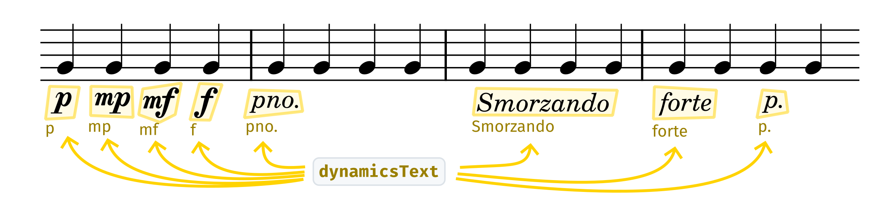
  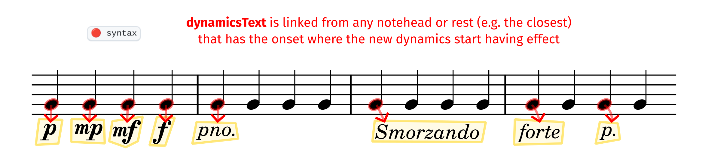
</p>

- Represents a **textual region** covering one or more **dynamic marks** ("p", "f", "mp") or **dynamic text** ("forte", "pno.", "p.").
- It does NOT cover crescendo and diminuendo text, these are separate classes [`dynamicCrescendo`](#dynamiccrescendo) and [`dynamicDiminuendo`](#dynamicdiminuendo).
- The mask is a **convex hull**, not a precise mask.
- It is a **text node** so the text inside the node must be [transcribed](https://github.com/OmniOMR/mung-studio/blob/main/docs/user-manual/user-manual.md#transcribing-text). It should be transcribed even when it consists only of marks ("ff", "sfz").
- The dynamic change starts on a specific note (onset). The `dynamicsText` must be <kbd>🔴 syntax</kbd> linked from one notehead/rest with this onset (the one closest, that makes the most sense).

<p>
  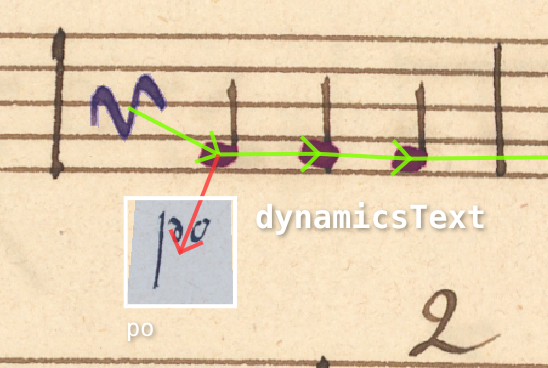
  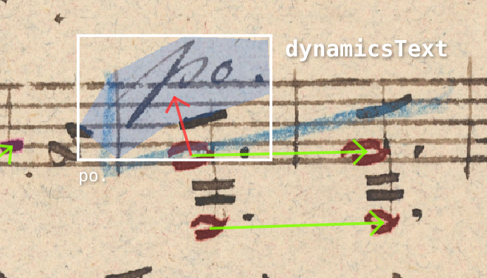
  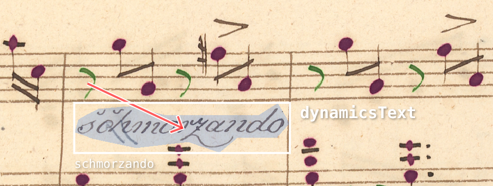
</p>

Subdivision to dynamic marks:

- If the individual marks can be reasonably separated, they should also be annotated as separate nodes and <kbd>🔴 syntax</kbd> linked from `dynamicsText`.
- The `dynamicsText` then becomes a **container object**.
- If the marks cannot be separated, or there is just plain text ("pno.", "p."), do NOT annotate the individual characters, just the container + text transcription.
- When subdividing to marks, <kbd>🟢 precedence</kbd> links must connect them left-to-right.

<p>
  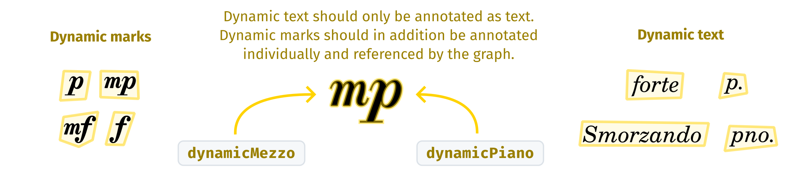
  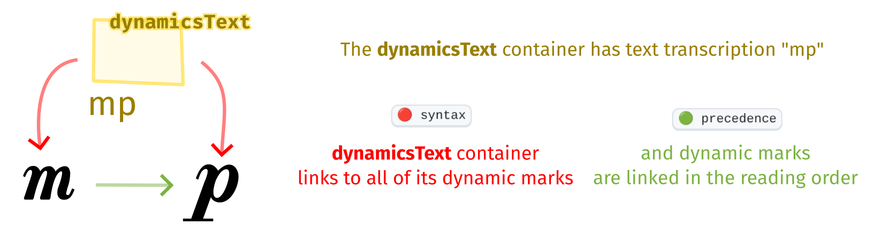
</p>

<p>
  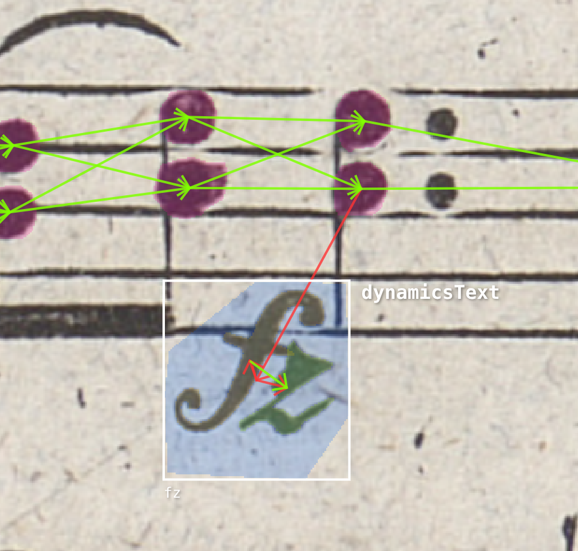
  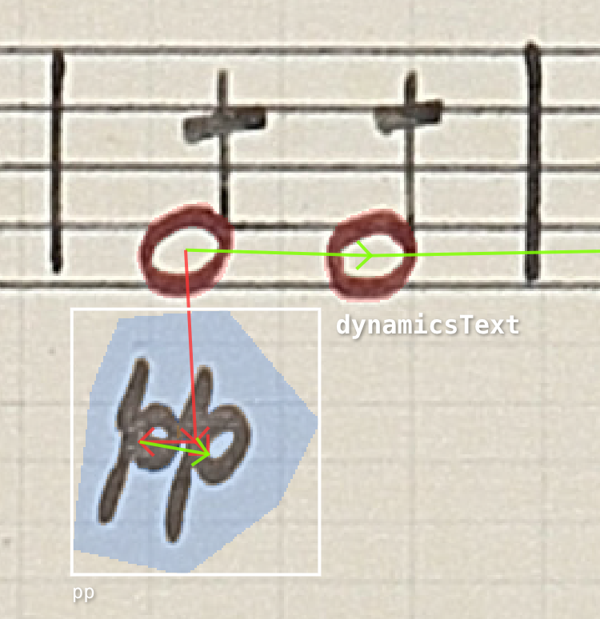
  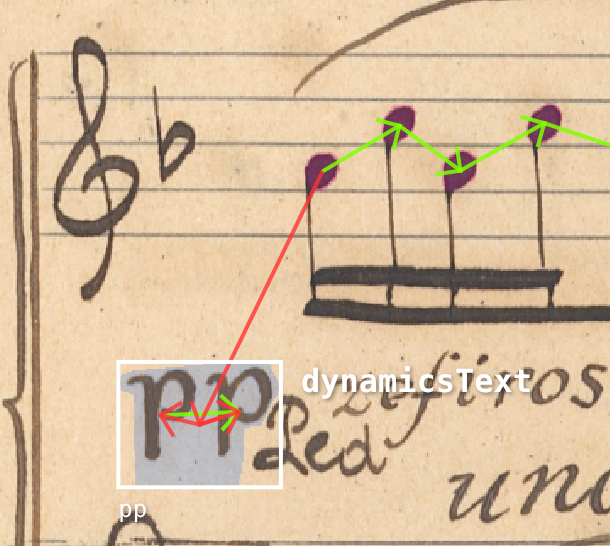
</p>

<details>
  <summary>🔗 Example documents</summary>

  - Dynamic text + marks
    - https://ufallab.ms.mff.cuni.cz/~mayer/mung-studio/#/simple-backend/93736ae0-d1c5-11ec-8264-005056827e51_f824ce8b-a273-4bd3-a70c-9d6381d69806
    - https://ufallab.ms.mff.cuni.cz/~mayer/mung-studio/#/simple-backend/ca625f33-b4e1-49a9-bbc4-63130ba0fe70_010e98cc-eab8-47d9-8424-1cfc8d3c1c1a
    - https://ufallab.ms.mff.cuni.cz/~mayer/mung-studio/#/simple-backend/1d507bc2-87e7-4b61-8bea-6126616c4851_2c51b8ce-49e1-4343-82b3-97a210f61897
  - Dynamic text only
    - https://ufallab.ms.mff.cuni.cz/~mayer/mung-studio/#/simple-backend/13abc7f9-5e3f-4e85-b753-0dab090728fe_da0e8022-a312-432a-b825-d66c024aa816
    - https://ufallab.ms.mff.cuni.cz/~mayer/mung-studio/#/simple-backend/81c9f683-28d1-4e73-8e25-e37333408f5a_5b6164cc-5653-494b-b43f-946fbb64d440
    - https://ufallab.ms.mff.cuni.cz/~mayer/mung-studio/#/simple-backend/86f8017f-c0c3-4d88-949e-e6f18aafd1c6_a9d78ada-642d-4a4a-b67b-12176961d7db
</details>

---


#### `dynamic[Mark]`

*(See the corresponding [SMuFL group](https://w3c.github.io/smufl/latest/tables/dynamics.html))*

<p>
  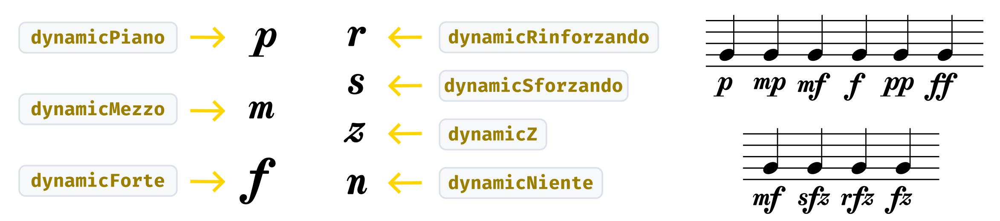
</p>

This group discusses these classes: `dynamicPiano`, `dynamicMezzo`, `dynamicForte`, `dynamicRinforzando`,`dynamicSforzando`, `dynamicZ`, `dynamicNiente`.

- These must always belong to a `dynamicsText` container, even when they stand alone. The container must have a [text transcription](https://github.com/OmniOMR/mung-studio/blob/main/docs/user-manual/user-manual.md#transcribing-text).
- The mask must be **precise**.
- The `dynamicsText` container links to all of its members via <kbd>🔴 syntax</kbd> links.
- Marks inside the container link left-to-right together via <kbd>🟢 precedence</kbd> links.

<p>
  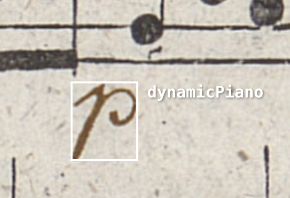
  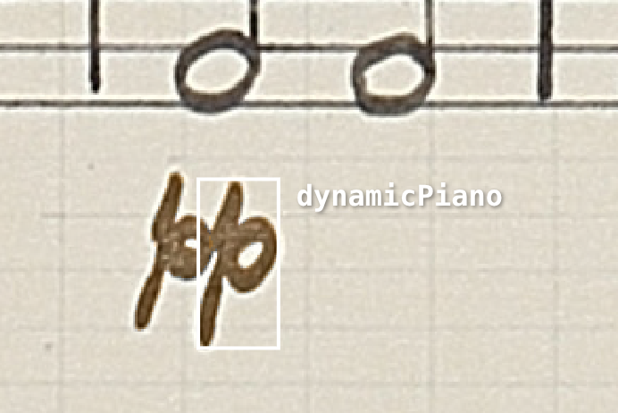
  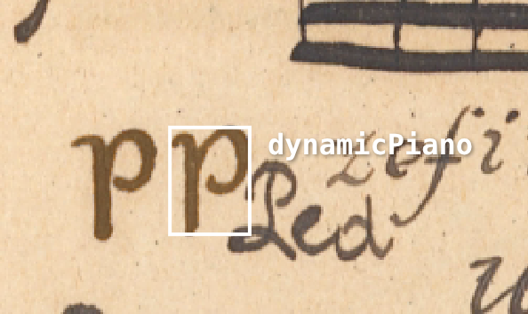
  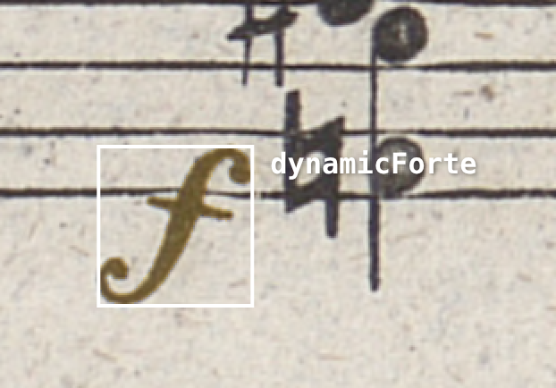
  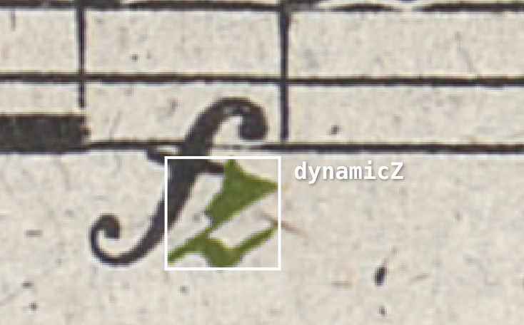
</p>

<details>
  <summary>🤔 Why do we annotate marks in more detail than other dynamic text?</summary>

  Dynamic marks have specific appearance and it is therefore useful to have their precise shape annotated for possible future use. This may be either just classification, but also data synthesis. But there is also a lot of "messy" dynamics text that is in no way special and so we only annotate that as any other text - by transcribing it.
</details>

<details>
  <summary>😕 I'm looking at "p.", should I annotate the "p" as a mark?</summary>

  If you're unsure, just annote it as text. Especially in cases such as "p.", you could in theory annotate just the "p" as a mark and ignore the dot. But that's not worth the struggle. When in doubt, annotate just text. When the marks are nice and distinct, annotate those as well.
</details>

<details>
  <summary>🔗 Example documents</summary>

  - https://ufallab.ms.mff.cuni.cz/~mayer/mung-studio/#/simple-backend/93736ae0-d1c5-11ec-8264-005056827e51_f824ce8b-a273-4bd3-a70c-9d6381d69806
  - https://ufallab.ms.mff.cuni.cz/~mayer/mung-studio/#/simple-backend/ca625f33-b4e1-49a9-bbc4-63130ba0fe70_010e98cc-eab8-47d9-8424-1cfc8d3c1c1a
  - https://ufallab.ms.mff.cuni.cz/~mayer/mung-studio/#/simple-backend/1d507bc2-87e7-4b61-8bea-6126616c4851_2c51b8ce-49e1-4343-82b3-97a210f61897
</details>

---


### `dynamicCrescendo`

*(`dynamicCrescendo` is not part of SMuFL, because it is a text class)*

<p>
  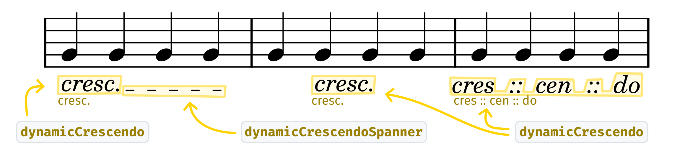
  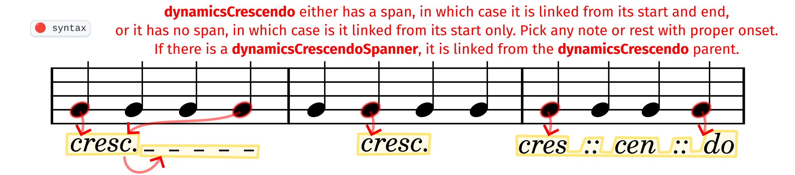
</p>

- The mask is a **convex hull**, not a precise mask.
- It is a **text node** so the text inside the node must be [transcribed](https://github.com/OmniOMR/mung-studio/blob/main/docs/user-manual/user-manual.md#transcribing-text).
- The dynamic change starts on a specific note (onset). The `dynamicCrescendo` must be <kbd>🔴 syntax</kbd> linked from one notehead/rest with this onset (the one closest, that makes the most sense).
- If it spans an explicit time (either with a spanner or being stretched-out), then there is an onset when it terminates. This onset should be marked with a second <kbd>🔴 syntax</kbd> inlink from a notehead/rest.
- A specific time span can be represented by a visual spanner line. This line is a separate node with class `dynamicCrescendoSpanner` and a **convex hull** mask. It is <kbd>🔴 syntax</kbd> linked from the parent `dynamicCrescendo`.
- When crescendo spanner continues to the next line, it should start with another `dynamicCrescendo` text and so can be treated as a separate `dynamicCrescendo` instance with a spanner. If the text is not present, then this second spanner should be linked from the first `dynamicCrescendo` (it will have two children - two spanners).

<p>
  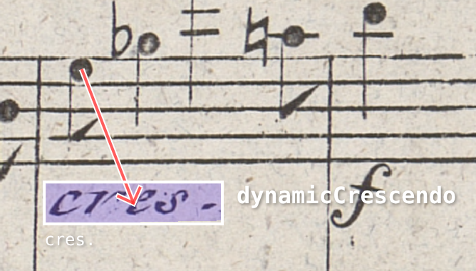
  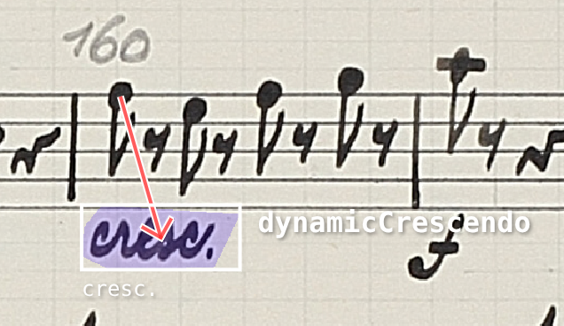
  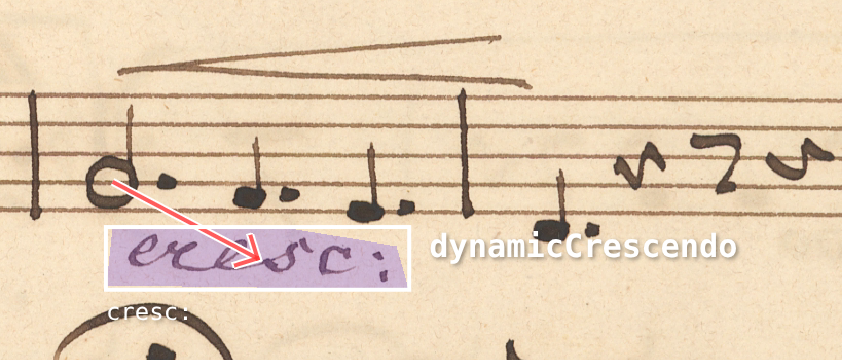
</p>

<details>
  <summary>🔗 Example documents</summary>

  - https://ufallab.ms.mff.cuni.cz/~mayer/mung-studio/#/simple-backend/93736ae0-d1c5-11ec-8264-005056827e51_f824ce8b-a273-4bd3-a70c-9d6381d69806
  - https://ufallab.ms.mff.cuni.cz/~mayer/mung-studio/#/simple-backend/ca625f33-b4e1-49a9-bbc4-63130ba0fe70_010e98cc-eab8-47d9-8424-1cfc8d3c1c1a
</details>

---


### `dynamicDiminuendo`

*(`dynamicDiminuendo` is not part of SMuFL, because it is a text class)*

<p>
  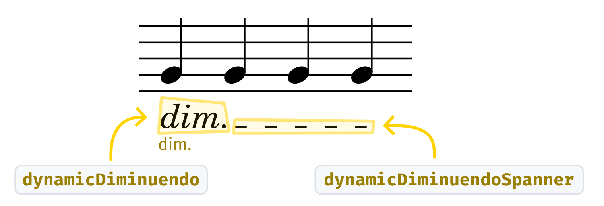
</p>

> TL;DR: Same rules as for crescendo above.

- The mask is a **convex hull**, not a precise mask.
- It is a **text node** so the text inside the node must be [transcribed](https://github.com/OmniOMR/mung-studio/blob/main/docs/user-manual/user-manual.md#transcribing-text).
- The dynamic change starts on a specific note (onset). The `dynamicDiminuendo` must be <kbd>🔴 syntax</kbd> linked from one notehead/rest with this onset (the one closest, that makes the most sense).
- If it spans an explicit time (either with a spanner or being stretched-out), then there is an onset when it terminates. This onset should be marked with a second <kbd>🔴 syntax</kbd> inlink from a notehead/rest.
- A specific time span can be represented by a visual spanner line. This line is a separate node with class `dynamicDiminuendoSpanner` and a **convex hull** mask. It is <kbd>🔴 syntax</kbd> linked from the parent `dynamicDiminuendo`.
- When crescendo spanner continues to the next line, it should start with another `dynamicDiminuendo` text and so can be treated as a separate `dynamicDiminuendo` instance with a spanner. If the text is not present, then this second spanner should be linked from the first `dynamicDiminuendo` (it will have two children - two spanners).

<p>
  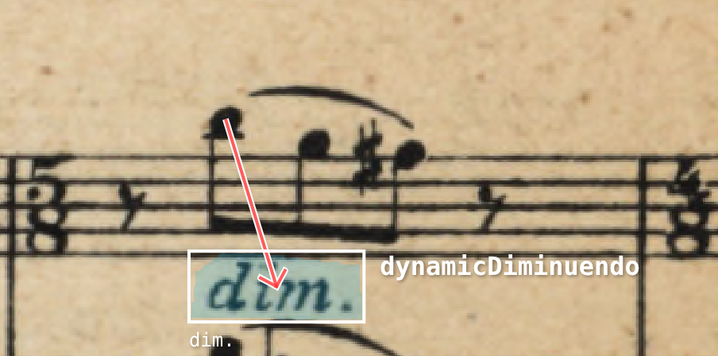
  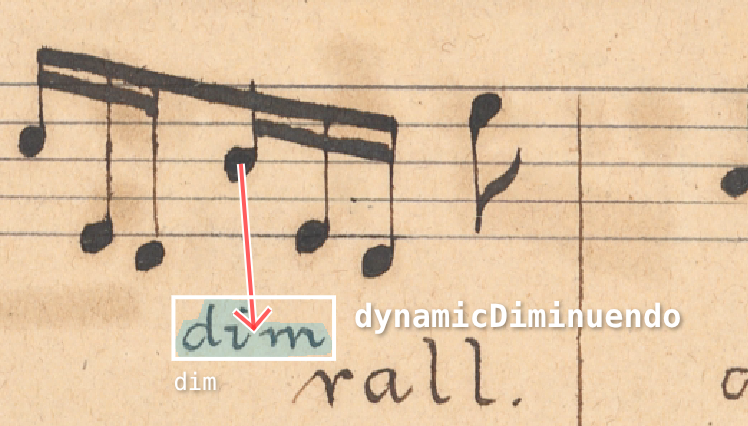
</p>

<details>
  <summary>🔗 Example documents</summary>

  - https://ufallab.ms.mff.cuni.cz/~mayer/mung-studio/#/simple-backend/30d6c780-c8fe-11e7-9c14-005056827e51_368171a0-f593-11e7-b30f-5ef3fc9ae867
  - https://ufallab.ms.mff.cuni.cz/~mayer/mung-studio/#/simple-backend/1d507bc2-87e7-4b61-8bea-6126616c4851_319410a3-e83e-42c4-9c73-1f616d09edf6
</details>

---


### `dynamicCrescendoHairpin`

*(See the corresponding [SMuFL group](https://w3c.github.io/smufl/latest/tables/dynamics.html))*

<p>
  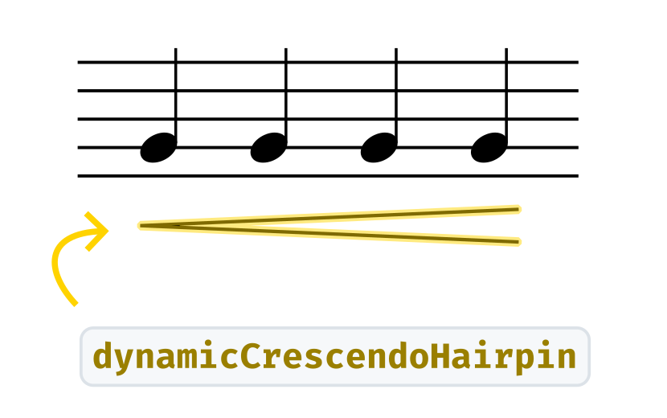
  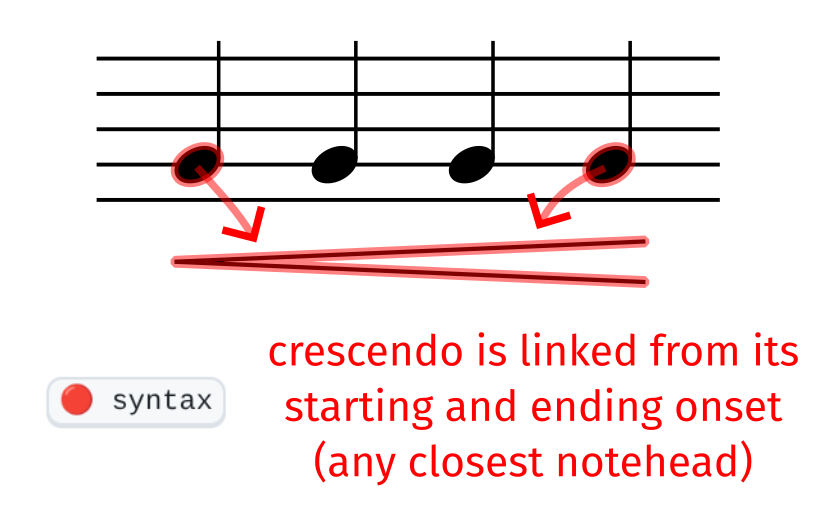
</p>

- Use a **precise** mask.
- <kbd>🔴 syntax</kbd> inlinks are from the starting and ending onset of the hairpin. Pick any (closest) note or rest with the proper onset.
- Hairpins can sometimes be written above the staff.

<p>
  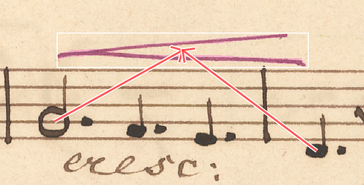
  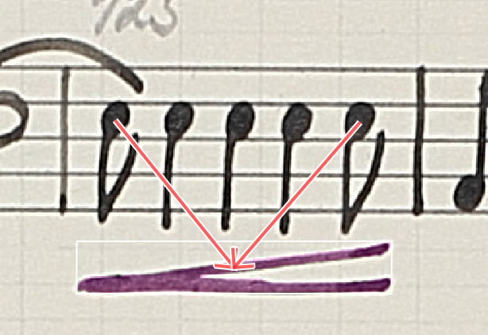
</p>

<details>
  <summary>🤔 Previously (MUSCIMA++) we annotated inlinks from all noteheads, why the change?</summary>

  The hairpin affects a time span for a system or staff. It always affects all the notes (within the staff). It makes no sense to annotate every single notehead if only two are needed to infer the time span. Annotating all the links just makes the graph hard to read and annotation process tedious.

  For a backwards-compatible parsing algorithm, simply take all the inlinks from durables (notes and rests), compute their onsets, and get the min and max values to get the time span.
</details>

<details>
  <summary>🤔 For slurs we link all the noteheads, why not here?</summary>

  A slur can only affect a single voice within a staff. You can have two slurs for two voices existing simultaneously and having opposite orientations. Hairpins, on the other hand, always affect all voices and so require less information to interpret correctly.
</details>

<details>
  <summary>🔗 Example documents</summary>

  - https://ufallab.ms.mff.cuni.cz/~mayer/mung-studio/#/simple-backend/93736ae0-d1c5-11ec-8264-005056827e51_f824ce8b-a273-4bd3-a70c-9d6381d69806
  - https://ufallab.ms.mff.cuni.cz/~mayer/mung-studio/#/simple-backend/13abc7f9-5e3f-4e85-b753-0dab090728fe_da0e8022-a312-432a-b825-d66c024aa816
</details>

---


### `dynamicDiminuendoHairpin`

*(See the corresponding [SMuFL group](https://w3c.github.io/smufl/latest/tables/dynamics.html))*

<p>
  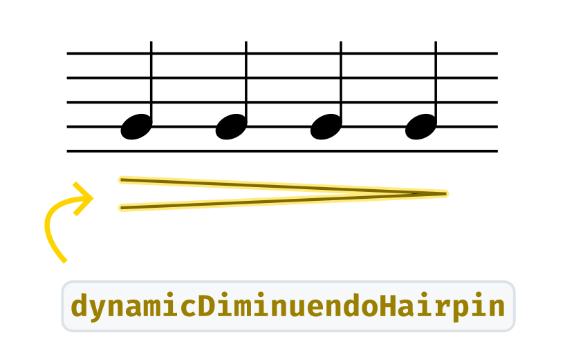
  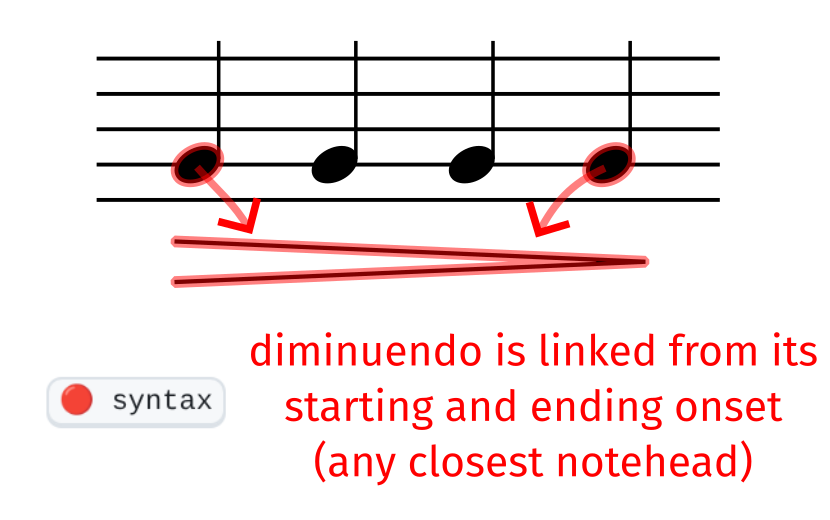
</p>

> TL;DR: Same rules as for the crescendo hairpin above.

- Use a **precise** mask.
- <kbd>🔴 syntax</kbd> inlinks are from the starting and ending onset of the hairpin. Pick any (closest) note or rest with the proper onset.
- Hairpins can sometimes be written above the staff.

<p>
  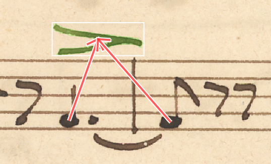
  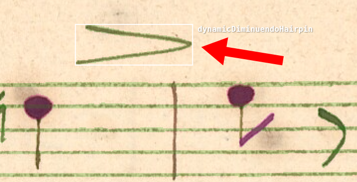
</p>

<details>
  <summary>🔗 Example documents</summary>

  - https://ufallab.ms.mff.cuni.cz/~mayer/mung-studio/#/simple-backend/13abc7f9-5e3f-4e85-b753-0dab090728fe_da0e8022-a312-432a-b825-d66c024aa816
</details>

---


### `dynamicNiente`

*(See the corresponding [SMuFL group](https://w3c.github.io/smufl/latest/tables/dynamics.html))*

<p>
  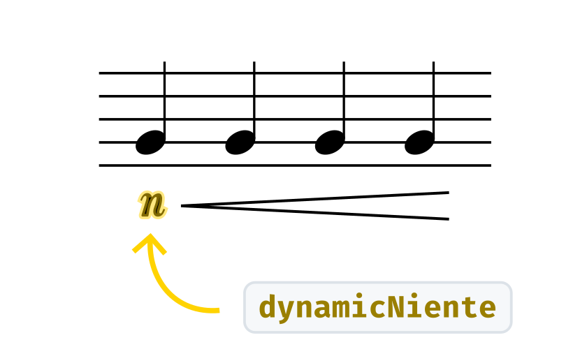
</p>

The `dynamicNiente` symbol is listed above in [`dynamic[Mark]` section](#dynamicmark), here we clarify its role and syntax.

Niente means "nothing", so zero volume. But it's often used at the start of crescendo or end of diminuendo hairpins. In MuNG, **it has no special relationship to the hairpin**.

How to annotate:

- Annotate precisely the `dynamicNiente` dynamic mark.
- Wrap the mark in `dynamicsText` container and <kbd>🔴 syntax</kbd> link it from the container. The container should have text transcription of "n".
- <kbd>🔴 syntax</kbd> link the `dynamicsText` object from the starting notehead.
- Annotate the `dynamicCrescendoHairpin` precisely.
- <kbd>🔴 syntax</kbd> link the `dynamicCrescendoHairpin` object from the starting and ending noteheads.

So we end up with:

- The starting notehead <kbd>🔴 syntax</kbd> links to both the `dynamicsText` and the `dynamicCrescendoHairpin`.
- There is **NO link** between the hairpin and the dynamics text (or the niente symbol).

If you want to interpret the graph and want to decide whether the niente symbol belongs to the hairpin, simply see if they share the starting notehead (or the ending one for diminuendos).

The niente dynamics text can also sometimes be written as text, e.g. "n." or "niente". In this case annotate it **only as `dynamicsText`** with text transcription. There will be NO `dynamicNiente` object. This is consistent with the way textual dynamics ("forte", "pno.") are annotated.

---


## `dynamicNienteForHairpin`

*(See the corresponding [SMuFL group](https://w3c.github.io/smufl/latest/tables/dynamics.html))*

<p>
  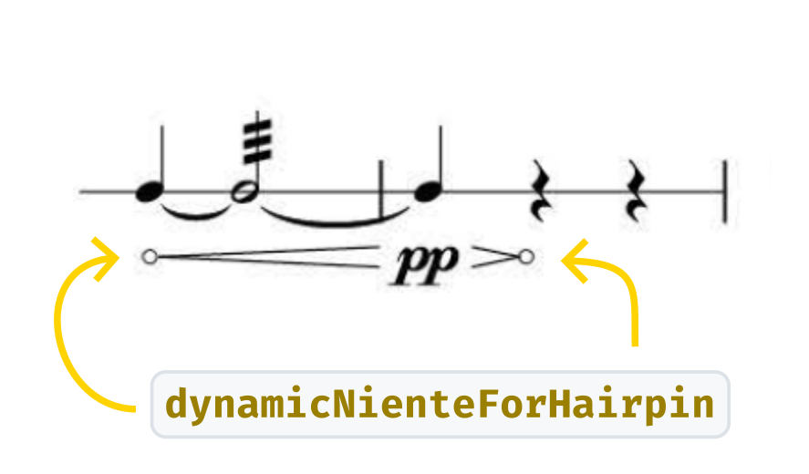
</p>

Another way how to mark a hairping going to/from zero volume (niente) is by drawing a small circle at the end of the hairpin. This circle is a separate object called `dynamicNienteForHairpin`.

- Annotate the mask **precisely**.
- Hollow out the center.
- Add a <kbd>🔴 syntax</kbd> link from the hairpin object to the circle object.

This symbol does NOT belong to any `dynamicText`, it belongs to the hairpin.

---


## Repeats

> **🚧 Under construction.**

TODO: smufl rozlišuje kontejner classes: repeatLeft repeatRight, my to taky zavedeme

<!--
https://w3c.github.io/smufl/latest/tables/repeats.html
Serpent segno examples:
- https://ufallab.ms.mff.cuni.cz/~mayer/mung-studio/#/simple-backend/2f6466fb-7268-48c4-8f98-ddcdb81db881_40c339dd-cd83-40b4-9259-474fb047d00d
- https://www.reddit.com/r/classicalmusic/comments/a7sqkj/what_is_this_swirly_thing_occurs_several_times_in/

Half-bar repeat annotated as "otherText":
https://ufallab.ms.mff.cuni.cz/~mayer/mung-studio/#/simple-backend/16c27f86-07f5-4b34-a6ca-ec8885f2b51f_445f7cea-17d1-43cb-a08b-a0e5994f17cb
-->

A **repetition mark** is composed of several elements:


### repeatDot

- The **two dots** next to the barline indicating the repeat.  
  Each dot should be annotated individually as a separate `repeatDot`.


### bracket / barlineSingle / barlineHeavy

- The **barline or bracket components** that form the vertical part of the repeat symbol.


### repeat

- The **container mask** that encloses the entire repeat sign (as a convex hull).
- Back-to-back repeats share the two barlines, but are two distinct repeat (containers).


### TODO: když se vyskytne

podivná repetice. Jak značit šikmé dvojčárky? - když se znovu vyskytne, volat výš, tohle je potřeba dořešit

<p>
  
</p>

ODPOVĚĎ: ocasy nahoře/dole jsou barline, vlnovky jsou repeat dot, jinak barline

---


### repeat1Bar

- in CVAT `repeat_measure_sign`
- `%`

TODO: nad tímhle může být text (stejně jako nad multi-measure rets / whole rest), ten se linkuje v precedenčním grafu (na to je nějaká diskuze někde)

TODO: někdy se používá pro repeat půl-taktu, to je v pohodě, je to pořád tento symbol

TODO: projít partitury a vychytat divnosti, je tam taky "repeat one beat", což je jen ten slash bez teček a někdy to opakuje půl-takt

<!--
- https://ufallab.ms.mff.cuni.cz/~mayer/mung-studio/#/simple-backend/049fd427-418f-4ef8-8944-4108b977d7be_b2dc7d20-babb-42a0-aa63-e33248d43fe6
-->

---


## Col violino unisono

> **🚧 Under construction.**

- TODO: není pro to maska - je to asi podobně rozšířené jako repeat_measure_sign (%)
- dvě čáry - Píšou se, když má nástroj hrát unisono s jiným partem (note: to je pokračování unisona)
- "col viol" https://github.com/orgs/OmniOMR/discussions/124 stejná věc (stejné precedenční hrany) (note: tohle je začátek unisona)

nějakej "unisonoMark"

nebo "col instruction" - text nebo něco

dvě čárky = "dtto", stejně jako to předtím

"interpretační pokyny = čti noty jinde"

Samples:
- https://ufallab.ms.mff.cuni.cz/~mayer/mung-studio/#/simple-backend/f0eb92d3-24ff-4aa8-bb21-cdebb709a276_6f750072-273e-487e-abd9-d9e8afdb767e

---


## Tuplets

*(also called "tuple", "tuples" previously; however, SMuFL uses "tuplet", "tuplets")*

*(see the corresponding [SMuFL Group](https://w3c.github.io/smufl/latest/tables/tuplets.html))*

<p>
  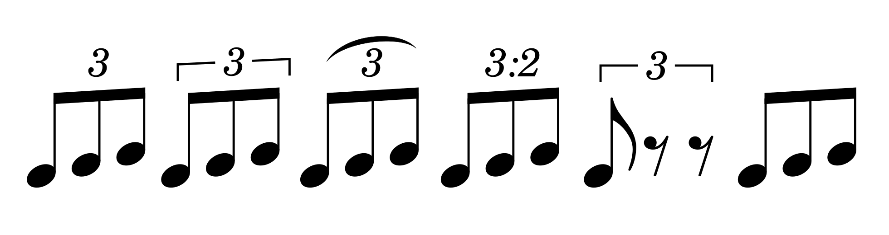
</p>

Tuplets are notes whose duration is modified relative to the regular duration of the note. In the example above, you can see triplets, where three triplet eight notes take up time of exactly two eight notes (you play three in the space of two). You can read more about tuplets in [MuseScore](https://musescore.org/en/handbook/3/tuplets) and on [Wikipedia](https://en.wikipedia.org/wiki/Tuplet).

There are a number of ways how a tuplet can be writen down:

- With a number above the group (e.g. **3** for triplets)
- With a number and a square bracket (modern notation)
- With a number and a round bracket (older notation, easy to confuse with a slur)
- With a ratio **3:2** instead of a number (three in two)
  - (note, sometimes the order is reversed despite meaning the same thing)
- With **no visible notation**, these are called **implicit tuplets** and are often used when a given tuplet continues within the piece
  - (e.g. the first tuplet is notated explicitly, and then it is expected to continue)
  - (must be infered from the context - too many notes within the number of beats)
  - (see the example documents below)
- Most tuplets are triplets (3 in 2), however there are also other numbers, such as duplets (2 in 3), quintuplets (5 in 4), sextuplets (6 in 4), or septuplets (7 in 4/6/8 depending on the context).

**How to annotate:**

- Annotate the visual glyphs according to their classes (e.g. `tuplet3`, `tupletBracket`), see the classes below.
- Connect numbers and colons left-to-right via <kbd>🟢 precedence</kbd> links (see the `tuplet[0..9]` classes).
- Create a container `tuplet` that contains affected notes and rests and the tuplet notation glyphs.
  - Affected noteheads <kbd>🔴 syntax</kbd> link to the `tuplet` container.
  - The `tuplet` container <kbd>🔴 syntax</kbd> links to tuplet glyphs.
  - Annotate *implicit tuplets* with the `tuplet` container as well.

See the individual classes below and the `tuplet` container class to learn more.

<details>
  <summary>🔗 Example documents</summary>

  - Implicit tuplets (must be infered from context)
    - https://ufallab.ms.mff.cuni.cz/~mayer/mung-studio/#/simple-backend/11ccf60d-cc2e-4843-806c-f647e910fa13_24fd65a4-6a07-4d25-a986-f95d083e6142
    - https://ufallab.ms.mff.cuni.cz/~mayer/mung-studio/#/simple-backend/1d507bc2-87e7-4b61-8bea-6126616c4851_319410a3-e83e-42c4-9c73-1f616d09edf6
    - https://ufallab.ms.mff.cuni.cz/~mayer/mung-studio/#/simple-backend/81c9f683-28d1-4e73-8e25-e37333408f5a_d3de8b4f-5d39-4445-9a37-23ee474a4ff5
  - Explicit triplets, only number, no brackets
    - https://ufallab.ms.mff.cuni.cz/~mayer/mung-studio/#/simple-backend/30d6c780-c8fe-11e7-9c14-005056827e51_36758ac0-f593-11e7-b30f-5ef3fc9ae867
    - <!-- TODO: https://ufallab.ms.mff.cuni.cz/~mayer/mung-studio/#/simple-backend/48788ad8-de8b-4d01-ace1-4adffc7ed0ad_ea864792-7020-47e7-bb7b-3a48477202cf -->
  - Explicit triplets, with round brackets
    - https://ufallab.ms.mff.cuni.cz/~mayer/mung-studio/#/simple-backend/33c9e218-519a-4e5d-8f6e-d4de89f4fc87_ac38f0d6-ba87-4008-a540-887fc9657b4b
    - <!-- TODO: https://ufallab.ms.mff.cuni.cz/~mayer/mung-studio/#/simple-backend/5895c292-1b64-41d6-acdf-c2cc77c18f71_5fbc84f2-6a4b-4f2c-b6fc-2403453c1e3d -->
    - <!-- TODO: https://ufallab.ms.mff.cuni.cz/~mayer/mung-studio/#/simple-backend/5c5a6d8c-b434-4496-a9ac-67d518230273_918a0a32-43d2-4f0f-90bd-944aef42b750 -->
  - Explicit triplets, with square brackets
    - To be encountered...
  - Other than 3-tuplets
    - <!-- TODO: 2-tuplets (last system, first measure): https://ufallab.ms.mff.cuni.cz/~mayer/mung-studio/#/simple-backend/48788ad8-de8b-4d01-ace1-4adffc7ed0ad_308137da-5365-4b05-8d46-2908974b1089 -->
    - <!-- TODO: WTF? Needs complete revision! 6-tuplets: https://ufallab.ms.mff.cuni.cz/~mayer/mung-studio/#/simple-backend/8136b106-6283-42c6-99eb-2f46c519c931_b71613df-c2b0-420c-9684-064e157facfb -->
    - 7-tuplets: https://ufallab.ms.mff.cuni.cz/~mayer/mung-studio/#/simple-backend/8136b106-6283-42c6-99eb-2f46c519c931_2904af42-889b-4358-bf4e-65c81818d642
</details>


### `tuplet[0..9]`

<p>
  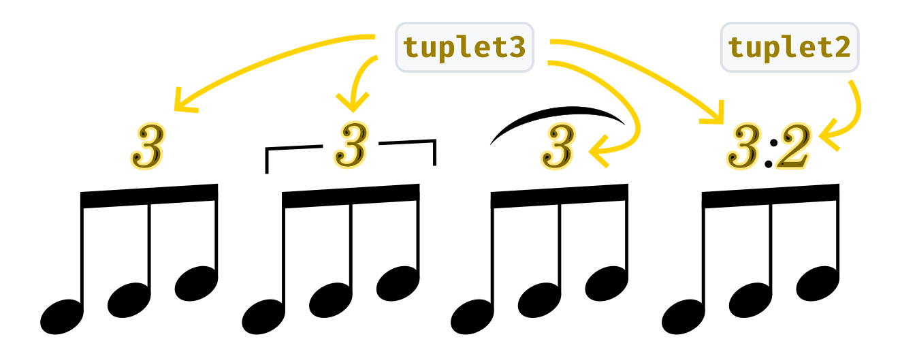
  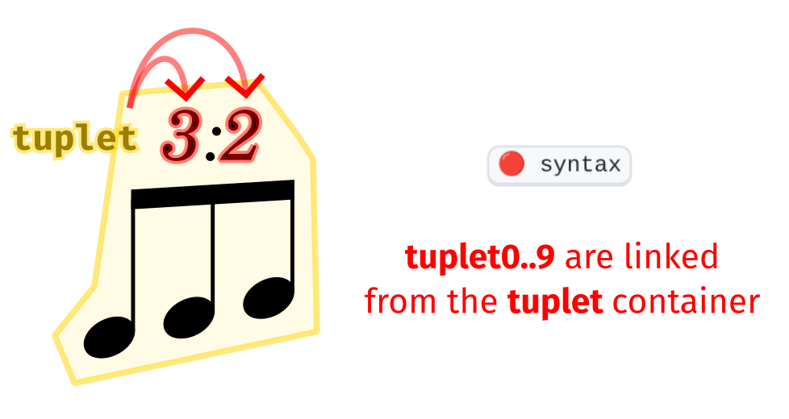
  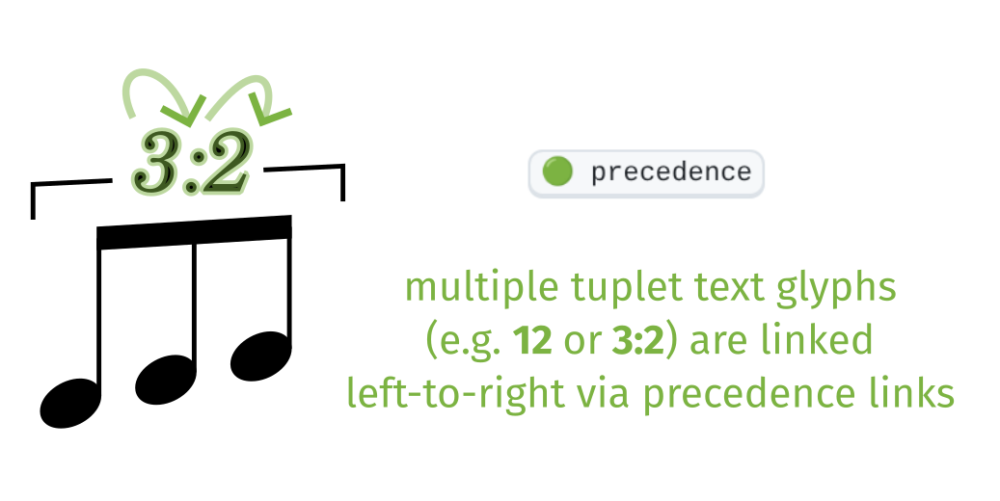
</p>

- Classes `tuplet0`, `tuplet1`, ..., `tuplet9` are individual numbers that denote a tuplet.
- Mark the mask **precisely** around the number.
- Annotate the numbers only if they are written in the score. If missing, there is nothing to annotate.
- Sometimes the number is hard to read (e.g. `3` looks like `ↄ`), infer the number from context and annotate it according to its meaning (e.g. `tuplet3`).
- Each number has an incomming <kbd>🔴 syntax</kbd> link from the `tuplet` container class.
- If a tuplet is marked by multiple numbers (e.g. `12` or `3:2`), mark each number **separately** as individual elements and join all of them **left-to-right** via <kbd>🟢 precedence</kbd> links.

<p>
  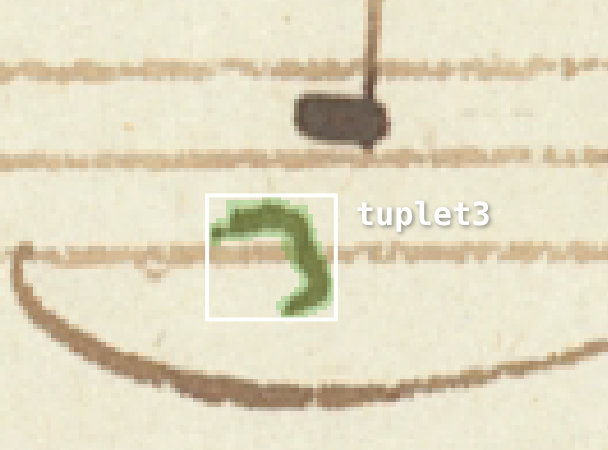
  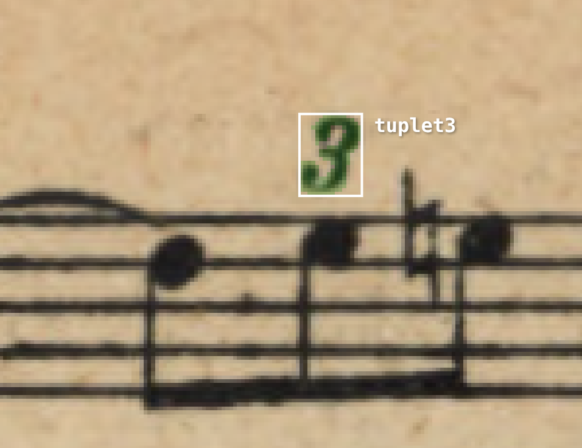
  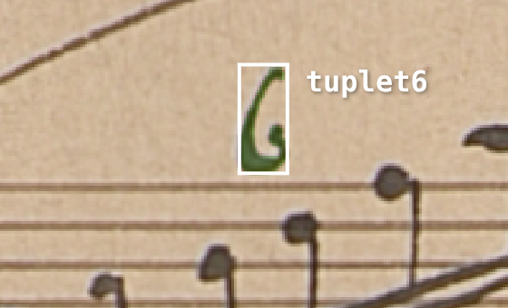
  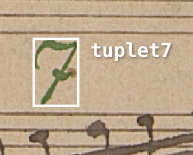
</p>


---


### `tupletColon`

<p>
  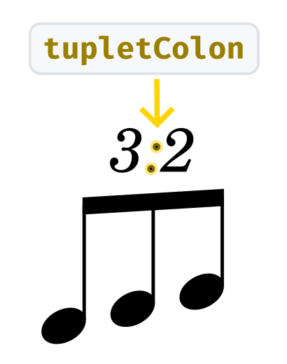
  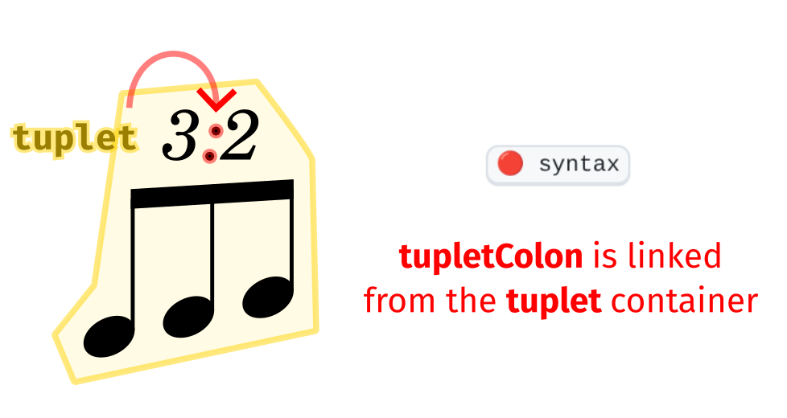
  
</p>

- A colon `:` may sometimes be used among tuplet numbers. Treat it just like the `tuplet[0..9]` numbers above.
- Mark the mask **precisely** around the colon.
- The colon has an incomming <kbd>🔴 syntax</kbd> link from the `tuplet` container class.
- The colon participates in the <kbd>🟢 precedence</kbd> links that link multiple tuplet numbers together **left-to-right**.

---


### `tupletBracket`

*(previously `tuple-spanner` or `tupleBracket`)*

<p>
  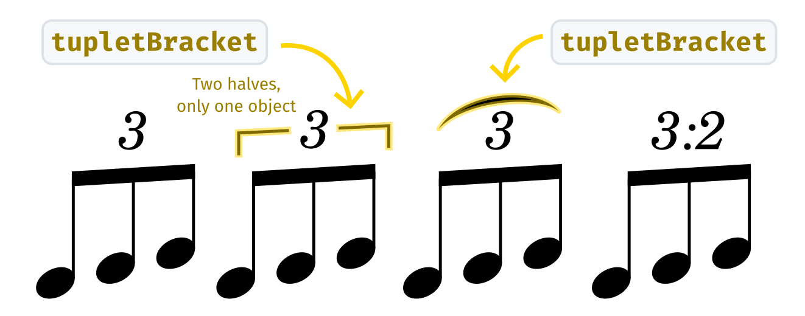
  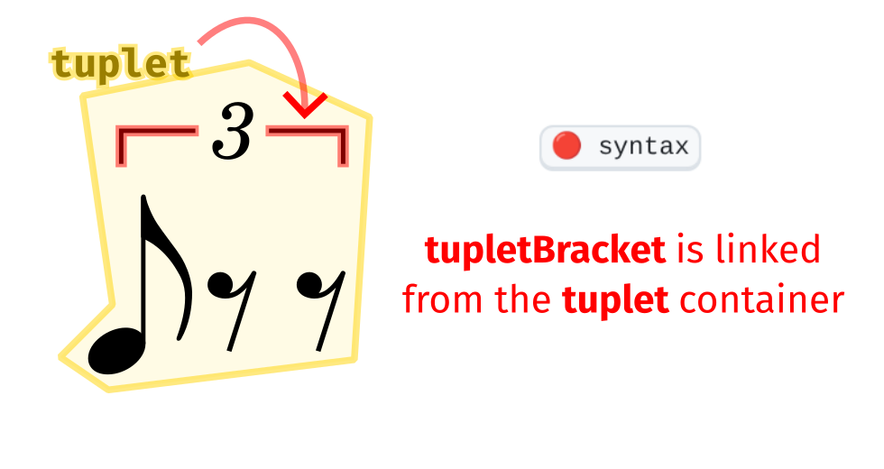
</p>

- A tuplet group may contain a bracket that defines exactly where the group begins and ends. This is often used, when the notes do not share a beam (because of half notes or rests).
- The bracket is a **single object** `tupletBracket`. Even if it is drawn as **multiple segments**.
- Modern notation uses square brackets (two halves) to make tuplets easily recognizable.
- Older notation uses round brackets that look like slurs. **Be careful and do not confuse slurs with tuplet brackets!** When in doubt, ask. See the example documents above to get a feel.
- The tuplet bracket has an incomming <kbd>🔴 syntax</kbd> link from the `tuplet` container class.
- Tuplet brackets **do NOT** participate in <kbd>🟢 precedence</kbd> links that link tuplet numbers together. Those are only for the text.

<p>
  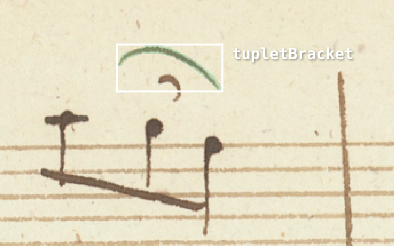
</p>

---


### `tuplet`

*(previously `tuple`)*

*(`tuplet` is not part of SMuFL, because it is a container class)*

<p>
  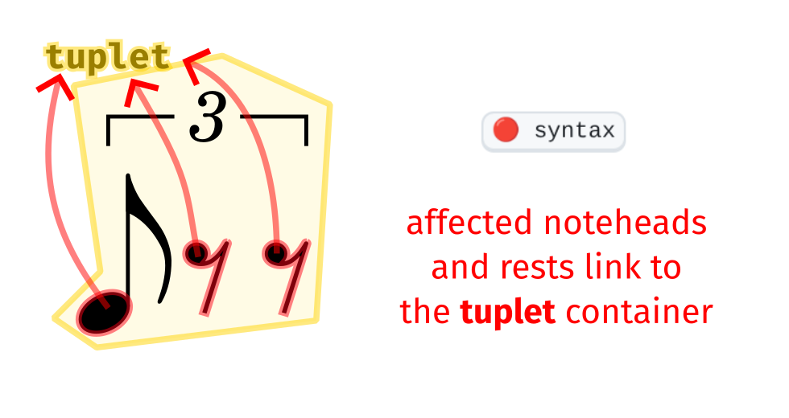
</p>

- A **container class** for grouping all elements that mark a tuplet note group.
- It has three purposes:
  - Group noteheads and rests that participate in the tuplet.
  - Group the tuplet notation primitives (bracket and numbers) for the tuplet group.
  - Link the two groups above together.

This is what the syntax hierarchy for the `tuplet` container looks like:

<p>
  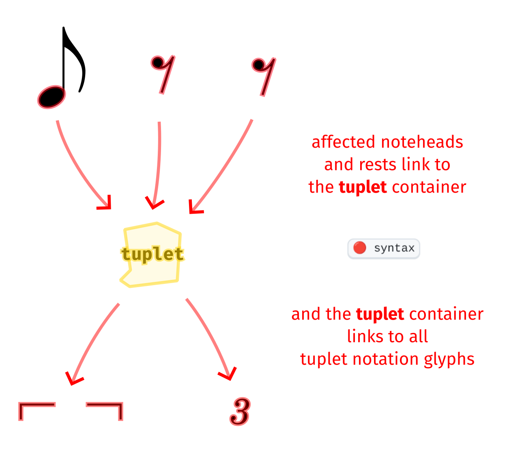
</p>

- Affected noteheads and rests have <kbd>🔴 syntax</kbd> links to the `tuplet` container.
- Tuplet notation primitives (bracket and numbers) are <kbd>🔴 syntax</kbd> linked from the `tuplet` container.

- The pixel-mask for the `tuplet` container is only present to make the container visible in MuNG Studio. **Draw a polygon shape that encapsulates the entire tuplet group** with all notes, tuplet bracket, numbers and stems and beams.
- Do **NOT** make the mask too tight, too small, or disjoint. It makes the review process more difficult and does not help with anything.

<p>
  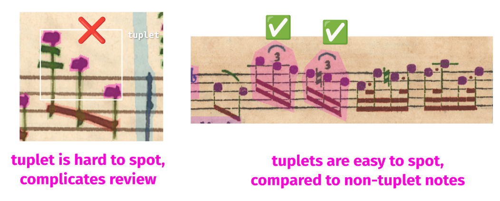
</p>

Here is an example triplet with `tuplet3` number, round `tupletBracket` and the `tuplet` container. The container <kbd>🔴 syntax</kbd> links to the number and bracket and the three affected noteheads link to the container:

<p>
  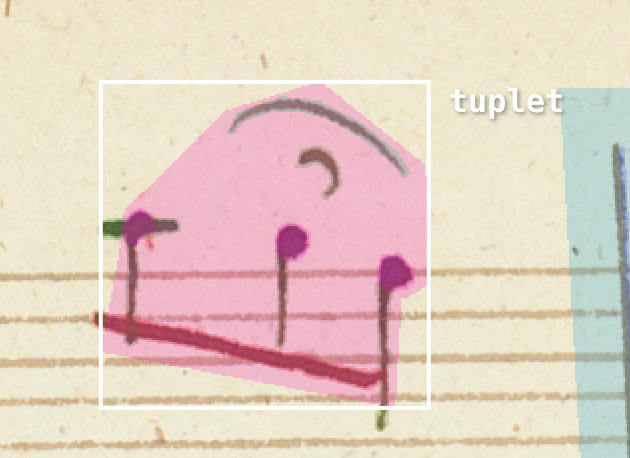
  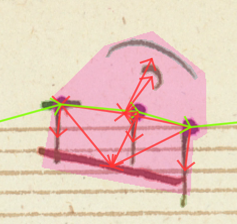
</p>

Here are **implicit tuplets** (no numbers, no brackets). The time meter is `4/4` because of the two half notes on the lower staff, which means these eight notes must be triplets (three per beat). The only annotation is the `tuplet` container and <kbd>🔴 syntax</kbd> links from noteheads:

<p>
  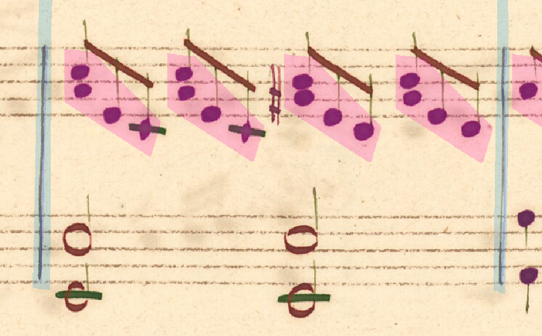
  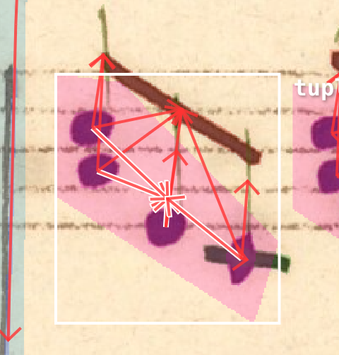
</p>

See *🔗 Example documents* above at the end of [Tuplets](#tuplets) section.

---


## Tremolo

Learn more about tremolos on [Wikipedia](https://en.wikipedia.org/wiki/Tremolo).

> TL;DR: A note (or two notes) should be quickly repeated in the time span of the apparent note, with the speed based on the number of tremolo strokes (or beams), which correspond to the beams that the short played notes would have if notated explicitly.


### `tremolo[1..5]`

*(see the corresponding [SMuFL Group](https://www.w3.org/2021/03/smufl14/tables/tremolos.html))*

*(Previously `tremolo_beam` in CVAT and `singleNoteTremolo` in MuNG)*

<p>
  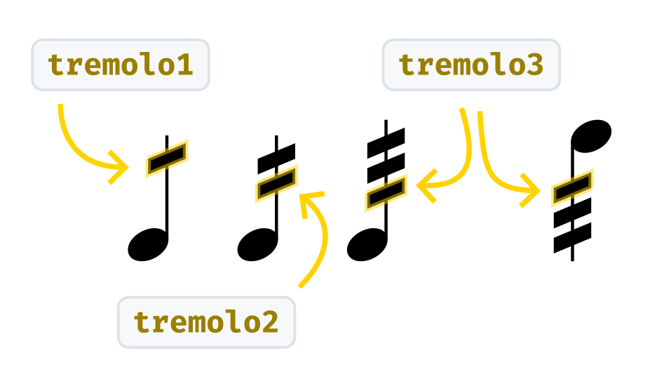
  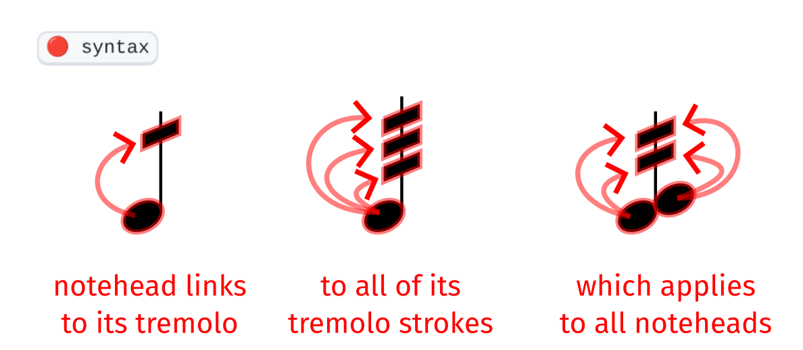
</p>

Strokes present on a note, when that note should be repeated quickly within its duration. The three example notes above correspond to playing eight-notes, sixteenth-notes, and thirty-second notes within the duration of a quarter note each.

- Multiple tremolo strokes are labeled from **outer to inner** as `tremolo1`, `tremolo2`, `tremolo3`, etc.
  - Analogous to the `flag` hierarchy but we do NOT distinguish up/down orientation, since they look identical.
- All noteheads of a chord have <kbd>🔴 syntax</kbd> links to all tremolo strokes for the chord.
- Tremolo strokes can also be present for **whole notes**, they are drawn where the stem would be (but there is no stem).

<p>
  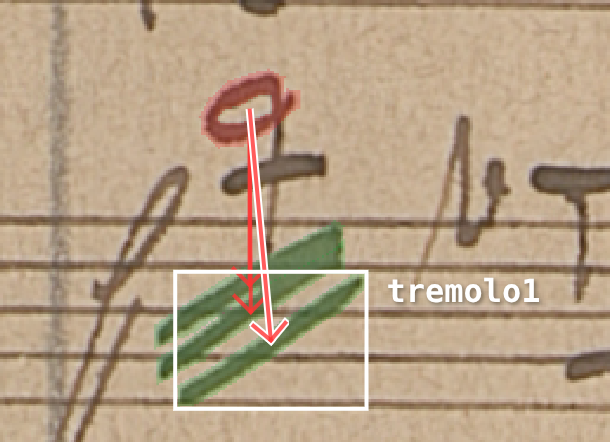
  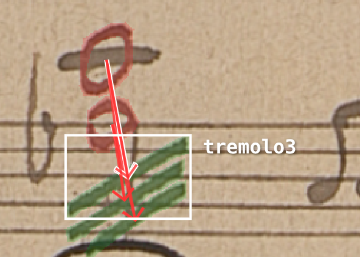
  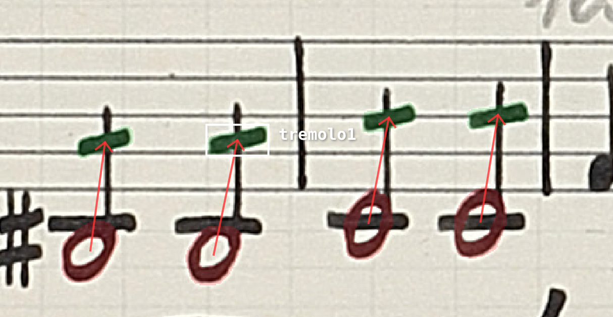
</p>

<details>
  <summary>🔗 Example documents</summary>

  - https://ufallab.ms.mff.cuni.cz/~mayer/mung-studio/#/simple-backend/8136b106-6283-42c6-99eb-2f46c519c931_2904af42-889b-4358-bf4e-65c81818d642
  - https://ufallab.ms.mff.cuni.cz/~mayer/mung-studio/#/simple-backend/ca625f33-b4e1-49a9-bbc4-63130ba0fe70_010e98cc-eab8-47d9-8424-1cfc8d3c1c1a
</details>


### `tremoloBeam`

*(`tremoloBeam` is not part of SMuFL, because it cannot be rendered using a notation font)*

*(Previously `tremolo_beam` in CVAT and `tremoloMark` in MuNG)*

<p>
  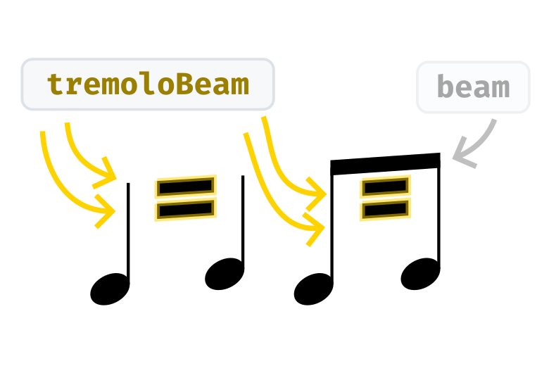
  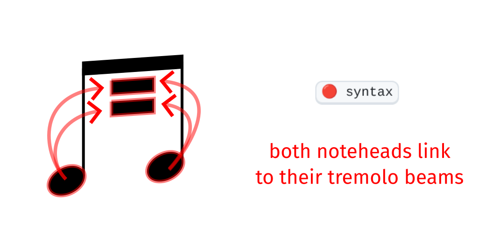
  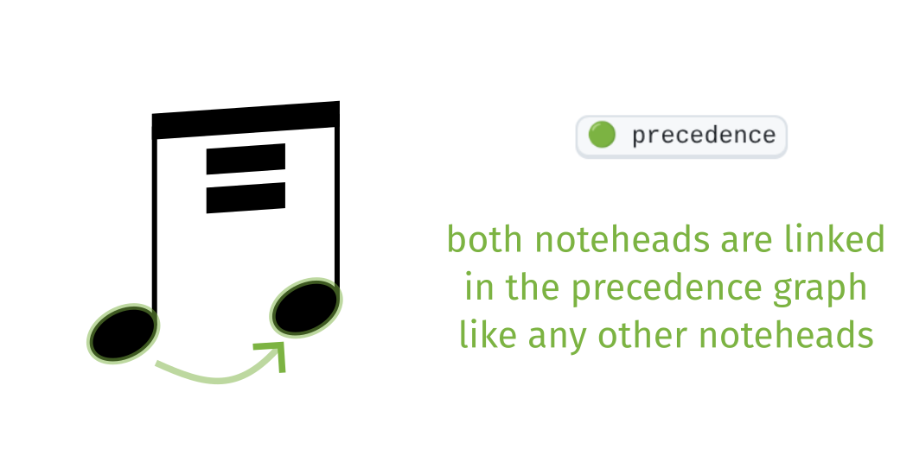
</p>

Tremolo beams are shorter beams that represent quick alteration between two notes. They are analogous to tremolo strokes above, but for 2 pitches (notes) instead. In the examples above, you have two sixteenth-notes (2-beams) alternating in the space of one quarter note; and the other example is two thirty-second notes (1 beam + 2 tremolo beams) alternating in the space of one eighth note (1 beam). Note that even though there are visibly two quarter/eighth notes, the whole tremolo group only takes up the time of one.

- Each notehead has <kbd>🔴 syntax</kbd> links to all of its tremolo beams.
- Both noteheads have <kbd>🟢 precedence</kbd> link between them, like any other noteheads.
  - (this is analogous to how [MusicXML](https://www.w3.org/2021/06/musicxml40/musicxml-reference/examples/tremolo-element-double/) treats them as two notes after each other with half as long duration)
- Tremolo beams can also be present between **whole notes**, they are drawn in the same place as a beam, but there are no stems.

Half notes can afford to have the tremolo beams connected to the stem (since half notes do not have any beam by itself). Therefore all of these variants below can appear. In all of these cases, there are only **tremolo beams**, no regular beams:

<p>
  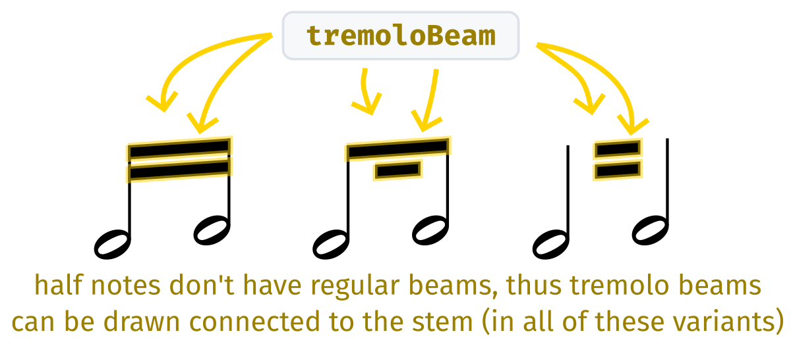
</p>

<p>
  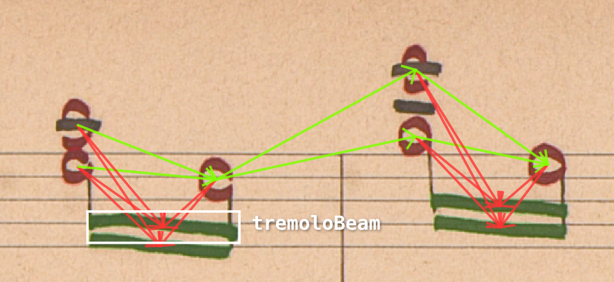
  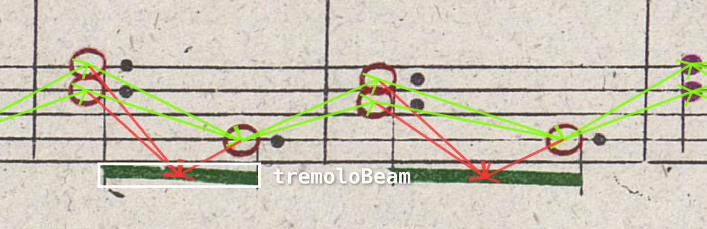
</p>

<details>
  <summary>🔗 Example documents</summary>

  - https://ufallab.ms.mff.cuni.cz/~mayer/mung-studio/#/simple-backend/5895c292-1b64-41d6-acdf-c2cc77c18f71_35f19b56-c7bd-4289-9d52-a5c128197708
  - https://ufallab.ms.mff.cuni.cz/~mayer/mung-studio/#/simple-backend/93736ae0-d1c5-11ec-8264-005056827e51_f824ce8b-a273-4bd3-a70c-9d6381d69806
</details>

---


## Figured bass

> **🚧 Under construction.**

<!--
- https://ufallab.ms.mff.cuni.cz/~mayer/mung-studio/#/simple-backend/16c27f86-07f5-4b34-a6ca-ec8885f2b51f_445f7cea-17d1-43cb-a08b-a0e5994f17cb
-->


### `figuredBassText`

> **🚧 Under construction.**

- konvexní obal skupinky (NE, chceme to mít pořešené líp - SMUFL na to má třídy)
- JE to v precedenčním grafu, protože ty symboly mají trvání (e.g. víc symbolů nad jednou celou notou)
  - precedence JENOM mezi věcma co jsou u jedné noty
- prohledat diskuze, pořešit s Adamem


### TODO: `figured_bass_spanner`

> **🚧 Under construction.**

- zatím pro to není třída (ani SMuFL pro to nemá nic)

---


## Grace notes

> **🚧 Under construction.**

*(see the corresponding [SMuFL Group](https://w3c.github.io/smufl/latest/tables/common-ornaments.html))*

A grace note is composed of:

- `noteheadWholeSmall` / `noteheadHalfSmall` / `noteheadBlackSmall`

<p>
  
</p>

- Uses a standard `stem`, `flag(number)th(Up/Down)`, `beam`

<p>
  
</p>

- The "slash" through the grace note is `graceNoteSlashStemUp` or `graceNoteSlashStemDown` based on the stem orientation (not the slash orientation).

<details>
  <summary>🧵 Relevant discussions</summary>

  - https://github.com/orgs/OmniOMR/discussions/61#discussioncomment-9843887
</details>

<!--
<details>
  <summary>🔗 Example documents</summary>

  - Last system, middle measure, top staff: https://ufallab.ms.mff.cuni.cz/~mayer/mung-studio/#/simple-backend/81c9f683-28d1-4e73-8e25-e37333408f5a_5b6164cc-5653-494b-b43f-946fbb64d440
  - https://ufallab.ms.mff.cuni.cz/~mayer/mung-studio/#/simple-backend/09bc8dd2-c0c8-40c8-b48d-9db654d4bb7a_3d7bfbbf-6ad8-4e68-aa81-3f8dc6d633b6
</details>
  - https://ufallab.ms.mff.cuni.cz/~mayer/mung-studio/#/simple-backend/ae6834fa-f241-4c24-8a11-a025281b6112_7ad6c7df-d12b-4bdd-b53a-49a3e8c1799d
-->

---


## `fermataAbove` / `fermataBelow`

> **🚧 Under construction.**

<p>
  
  
</p>

---


## Ornaments

*(see the corresponding [SMuFL Group](https://w3c.github.io/smufl/latest/tables/common-ornaments.html))*


### `ornamentTrill`

> **🚧 Under construction.**

*(Previously grouped under `ornament` in CVAT.)*

- Used for the **“tr” text** symbol marking a **short trill**.
- Do not use a simple convex hull. The annotation **must follow the exact shape** of the symbol. **TODO:** je toto pravda?

<p>
  
</p>

<!--
TODO: docs:
- https://ufallab.ms.mff.cuni.cz/~mayer/mung-studio/#/simple-backend/8136b106-6283-42c6-99eb-2f46c519c931_2904af42-889b-4358-bf4e-65c81818d642
- https://ufallab.ms.mff.cuni.cz/~mayer/mung-studio/#/simple-backend/30d6c780-c8fe-11e7-9c14-005056827e51_36058ae0-f593-11e7-b30f-5ef3fc9ae867
- https://ufallab.ms.mff.cuni.cz/~mayer/mung-studio/#/simple-backend/ca625f33-b4e1-49a9-bbc4-63130ba0fe70_b611e394-9858-4732-a14c-648f11497bb9
-->

---


### `wiggleTrill`

> **🚧 Under construction.**

*(see the corresponding [SMuFL Group](https://w3c.github.io/smufl/latest/tables/multi-segment-lines.html))*

- Represents the **wavy line** that typically **follows a trill mark**,  
indicating the continuation of the trill.

<!--
TODO: docs:
- https://ufallab.ms.mff.cuni.cz/~mayer/mung-studio/#/simple-backend/8136b106-6283-42c6-99eb-2f46c519c931_2904af42-889b-4358-bf4e-65c81818d642
-->

---


### `ornamentTurn`

*(Previously grouped under `ornament` in CVAT.)*

- <kbd>🔴 syntax</kbd> link from the notehead to the ornament.

<p>
  
</p>

---


### `ornamentTurnInverted`

*(Previously grouped under `ornament` in CVAT.)*

- <kbd>🔴 syntax</kbd> link from the notehead to the ornament.

<p>
  
  
  
</p>

<details>
  <summary>🔗 Example documents</summary>

  - https://ufallab.ms.mff.cuni.cz/~mayer/mung-studio/#/simple-backend/93736ae0-d1c5-11ec-8264-005056827e51_f824ce8b-a273-4bd3-a70c-9d6381d69806
</details>

---


## `systemDivider`

> **🚧 Under construction.**

*(Called `system_break` in CVAT)* 

TODO: image

---


## `splitBarDivider`

> **🚧 Under construction.**

- napojení taktu (ta vlnovka na konci)

<p>
  
</p>

---


## Octaves

> **🚧 Under construction.**

*(see the corresponding [SMuFL Group](https://w3c.github.io/smufl/latest/tables/octaves.html))*

TODO: the `horizontalSpanner` for ottava marking belongs here (but there's another one for figured bass sharing the class name)

TODO: the first example document below also contains pedal markings

<!--
<details>
  <summary>🔗 Example documents</summary>

  - https://ufallab.ms.mff.cuni.cz/~mayer/mung-studio/#/simple-backend/1d507bc2-87e7-4b61-8bea-6126616c4851_2c51b8ce-49e1-4343-82b3-97a210f61897
  - https://ufallab.ms.mff.cuni.cz/~mayer/mung-studio/#/simple-backend/1d507bc2-87e7-4b61-8bea-6126616c4851_319410a3-e83e-42c4-9c73-1f616d09edf6
</details>
-->

---


## `arpeggiato`

> **🚧 Under construction.**

*(Previously grouped under `ornament` in CVAT.)*  

- Used for **vertical wavy lines** indicating that a chord should be **arpeggiated**.  
- Note: use the class name **`arpeggiato`**, **not** `arpeggio`.

<!--
<details>
  <summary>🔗 Example documents</summary>

  - https://ufallab.ms.mff.cuni.cz/~mayer/mung-studio/#/simple-backend/1d507bc2-87e7-4b61-8bea-6126616c4851_319410a3-e83e-42c4-9c73-1f616d09edf6
  - https://ufallab.ms.mff.cuni.cz/~mayer/mung-studio/#/simple-backend/6381d3b0-00c7-11f0-9b34-5ef3fc9bb22f_a869cf3d-924f-406d-b3ee-f09f112e5a58
</details>
-->

---


## `unclassified` / UFO

*(Called `ufo` in CVAT)*

> **🚧 Under construction.**

**TODO:** Vyřešit jestli je tahle třída opravdu potřeba.

Use this class for **non-musical marks or noise** that appear on the page **only if they interfere with reading the notation**.

- Examples include: stray hairs, spilled coffee, squashed insects, or other artifacts that overlap staves or notes.  
- Do **NOT** annotate: book spines, notation on neighboring pages, symbols from previous pages, or anything you are unsure about — ask before labeling.

- Marks that appear faintly in the background (like “ghost”  bleed-through) should NOT be annotated, only if they don't look like “ghosts”. 

<p>
  
  
</p>

---


## Precedence graph

TODO ...

- primary rule: when two durables meet (end-start), link is there
- secondary rule: minimize links in-between separate voices (staffs, parts)
- lemma: between chords, it's all-to-all connections

Here, there is a missing eighth rest, first system, last measure, bottom staff, onset 1.5 beats: https://ufallab.ms.mff.cuni.cz/~mayer/mung-studio/#/simple-backend/81c9f683-28d1-4e73-8e25-e37333408f5a_d3de8b4f-5d39-4445-9a37-23ee474a4ff5
(this breaks the central assumption for precedence links, what to do about it?)
