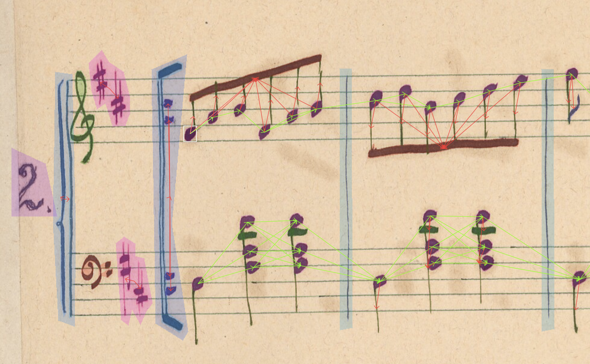
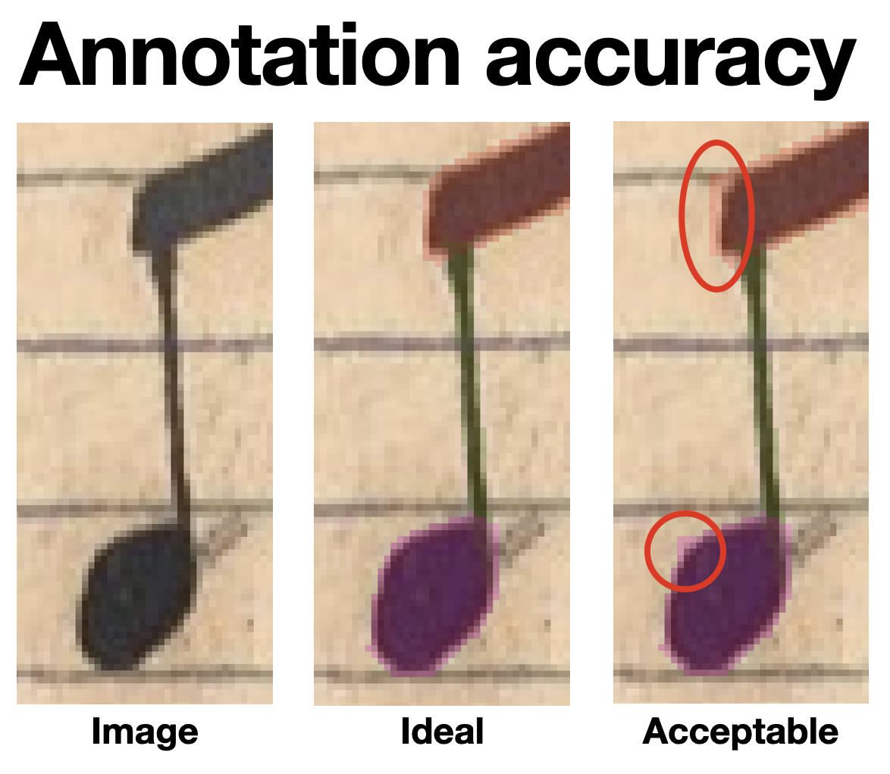
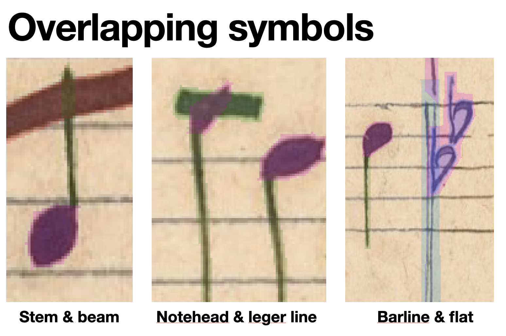
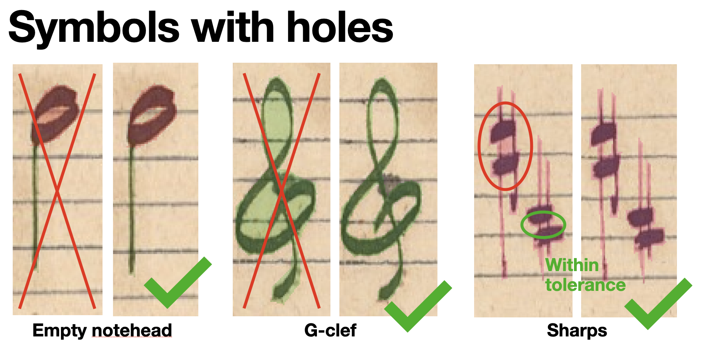

# Annotating Music Notation Graphs

The **Music Notation Graph (MuNG) format** is designed to represent music notation in a structured way 
that forms a complete, unambiguous description of the music notation on a given page. That is: once
we have a MuNG representation, we already know everything about what is notated and no longer have 
to look at the original image.

Annotating music notation in MuNG involves:

- identifying and labeling various musical symbols (such as: noteheads, beams, clefs, etc.),
- and defining the relationships between them (such as: connecting a notehead to its stem, clef to a staffline, etc.).

The resulting structure is called a **graph**. The symbols are **vertices** of the graph (also called nodes). 
The relationships between symbols are **edges** connecting those vertices. This is what a MuNG graph looks like:

  

"Annotating MuNG" is the process of manually (or semi-automatically) creating such graphs over images of music notation.
This is what you will be doing.

## Why graph, and not just symbols?

In music notation, symbols do not exist in isolation; they interact with each other to convey **musical semantics:
pitches, durations, and onsets**. 

When we read music notation, we automatically interpret in terms of semantics: "This is
an 8th note with pitch F#4 that is played on the 1st beat." (from the image above).
But there is no such thing as an "8th note" written on the page. What is actually going on? 

The music notation elements that communicate the existence of this 8th note is the full (or "black") notehead.

Its **pitch** is communicated primarily by its position on the staff -- in this case, the 1st staffspace from the bottom.
But the position of the notehead on the staff does not by itself suffice: 
we need to know what clef applies to interpret the stafflines correctly in terms of pitch 
(in this case: the G-clef communicates that the 2nd line from the bottom should be interpreted as G4), 
and also whether any accidentals or key signatures apply (in this case: 
the two sharps in the key signature tell us that all Fs are to be played as F#, and all Cs as C#).

The **duration** of this 8th note is communicated by a combination of three elements: the fact that the notehead
is full (or black), the stem, and the single beam that applies to this notehead. 
But the same beam is shared by multiple 8th notes. The stem may be shared by multiple notheeads in a chord.
And there is no tuple (like a triplet) that applies to this notehead.

Finally, in order to determine the **onset** of this 8th note, we need to know where it is located with respect
to the other notes: when a note is supposed to be played in musical time is simply the sum of
durations of all the notes (and rests) that come before it in the score. In this case, nothing came before:
therefore, the onset is the 1st beat of the entire system (but it may not be the first beat of the entire piece, 
if this system is not the first one).

By now it should be clear why annotating individual symbols are not enough, and why we need to explicitly relate
them to each other.

## Why annotate MuNG?

We need MuNG data for creating **Optical Music Recognition (OMR) systems** that read music notation from images.
OMR systems are based on machine learning, and the MuNG format is a way to decompose the whole problem of reading
music notation automatically into just two steps: detecting the graph vertices, and then predicting which vertices are connected
by edges. But the data is useful in many other ways, beyond training and evaluating these systems:
we can for instance use these annotations to synthesise realistic sheet music images to overcome the lack of training data,
we can study how music notation is in fact written, what makes it possible to identify scribal hands, etc.

Thus, annotating MuNG, and doing so consistently and at a very high level of quality, is a mission-critical task
for Optical Music Recognition. Without such data, progress in OMR will not happen, or will not be measurable.
These annotation instructions exist to make sure that the data we create meets these consistency and quality requirements.

## General principles of symbol annotation

Thee are a few things to understand first, before we dive into the specifics.

Pixel-level accuracy matters. Each pixel that is incorrectly not marked as part of a symbol needs compensating
by 100+ correct pixels of that symbol class somewhere else; each background pixel incorrectly marked as part
of a symbol needs the same, due to the sensitivity of machine learning to data quality.
Acceptable precision is shown in the images below.

  

All pixels in a symbol should be marked. So if symbols intersect, such as between a stem and a beam, 
the intersection pixels just belong to both symbols. Belonging to one symbol does not exclude a pixel 
from belonging to another symbol. Intersections happen all the time.

  

If symbols have holes (such as empty noteheads), these should be annotated accurately as well.
(This does not hold for higher-level symbols, such as key signatures vs. their component accidentals.)
See image below for examples. Some very small gaps might not warrant making a hole (see 3rd example)

  

