# Noteheads

Class names in this group:

- [`noteheadWhole`](#noteheadwhole)
- [`noteheadHalf`](#noteheadhalf)
- [`noteheadBlack`](#noteheadblack)
- [`noteheadFull`](#noteheadfull) DEPRECATED
- [`notehead-full`](#notehead-full) DEPRECATED
- [`notehead-empty`](#notehead-empty) DEPRECATED
- `noteheadDoubleWhole`
- `noteheadDoubleWholeSquare`
- `noteheadXBlack`
- `noteheadXOrnate`

Corresponding SMuFL group: [4.7. Noteheads](https://w3c.github.io/smufl/latest/tables/noteheads.html)

## `noteheadWhole`

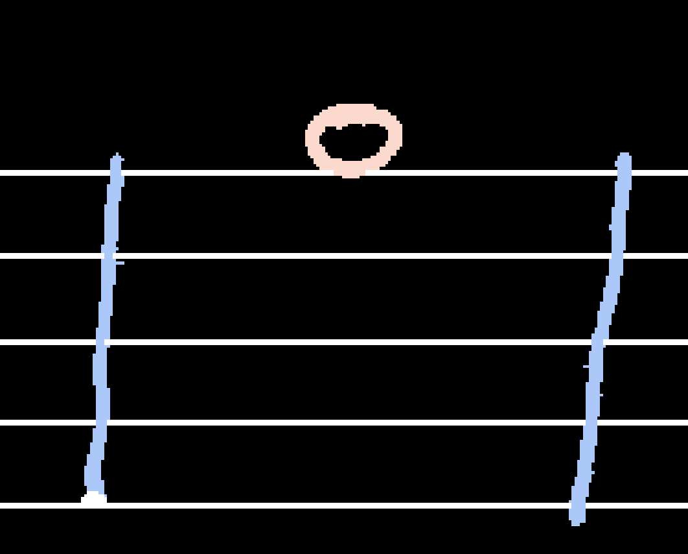
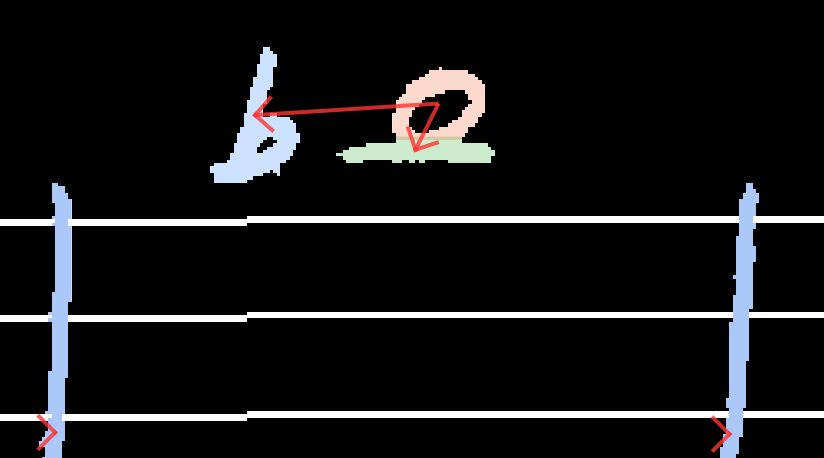

Represents a note that has 4 beats of duration. Has no stem. In typeset music notation, the glyph differs slightly from `noteheadHalf`, so two distinct class names are used. In handwritten music notation, there is no visual difference between the two.

🎯 **Goal:** Pixels inside the glyph SHOULD NOT be part of the mask. In practise, they sometimes are (disclaimer - the example is a half note):

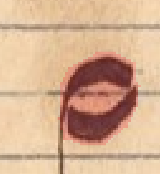

🎯 **Goal:** Pixels of the ledger line crossing the symbol SHOULD NOT be part of the mask. In practise, they sometimes are:

🤖 **Validation rules:**

- `noteheadWhole` should have no links to `stem`.

## `noteheadHalf`

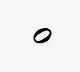
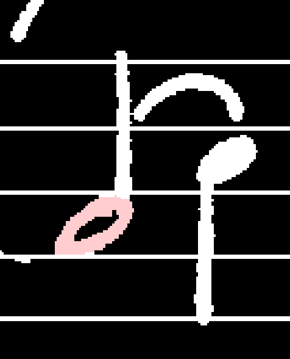
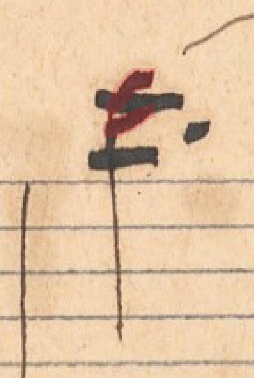
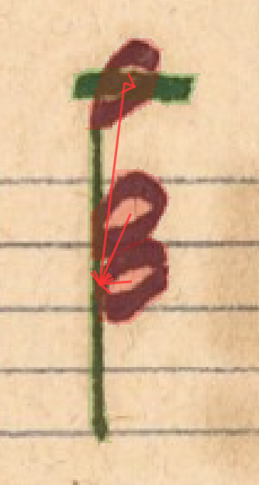

Represents a note that has 2 beats of duration. Has a stem. Can have two stems if it belongs to two voices. In typeset music notation, the glyph differs slightly from `noteheadWhole`, so two distinct class names are used. In handwritten music notation, there is no visual difference between the two.

This class has the same 🎯 **Goals** as `noteheadWhole`.

🤖 **Validation rules:**

- `noteheadHalf` must have at least one link to a `stem` (can have two).

## `noteheadBlack`

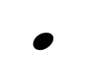
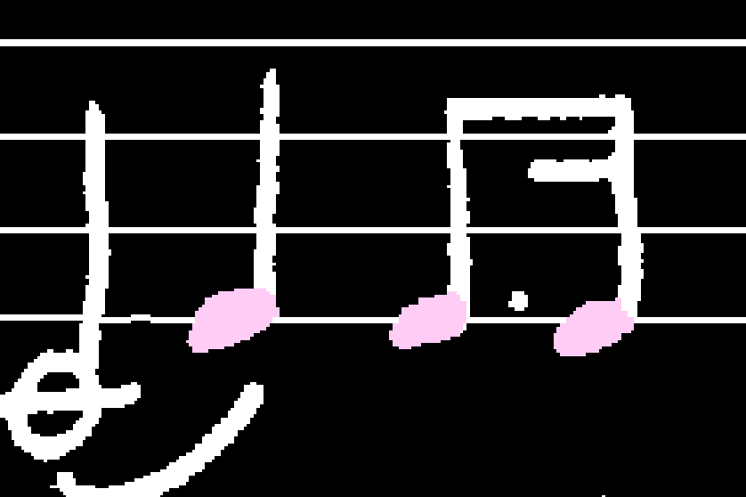
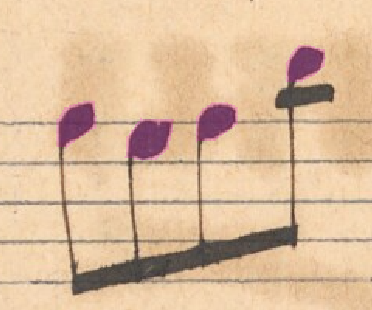
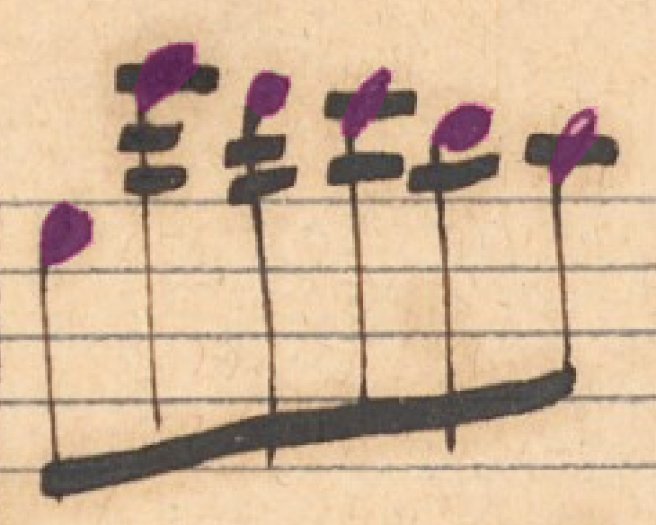

Represents a note that has 1 beat and less of duration. Has a stem, optionally flags or beams. Can have two stems if it belongs to two voices.

🤖 **Validation rules:**

- `noteheadBlack` must have at least one link to a `stem` (can have two).

## `noteheadFull`

🪦 **Deprecated:** Use `noteheadBlack` instead.

Used in MUSCIMA++ 2.0, does not align with SMuFL. Treat it as an alias for `noteheadBlack` when parsing MuNG. For new data, use the `noteheadBlack` class instead. Has the exact same definition as the `noteheadBlack` class.

🤖 **Validation rules:**

- `noteheadFull` should be replaced with `noteheadBlack`.

## `notehead-full`

🪦 **Deprecated:** Use `noteheadBlack` instead.

Used in MUSCIMA++ 1.0. Now replaced by the `noteheadBlack` class name, which aligns with SMuFL.

🤖 **Validation rules:**

- `notehead-full` should be replaced with `noteheadBlack`.

## `notehead-empty`

🪦 **Deprecated:** Use `noteheadWhole` or `noteheadHalf` instead.

Used in MUSCIMA++ 1.0. Now replaced by `noteheadWhole` for whole notes (no stem) or by `noteheadHalf` for half notes (has a stem).

🤖 **Validation rules:**

- `notehead-empty` should be replaced with `noteheadWhole` if it has no stem and with `noteheadHalf` otherwise.
