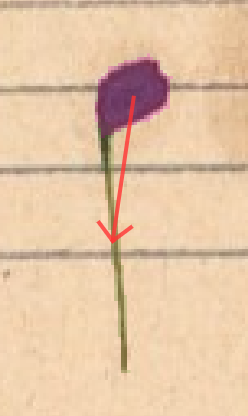
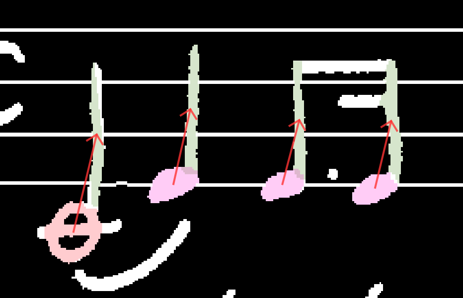

# Stems

Corresponding SMuFL group: [4.15. Stems](https://w3c.github.io/smufl/latest/tables/stems.html)

Class names in this group:

- [`stem`](#stem)

## `stem`

The line that extends vertically up or down from a notehead. Flags and beams attach to stems.

A notehead can have two stems, if the notehead represents two simultaneous notes from two voices with the same pitch. Example:

🔗 **Inlinks:** From these noteheads: `noteheadHalf`, `noteheadBlack`. And from these gracenote noteheads: `noteheadHalfSmall`, `noteheadBlackSmall`.

🤖 **Validation rules:**

- `stem` must have exactly one inlink from some notehead.
