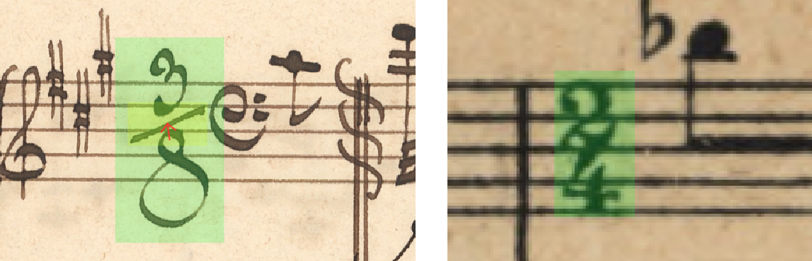
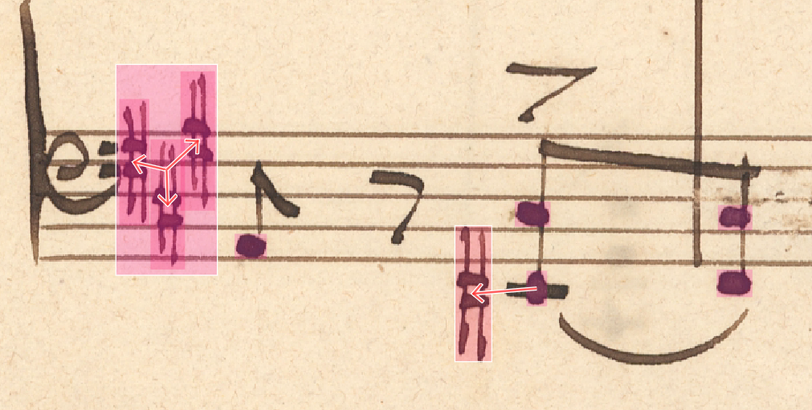
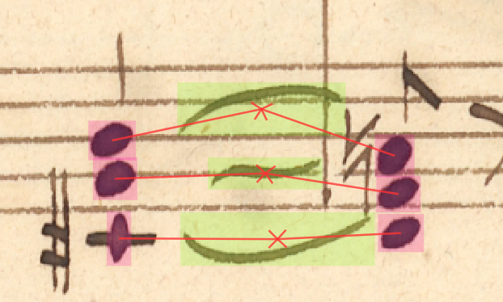
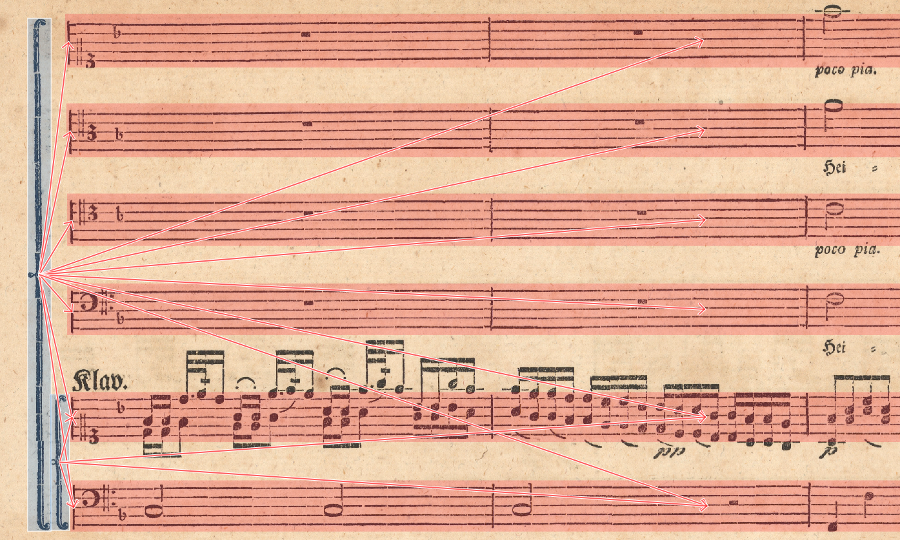

# Grammar

Grammar is an object that is able to parse grammar rules from files, check a given graph against these rules and output a list of errors along with fix suggestions.

All of the examples listed above are related closely to relations defined in MuNG, but the grammar works for any set of rules and a directed graph with vertex names.

## Alphabet and Rules

A grammar has an **Alphabet** and **Rules**. The alphabet is a list
of symbols that the grammar recognizes. Rules are constraints on
the structures that can be induced among these symbols.

There are two kinds of grammars according to what kinds of rules
they use: **dependency** rules, and **constituency** rules. We use
dependency grammars. Dependency grammar rules specify which symbols
are governing, and which symbols are governed:

    noteheadFull | stem

There can be multiple left-hand side and right-hand side symbols,
as a shortcut for a list of rules:

    noteheadFull | stem beam
    noteheadFull noteheadHalf | legerLine durationDot tie notehead*Small

The asterisk works as a wildcard. Currently, only one wildcard per symbol
is allowed:

    timeSignature | numeral*

Lines starting with a ``#`` are regarded as comments and ignored.
Empty lines are also ignored.

### Cardinality Rules 

We can also specify in the grammar the minimum and/or maximum number
of relationships, both inlinks and outlinks, that an object can form
with other objects of given types. For example:

* One *time signature* may have up to one *time signature divider*.
* We also allow *signatures* without any *dividers*.
* One *divider* has to be attached to a single *signature* only.
* *Signature* is a parent of *divider*.

This would be expressed as:

    timeSignature{,1} | timeSigDivider{1}

It is also possible to specify that regardless of where outlinks
lead, a symbol should always have at least some:

    timeSignature{1,} |
    repeat{2,} |

And analogously for inlinks:

    | letter*{1,}
    | numeral*{1,}
    | legerLine{1,}
    | noteheadFullSmall{1,}

### Tokenized Rules

Tokenized rules contain *token* on at least one side. Token is a keyword that groups together multiple symbols. This is an upgrade over the previous implementation of the grammar, in which defining a rule i.e. "Articulation should be a child of all noteheads that it affects" was not possible. We were able allow the existence of edges `noteheadFull -> articulation`, `noteheadHalf -> articulation`, ..., but introducing any cardinalities would lead to a much stricter rule that does not hold in general. In the end, we would have to settle for a rule `notehead* | articulation*` which allows the existence of articulations without any connection to a notehead.

Here, the predefined token `ANYOF` becomes useful as the grammar explicitly checks the aggregated cardinality of all the symbols enclosed by the token. We can define the wanted rule as:

    ANYOF(notehead*) | articulation*{1,}

- *Noteheads* can have multiple *articulations* and even none.
- *Articulation* has to have at least one *notehead* as its parent.

Another example:

    keySignature{1,} | ANYOF(accidental*)

- *Key signature* has to have at least one *accidental* as its child.
- *Accidental* can be connected to *key signature*.

Next predefined token is `EXACLTYONE` which allows the grammar to specify exclusive relations, i.e. "Accidental should always be a child of some notehead or (exclusive) a key signature":

    EXACTLYONE(notehead* keySignature) | accidental*{1}

## Grammar Violation Reporting

Any issues found within the graph are returned as `GrammarViolation`s, that contain all data relevant to the concrete rule violation - message to the user, affected edges, nodes etc.

Every `GrammarViolation` also contains a list of suggested corrections that should solve the issue in the simplest way, i.e. remove edge, add edge, etc. These can be applied to the graph.

## Validators Specific to MuNG

There are some rules that are relevant for MuNG but cannot be defined with the grammar specified above. These are relevant only for the MuNG format as they are implemented for the `NotationGraph` specifically, not for a general graph - list of edges and vertex names.

### Subset Validator

Single-stem noteheads that together form a chord should share beams, flags, tuples, slurs, etc.

For slurs especially, this holds only most of the time. For example, in this image, there are three slurs connecting three pairs of noteheads. Even though the noteheads form chords, there should be syntax links only between the pairs:

### Deprecation Validator

Some of class names, that were used in the past, were changed or redefined. `DeprecationValidator` warns the user of potential naming errors and tries to correct them based on a predefined mapping.

### Staff Grouping Subset Validator

This validator makes sure that if two staff groupings share a staff, the grouping also have an edge between them. This is important when there are nested groupings.

For every two staff groupings that are in a ancestor/descendant relation, it should hold that the grouping, higher in hierarchy, is a parent of all the staffs that are children of the grouping lower in hierarchy. If not, the validator creates a violation record.

Explained using the image below:

- The two groupings have an edge between them because they share some staffs.
- The larger grouping contains all staffs that the smaller grouping has, as it is higher in hierarchy.

