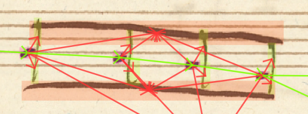
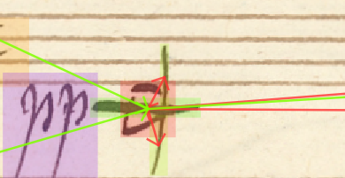
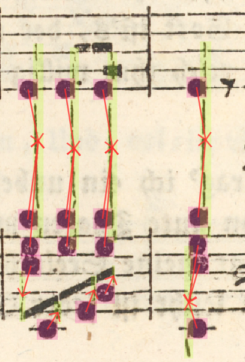
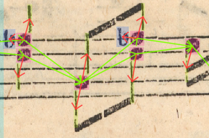
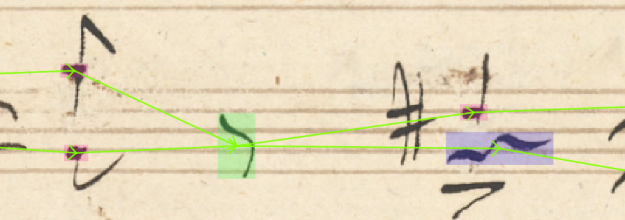
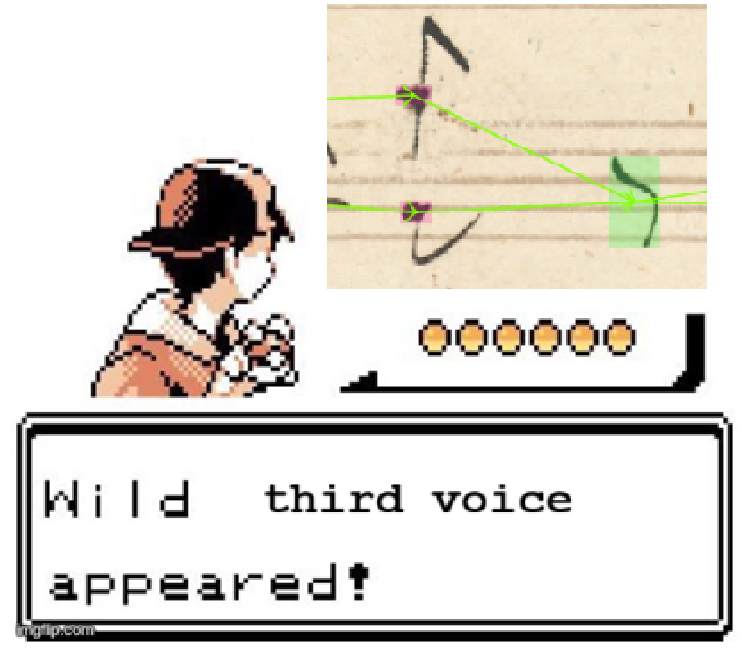
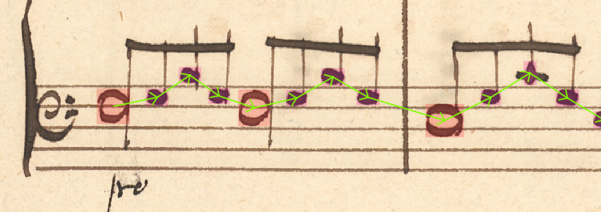
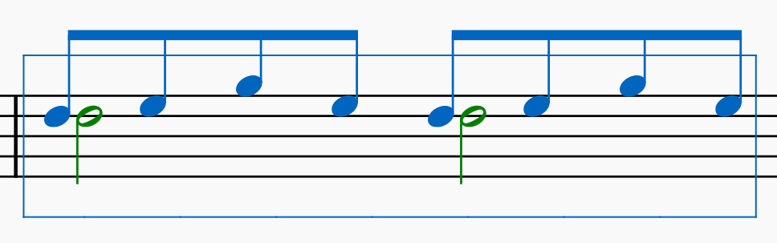

# Resolving multistem (double stemmed noteheads)

The current strategy is to split the notehead into two and reassign other notation to them based on its relative position. The notehead symbol, that is present in the graph before this preprocessing step, will be called *original*, and the other, copied, a *ghost*.

## Examples

## Complex cases

### Notes with different durations

A situation, in which the original and ghost end up having different durations is not uncommon.
In this example, there are actually three voices on the left, two 8th notes and one quarter note. There should be an edge between the double stemmed notehead and the quarter note on the right - if they were written as three separate notes.

This is an incorrect use of notation, the author took a shortcut and assumes that a voice suddenly appears and disappears with a single note.

The best (an easiest to implement) solution would be to not have any outgoing edges from the note with longer duration. Our duration inference engine can handle these cases.

### Different types of noteheads reduced to one

This is another example of what could be considered a bad practice. Once again, the author took a shortcut and created something we cannot be certain is intentional or merely an error that originated earlier in the pipeline.

There is no way of resolving this correctly into the two voices as such:

Again, in this case, the algorithm would leave the longer notehead without any precedence outlinks.

## Shared and divided symbols

There are multiple symbols that need to be reassigned to the correct notehead as they do not apply to both noteheads. By default, these are:

- flags,
- beams,
- single tremolos and tremolo beams.

Other symbols are shared between these two, by default:

- staffline, staffspace, staff,
- leger lines,
- accidentals.
