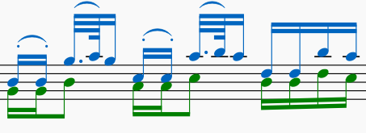
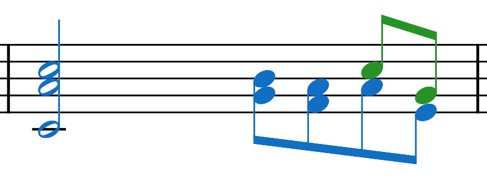
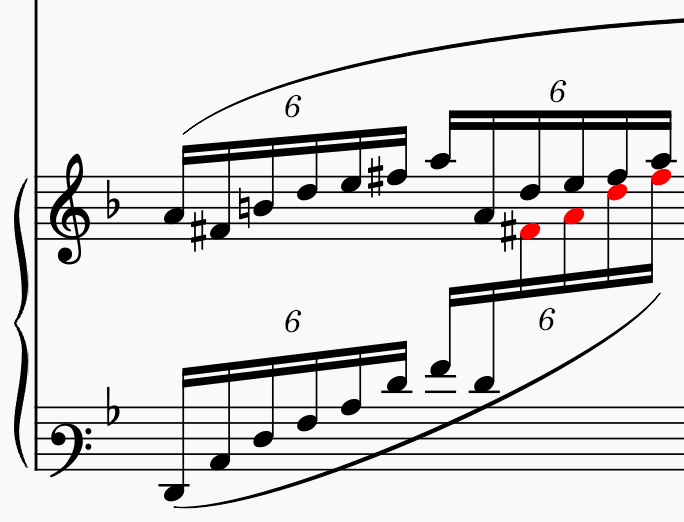
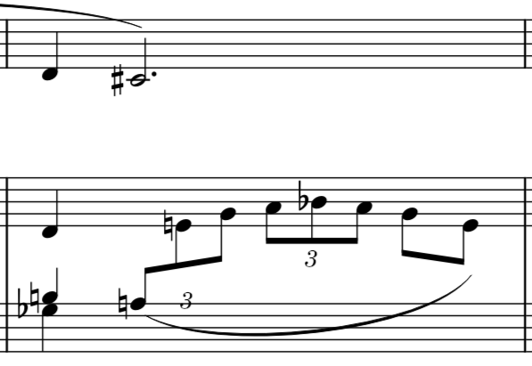
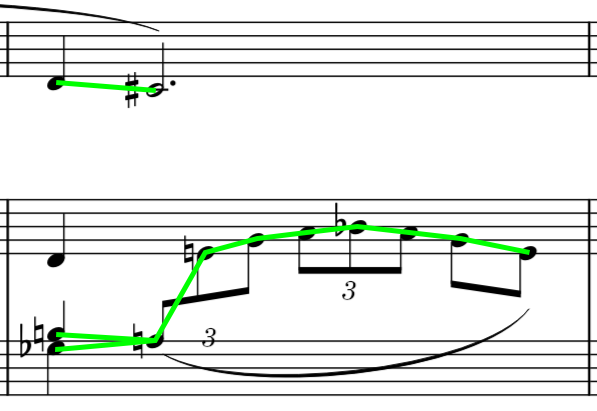
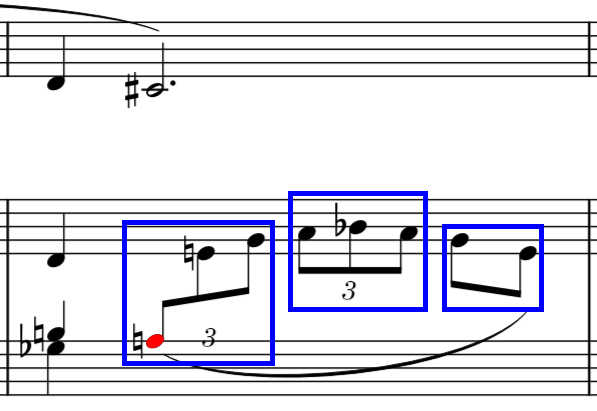
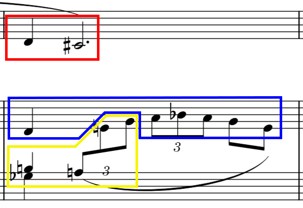
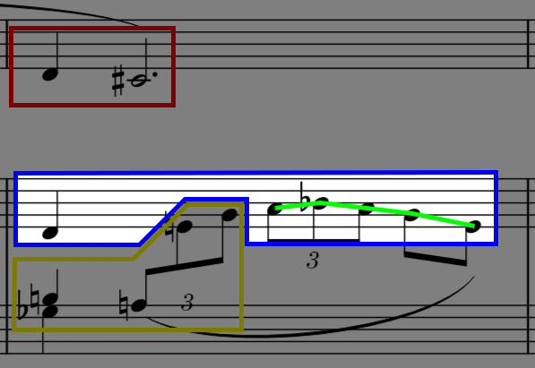
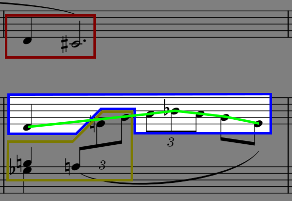
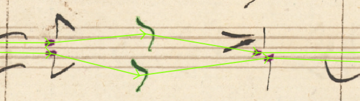

# Inferring Voices

> A voice is a sequence of musical events (e.g. notes, chords, rests) that proceeds linearly in time.
>
> -- <cite>[W3C, MusicXML 4.0](https://www.w3.org/2021/06/musicxml40/musicxml-reference/elements/voice/)</cite>

In MusicXML, each staff has a set of voices to use, for the sake of simplicity, we will use voice ids from `1` to `N`. Rests, notes and grace notes are the main objects that have a voice assigned.

An example of two voices playing at the same time on the same staff, first one is blue, second green:

<p>
  
</p>

This module is responsible for inferring voice ids for given preprocessed MuNGs.

## Conventions

We work in a scope of system measures.

1) Durables that share beam, chord, or tuple must be assigned to the same voice.
2) Durables on the same staff, that overlap, and do not belong to the same chord, must be assigned to different voices.
3) In grand staff, voices are notated using ids `1-4` for the top staff and `5-8` for the bottom staff. Single staff instruments have voices `1-4`.
4) Voice ids are sorted and assigned to durables based on the total time played (inside the measure) and the average pitch of notes assigned. (Voice with the lowest id takes up the most of the duration of a measure.)
5) The lower the voice id, the more important it is.

<details>
  <summary>🤔 Why special voice id notation for grand staff?</summary>
  
  MuseScore supports only four voices, the catch is that, under the hood, MuseScore actually uses eight voices - `1-4` and `5-8`. These ids are the actual output of MuseScore to MusicXML. Our engine <b>follows</b> these rules set.
</details>

<details>
  <summary>🤔 Why sort the voices by total duration of durables?</summary>
  
  Based on *Convention 4* and *5* we deduce that voices that play the most (take up the most of the time available inside the measure) are the most important. The most important voice is the one that plays throughout the whole measure - and it does not have to be the one with the highest mean pitch.

  Take this score as an example (blue voice `1`, green `2`). Would we be satisfied if the voice ids were turned around?

  <p>
    
  </p>
</details>

### One small complication - Cross staff objects

Sometimes, the author of a piano score wants to notate the left hand going up on the scale (or vice versa), so the notation for the left hand suddenly moves from the bottom staff to the upper staff. This can create cross staff notation - [MuseScore Docs](https://musescore.org/en/handbook/3/cross-staff-notation). Example:

<p>
  
</p>

The notes highlighted in red, belong to a tuple and to two shared beams (*Convention 1*). The earliest note in that tuple is assigned to voice `5` (first voice of a bottom staff inside a grand staff).

When inferring voices, we work at a level of measures (not system measures), here the measure in the first staff and second staff will be processed independently. It would be the best, if we would process these cross staff objects as one.

That's why we propose this solution:

### Assigning durables to measures

- The idea:
  - Assign durables to measures (defined by staffs inside the system measure) for voice inference based on their relation to a larger, possible cross staff object.

- The assignment algorithm:
  - Durable is assigned to measure:
    - Based on beam, tremolo, tuple, ...:
      - Topmost staff of a chord with the smallest onset.
    - Based on chord:
      - Topmost staff.

## Voice Engine Algorithm

The MuNG library provides algorithm to group durables into systems and to system measures. Let's go through a single example of a system measure consisting of one piano grand staff and one other single staff instrument on top:

<p>
  
</p>

Its MuNG precedence might looks something like this:

<p>
  
</p>

### 1) Grouping into subevents

All durables are grouped into subevents (chords that share stem, single rests). In this example, there are no chords, so all the noteheads are their own subevents.

### 2) Resolving cross staff objects

Second, assign staffs to cross staff objects (tuples, beams, tremolos). In our example, there are three, possibly cross staff, objects:

<p>
  
</p>

The first tuple from left is actually the only complex one. It is assigned to the bottom staff, as it is the staff of the note with the earliest onset inside the tuple (highlighted in red).

Now, the measure groups look like this:

<p>
  
</p>

### 3) Building the Voice Graph

Two subevents inside the voice graph, are linked together, if:
- They are connected by a precedence edge in the original graph.
- The child subevent has no precedence inlinks and the parent subevent is the closest one preceding it.

If following the first rule only, the voice graph for the blue measure would look like this:

<p>
  
</p>

As the voice assignment algorithm does not care about durables' onsets nor durations, this would appear to the algorithm as the two source notes playing at the same time. That's why the second step is essential:

<p>
  
</p>

<details>
  <summary>🤔 Why don't we fill in all possible edges inside the graph?</summary>

  Filling in all edges would result in the perfect graph for voice inference - the voice with the smallest id would always be on top, no weird voice switching (two voices crossing each other, voice going from under to above another voice), etc.
  
  While the benefits look great, this would greatly reduce the potential of the MuNG format, as it aims to keep the voices separated in the precedence graph. For example, in this example, the two voices are clearly separated even though there could be many more valid precedence links:
  
  <p>
    
  </p>

  Our algorithm tries to respect the voice arrangement given by the precedence edges as much as possible, but does not depend on it.
</details>

### 4) Finding groups of durables that must have same voice

We ensured that possible cross staff objects will be evaluated all in the same measure. Now, we need to ensure that durables belonging to these objects will have the same voice assigned. This is achieved with the `groups` parameter inside of the `assign_voices` algorithm. `groups` is a list of groups of subevents (chords, rests, ...) when a voice is assigned to a group member the same voice is immediately assigned to all other objects inside the group.

For this example, the groups make sure that durables belonging to the larger beam have different voices than durables belonging to the shorter beam. Otherwise the algorithm wouldn't have any clue that these need to arranged as such.

<p>
  
</p>

### 5) Actually inferring voices

First, we find the widest place in the graph, this is the place where all the voices are active (they are all played at that point in time). Based on priority (ascending based on `y` coordinate), we assign voices to subevents in this widest place. Then, using a priority queue, where the priority of a subevent is `(voice id, y coordinate)`, a greedy algorithm propagates the voices through the graph.

When a node is retrieved from the queue, the algorithm assigns voice ids to both, its children and its parents separately. Voices are assigned to all neighbors without a voice, starting from the bigger of two: max id assigned neighbors + 1 or voice id of the current node.

```
Input: nodes_in_widest_place, graph, groups

pq <- PriorityQueue

voice_id <- 1
for node in nodes_in_widest_place:
    node.voice <- voice_id
    pq.put(node, (node.voice_id, node.top))
    propagate node through groups
    voice_id <- voice_id + 1

while pq is not empty:
    current_node <- pq.pop()

    # process children
    voice_id <- max(current_node.voice, maximum voice id of children + 1)
    for child in current_node.children:
        if child not visited: # is missing voice
            child.voice <- voice_id
            voice_id <- voice_id + 1
            pq.put(child, (child.voice, child.top))
            propagate node through groups
    
    # same for parents
    ...
```

To make sure that the algorithm propagates voices through all the nodes a `__START__` node is added, it is a parent of all notes that would be otherwise sources.

### 6) Sorting voices

This algorithm so far only gives the best guesses for voices, they need to be further ordered (*Convention 4*). We sort the voices by the total duration and mean pitch of durables they contain.

Mean pitch is calculated as mean MIDI note number. Mean pitch of a voice without any notes (symbols with pitch) is set to `-1`.