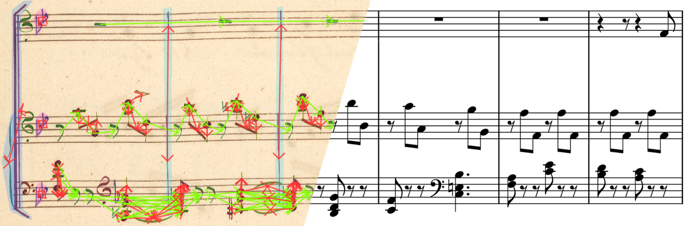
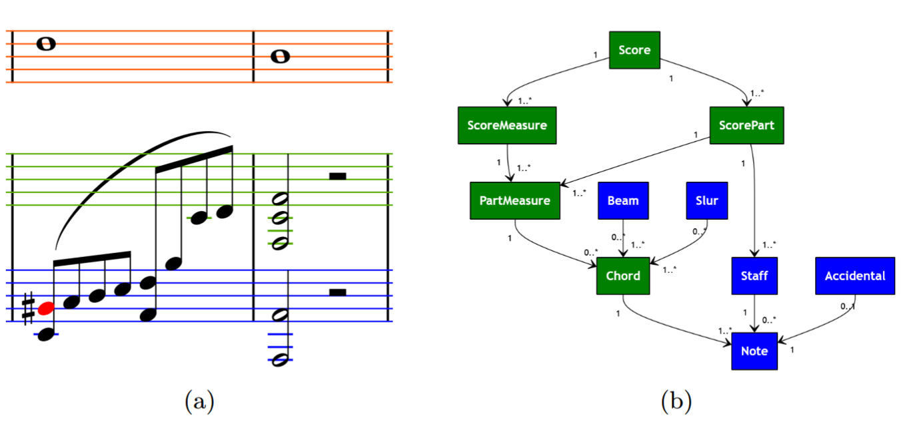

# ScoreGraph

ScoreGraph is a graph representation of music notation heavily inspigreen by the [MusicXML 4.0 standard](https://www.w3.org/2021/06/musicxml40/). ScoreGraph is a cluster of dataclass instances that are interlinked. The architecture is derived from [Smashcima](https://github.com/OMR-Research/Smashcima).

Abstract classes for loaders and exporters are provided. Once the graph is loaded it can be exported to any format for which the exported is implemented.

## Architecture

ScoreGraph is a densely interlinked graph of typed Python classes that correspond almost one to one to their MusicXML equivalents. Every edge between two instances in the graph can be used in both directions, making it possible to get reference to an object through any other object if there exists an undirected path between them.

`Score` holds all `ScoreParts` (instruments) and `ScoreMeasures` (measures from all the instruments that start at the same onset). `ScorePart` holds `PartMeasures` (individual measures of that instrument) inside these, all the in-measure symbols are held in a list and sorted by onset - chords, rests, repeats, clefs, time signatures. Clefs and time signatures have onset because they can appear inside the measure between other durables. We define a new object `Subevent`, it is a chord, rest or repeat symbol (durables).

Than there are multiple objects that connect to one or more `Subevent` - beams, tuplets, slurs, accidentals, dynamics, tremolos. All the implemented classes are located at [graph](./graph), there is also a list of [all the supported classes from the MuNG format](./docs/supported-mung-classes.md).

More on the philosophy and design of its inner workings can be found in [Smashcima documentation](https://github.com/OMR-Research/Smashcima/blob/main/docs/scene-objects.md).

### Architecture example

  

Example of a possible score **(a)** consisting of two instruments: a single-staff instrument shown in red, and a grand staff represented by the green and blue staves. The note highlighted in red belongs both to a chord and to the blue staff. Connections of a notehead highlighted in red to other ScoreGraph classes are illustrated in graph **(b)**. ScoreGraph objects directly constructed from MuNG objects are highlighted in blue and the abstract classes introduced in our ScoreGraph implementation are highlighted in green. Voice is a sequence of musical events that proceeds linearly in time, each ScorePart defines its own Voice objects.

A `Chord` is defined as the union of all notes sharing the same stem. A `ScorePart` is a unique object representing a single instrument and contains all of its staffs and measures (`PartMeasures`). A `ScoreMeasure` groups all `PartMeasures` across instruments that occur simultaneously in time. The `Score` object forms the root of the ScoreGraph hierarchy.

## Limitations of MuNG to MusicXML conversion

These documents cover potential issues that the user might run into while using our convertor and MuseScore:

- [MuseScore Limitations](docs/musescore-limitations.md)
- [MusicXML Exporter Limitations](docs/musicxml-exporter-limitations.md)
- [MusicXML Limitations](docs/musicxml-limitations.md)

## Design principles

- Object names and their design should be defined with respect to their MusicXML 4.0 equivalent.
- ScoreGraph construction and its export should be two separate procedures.
- During ScoreGraph construction, decisions should not be made based on the output format.
- Implementation of MusicXML exporter should follow conventions set by MuseScore Studio 4 (MSS4) as our main goal is to make the documents readable and editable in this software.
- Any discrepancy found withing the graph while loading and exporting should be logged for the user to see.
