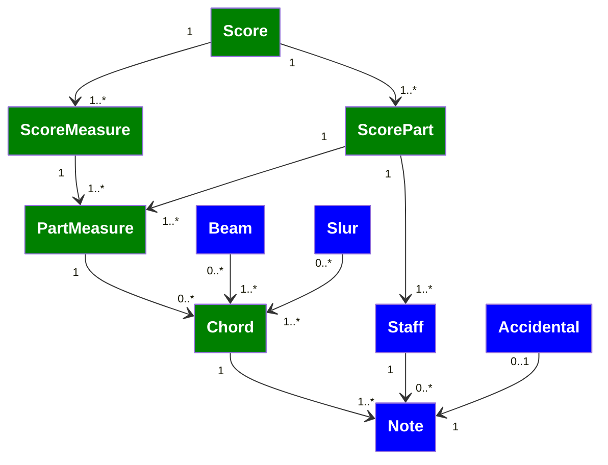

```mermaid
---
  config:
    class:
      hideEmptyMembersBox: true
---
classDiagram
    class Score
    class ScoreMeasure
    class ScorePart
    class PartMeasure
    class Staff
    class Chord
    class Note
    class Beam
    class Accidental
    class Slur

    Score "1" --> "1..*" ScorePart
    Score "1" --> "1..*" ScoreMeasure
    ScoreMeasure "1" --> "1..*" PartMeasure
    ScorePart "1" --> "1..*" PartMeasure
    ScorePart "1" --> "1..*" Staff
    PartMeasure "1" --> "0..*" Chord
    Chord "1" --> "1..*" Note
    Staff "1" --> "0..*" Note
    Accidental "0..1" --> "1" Note
    Beam "0..*" --> "1..*" Chord
    Slur "0..*" --> "1..*" Chord

    style Score fill:green,color:white
    style ScoreMeasure fill:green,color:white
    style ScorePart fill:green,color:white
    style PartMeasure fill:green,color:white
    style Staff fill:blue,color:white
    style Chord fill:green,color:white
    style Note fill:blue,color:white
    style Beam fill:blue,color:white
    style Accidental fill:blue,color:white
    style Slur fill:blue,color:white
```