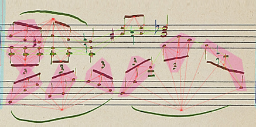
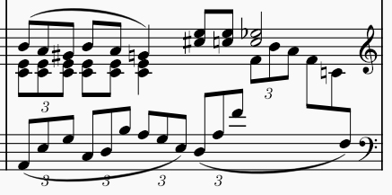
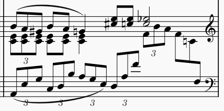
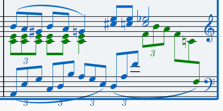
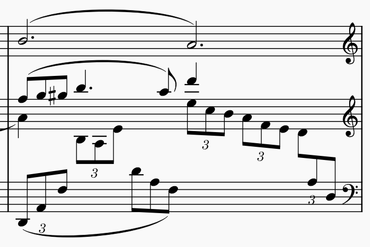
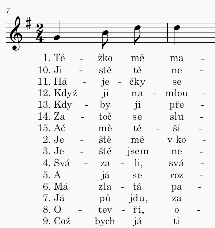
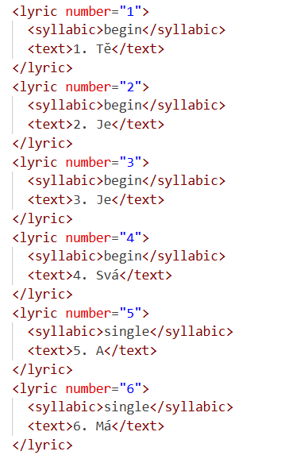
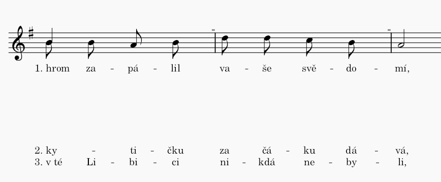
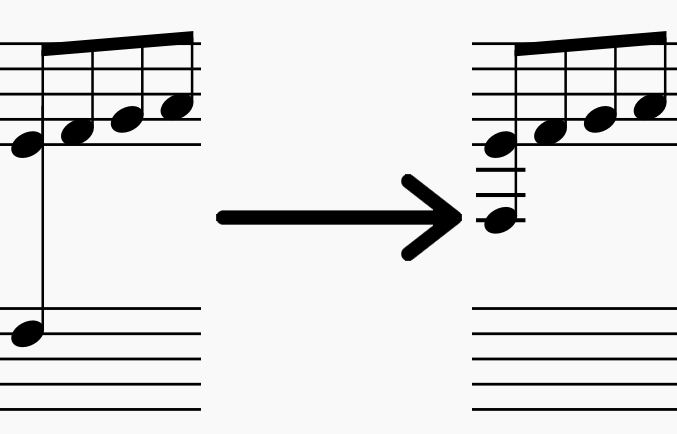
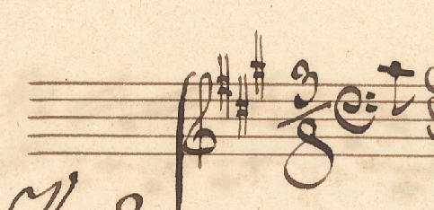

## MuseScore Studio Limitations

End users may want to preview exported documents in a MusicXML 4.0 editor. One of the most widely used options is MuseScore, its latest version MuseScore Studio 4 (MSS4).

While MSS4 is a powerful and capable tool, it does not support the full range of constructs available in MusicXML. Some of these gaps can be worked around using various tricks or hacks. However, we have chosen not to rely on such approaches. Instead, we follow the MusicXML standard as close as possible, with the expectation that these limitations will be fixed in future MuseScore releases.

This documents lists found issues with an assumption of their severity:

- :eyes: - only visual
- :boom: - breaking
- :question: - to be determined

These issues are the reason why standardizing score with MSS4 should be done with caution.

### Slurs disappear in complex situations (:eyes:)

Slurs (and other large objects linking multiple durables) will not be displayed in some edge cases. Mainly when the end durable appears before the start durable in the input MusicXML. This happens when durables have different voices and are at different staffs.

For example, the slur on the bottom right (1) can be added in MSS4 (2) but when the file is saved as MusicXML and reloaded, the slur disappears (3), even though it is notated in the exported file. The issue lies (or rather seems to lie) in the order of its start and stop durable (4). End durable is outputted before the start durable, the second voice (green) of the first staff is written to the file **before** the first voice (blue) of the second staff.

Output from out convertor contains these slurs, but MSS4 is unable to render them.

### Notes with different durations in a chord (:boom:)

MusicXML chord definition can be interpreted as *notes with the same onset connected to one stem (if they have any)*. This means that notes in a chord can differ in duration.

In most cases `<duration>`s of notes in a chord are the same. However it can be shorter in situations such as multiple stops for string instruments. Here is an example from Mozart's Concerto No. 3 for Violin, K. 216:

  

If we were to open MusicXML denoting this score in MSS4, it would break. All notes in the chord will inherit duration of the first written note (the longest one). This does not break the score completely, as the chord still takes up the same amount of time, only the short notes are now longer. When exported from MSS4, it does not match the content of the input file.

(In MSS4, this issue is solved by using different voice for each duration and making it seem like the affected notes share a stem.)

### Extra clefs at the end of a system (:eyes:)

By default, we output all clefs that are in the score. For every clef at the start of a system, there is a clef object in the MusicXML output. MSS4 renders them with cautionary clefs at the end of the preceding system, these are only visual and not present in the source MusicXML.

### Misaligned lyrics (:eyes:, potentially :boom:)

MSS4 has a problem with exporting and importing lyrics to and from MusicXML. Their vertical order is set by `number`:

> Specifies the lyric line when multiple lines are present. (via [docs](https://www.w3.org/2021/06/musicxml40/musicxml-reference/elements/lyric/))

MSS4 does not respect this ordering and creates a seemingly random one. Even exporting and importing the same file multiple times does not end at a stable state in which the ordering would match that in the MusicXML file.

Above-mentioned line shuffling causes huge white spaces to appear, as shown in the example below:

Is breaking, if MSS4 is used for MusicXML normalization.

This issues was reporter in MS 3.5, [issue](https://musescore.org/en/node/309953).

### Lyrics `<extend>` not showing (:eyes:, potentially :boom:)

The extend element creates a line after a lyric that can extend further than simple textual `_`. It can be used in two ways: simple extend defined inside one durable or one that spans multiple durables (with `start` and `stop` elements). The example below shows extend that starts at the first note and stops at the second one.

  

MSS4 sometimes does not show nor save simple extends that start and stop at the same durable.

Is breaking, if MSS4 is used for MusicXML normalization.

### Multi-staff chords (:eyes:, potentially :boom:)

Chords that span over two staffs can be defined in MusicXML. MSS4 renders them as if all belong to the first staff. Their pitch is kept.

There exists a [trick](https://musescore.org/en/node/8717) to achieve this to render properly in MSS4.

Is breaking, if MSS4 is used for MusicXML normalization.

### Immediate Clefs (:eyes:, potentially :boom:)

MSS displays only the last clef defined in attributes. Displaying score in the example below (G clef and than F clef) is therefore not possible:

The symbol disappears from the file, if MSS4 is used for MusicXML normalization. But we would not call this *breaking*.
