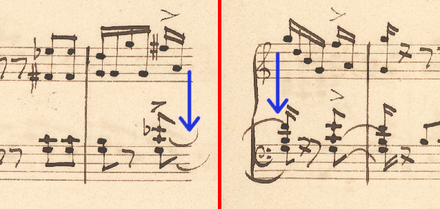

# Limitations of our MusicXML exporter

### Double-stemmed noteheads and repeated symbols

When a double-stemmed notehead has an accidental attached to it (and other symbols that are linked to a notehead: fermata, articulations, ...), we link the accidental to **both** of the notes (after their resolution into two separate notes).

This creates a situation when one of these accidentals should probably be marked either as `cautionary` or hidden, as the second accidental is already activate. [Accidental docs](https://www.w3.org/2021/06/musicxml40/musicxml-reference/elements/accidental/). The implemented export engine **does not** check for repeating or overlapping accidentals, it does not use the `cautionary` tag.

Same for fermatas, there will be two of them, overlapping. MSS4 handles this just fine.

### Slurs and ties between two systems

Slurs and ties can connect noteheads that are located in two different systems (start is on another "line" than end). In [MuNG annotation instructions](https://github.com/OmniOMR/mung/blob/main/docs/annotation-instructions/annotation-instructions.md#slur) it is explicitly stated, that the slur should be linked only to noteheads located in the same system.

In the example below there are two slurs/ties at the bottom staff, system boundaries are visualized by the red line. Let's focus on the slurs highlighted by blue arrows.

In MuNG and the ScoreGraph, these are two separate objects, each linked to only one notehead. They will be processed without any special treatment. In MSS4 (and MusicXML) this would be a single object that starts at the left notehead and ends at the right notehead, its separation into "two" slurs is just visual.

Further info on how these special cases of slurs are processed can be found in [MusicXML Limitations](./musicxml-limitations.md).

