# Limitations of our MusicXML exporter

### Double-stemmed noteheads and repeated symbols

When a double-stemmed notehead has an accidental attached to it (and other symbols that are linked to a notehead: fermata, articulations, ...), we link the accidental to **both** of the notes (after their resolution into two separate notes).

This creates a situation when one of these accidentals should probably be marked either as `cautionary` or hidden, as the second accidental is already activate. [Accidental docs](https://www.w3.org/2021/06/musicxml40/musicxml-reference/elements/accidental/). The implemented export engine **does not** check for repeating or overlapping accidentals, it does not use the `cautionary` tag.

Same for fermatas, there will be two of them, overlapping. MSS4 handles this just fine.

### Slurs and ties between two systems

Slurs and ties can connect noteheads that are located in two different systems (start is on another "line" than end). In [MuNG annotation instructions](https://github.com/OmniOMR/mung/blob/main/docs/annotation-instructions/annotation-instructions.md#slur) it is explicitly stated, that the slur should be linked only to noteheads located in the same system.

In the example below there are two slurs/ties at the bottom staff, system boundaries are visualized by the red line. Let's focus on the slurs highlighted by blue arrows.

In MuNG and the ScoreGraph, these are two separate objects, each linked to only one notehead. They will be processed without any special treatment. In MSS4 (and MusicXML) this would be a single object that starts at the left notehead and ends at the right notehead, its separation into "two" slurs is just visual.

Further info on how these special cases of slurs are processed can be found in [MusicXML Limitations](./musicxml-limitations.md).

### Complex repeats: slash repeat, repeat one beat, repeat phrase

There are multiple repeat types that can appear as symbols in measure. MuNG only defines one - `repeat1Bar` ([Annotation Instructions, Feb 6 2026](https://github.com/OmniOMR/mung/blob/7bddc87d61e19b62ac46834a66c88239dbfebdc5/docs/annotation-instructions/annotation-instructions.md#slur)).

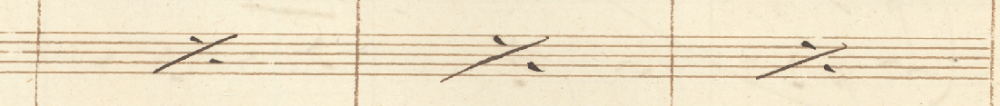

But, they can be used to repeat only a part of a measure:

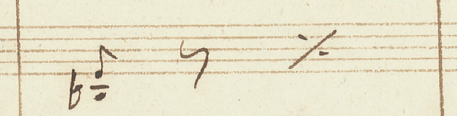

This is problematic, as our underlying engine thinks that this symbol should take up the whole measure. And MusicXML symbol equivalent to `repeat1Bar` is not actually a symbol but an attribute of the measure object.

If `repeat1Bar` symbol appears in a measure, and it is not there alone (some other durables are present), we ignore it and replace it with a `forward` element (equivalent to a hidden rest). Render of MusicXML with ignored `repeat1Bar` from the example above:

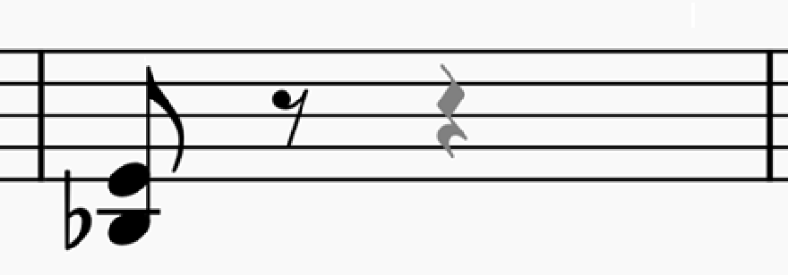

Slashes and other types are ignored as they are not defined by MuNG.

### Complex tuplets

Our exporter is unable to process complex tuplets where there are multiple voices inside a single tuplet. This is problem not only for duration inference but also for voice inference. 

For example, the tuplet highlighted in red contains three voices

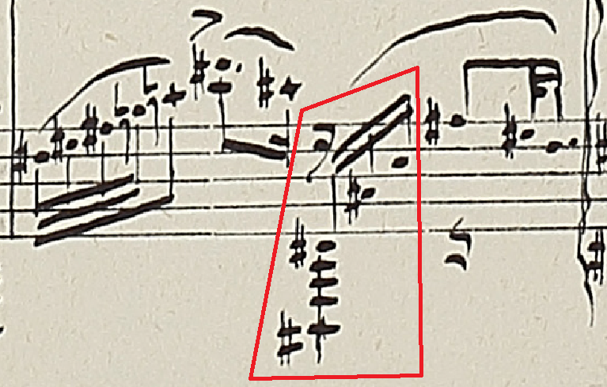

This is an interpretation of the score above with highlighted voices (one of many possible):

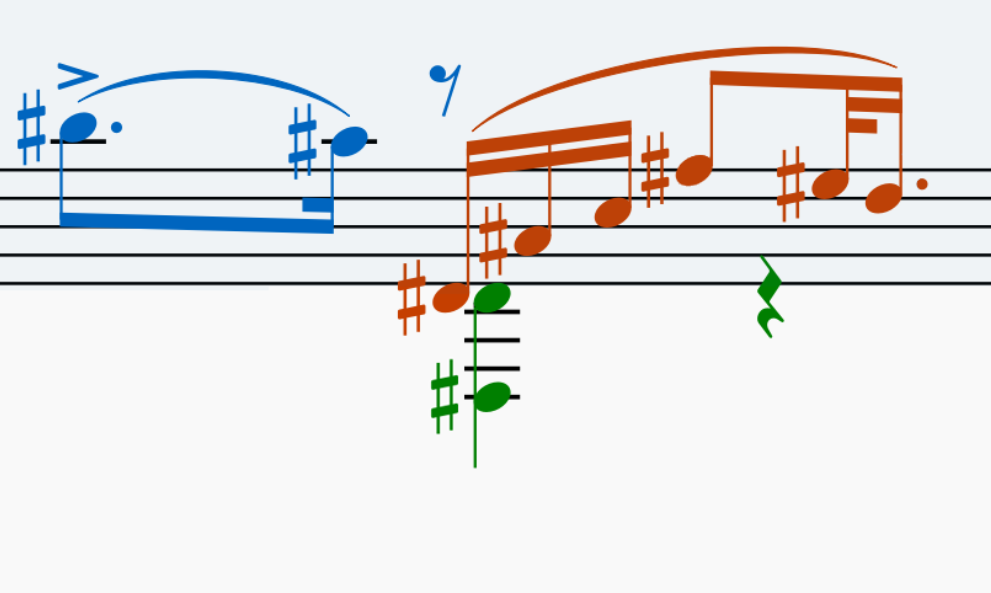

The library is not able to process these cases correctly until there are updates made to all the the other preprocessing engines.

### Empty measures, ends of systems

Empty measures are outputted as standard MusicXML measure with a `forward` element that fills the whole measure. Ends of staff may contain cautionary symbols (clefs, keys) outside of a proper measure or may not be closed with a proper barline.

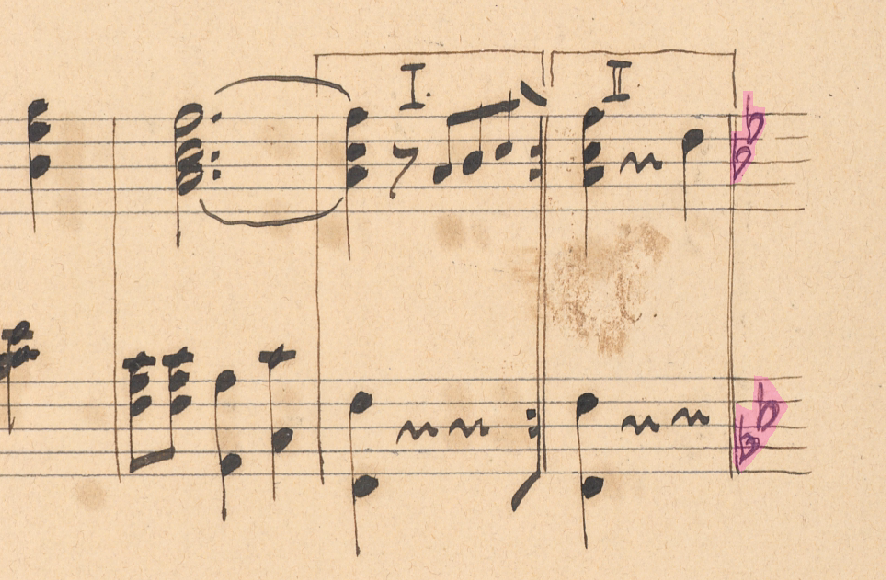

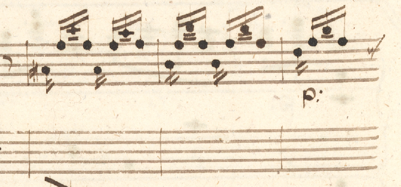

Algorithm, that separates the MuNG score into measures, considers both of these valid measures and creates and outputs them as such. Further down the conversion pipeline, we won't be able to match the right side of that measure to any measure separator so the barline will be hidden.

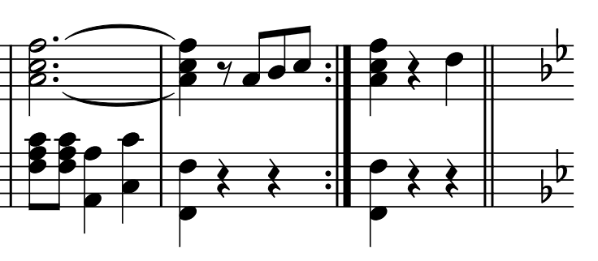

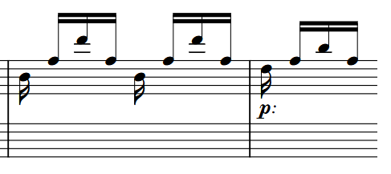

### Multi-Measure Rests Not Supported

In MusicXML, a multi-measure rest spans several measures but is rendered visually as a single measure. Supporting this construct would require recomputing measure IDs, which would then no longer align with those in the source score. For this reason, multi-measure rests are not and will not be supported.

The `restText` element is supported through its own dedicated class. Any measure containing a multi-measure rest is resolved into a single measure holding one full-measure rest:

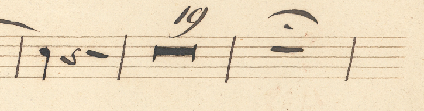

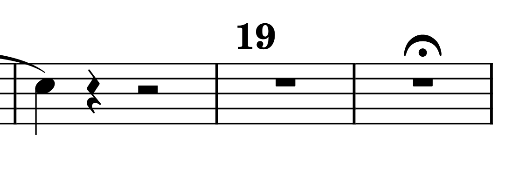

In practice, this decision has small impact: across a sample of approximately 300 scores, we encountered only 27 multi-measure rests spread across eight documents, compared to roughly 7,800 measures that contain no multi-measure rests.
