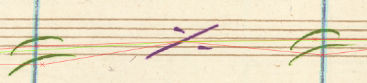
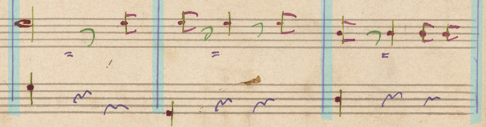
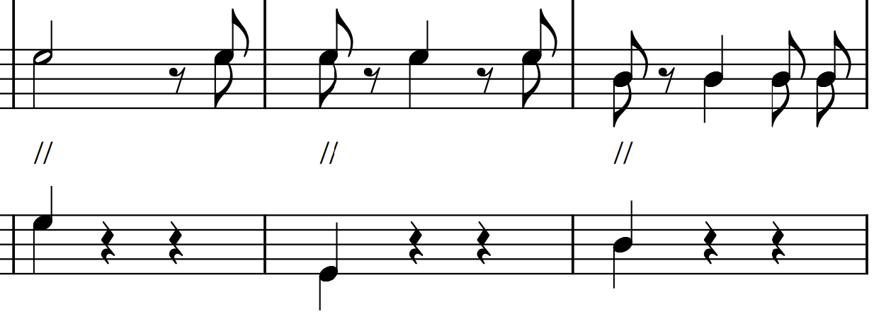

## MusicXML 4.0 Limitations

This documents limitations of the MusicXML 4.0 standard:

### Slurs cannot be linked to repeat symbols

Cannot link slurs (and other similar objects) to repeats. Slur are a notation attribute of a note. Repeat one bar is an attribute of the whole measure. Documentation: [Slurs](https://www.w3.org/2021/06/musicxml40/musicxml-reference/elements/slur/), [Measure repeat](https://www.w3.org/2021/06/musicxml40/musicxml-reference/elements/measure-repeat/).

### Slurs and ties and missing start/end durables

Slurs must have start and end, so hanging slurs at the end of a staff or at the start are not possible. Same goes for ties, with one exception: `let-ring` type allows for ties that start at a durable and end right behind it without the need for an end durable.

In the example below, the second tie uses `let-ring`:

  

### Lyrics Unisono

Lyric unisono is not part of SMuFL, character does not exist for it so we are not able to display it properly. 

We use `//` instead inside a standard MusicXML lyric object.

  

  

### Barline Final

MusicXML contains no such object. We resolve it into barline with style `heavy-heavy`.

  

