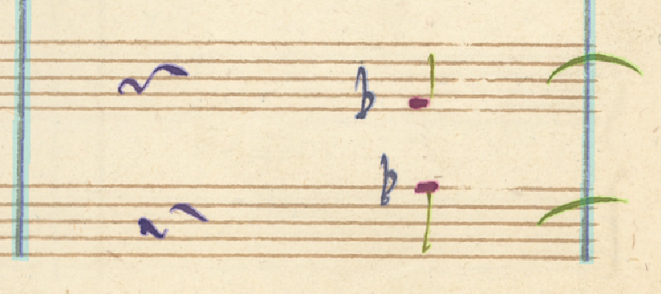
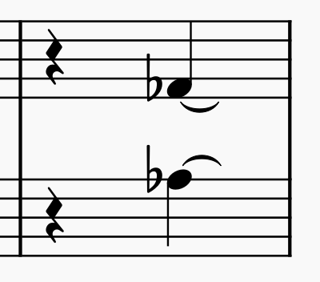
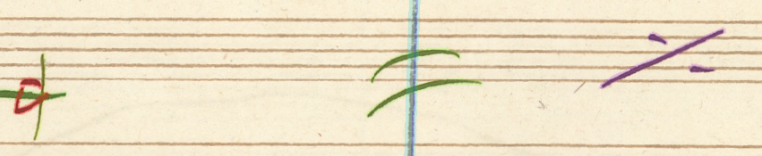
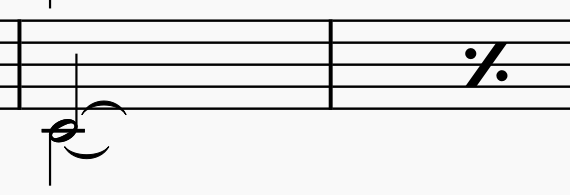
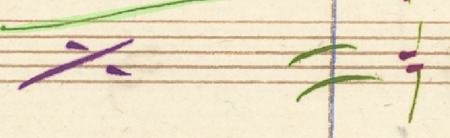
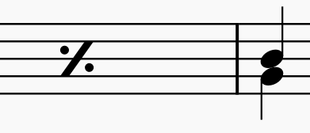
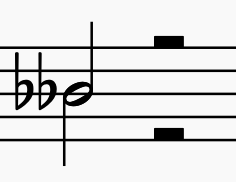

## MusicXML specifics

- Cannot link slurs (and other spanners) to repeats - slur is child of notations (child of note). Repeat one bar is outputted as a measure repeats (child of measure style child of attributes child of measure)

    - [Slurs](https://www.w3.org/2021/06/musicxml40/musicxml-reference/elements/slur/)
    - [Measure repeat](https://www.w3.org/2021/06/musicxml40/musicxml-reference/elements/measure-repeat/)

- Unable to create single subevent slurs (going only from one durable):
    - When the repeat symbol should be the stop of that durable, the slur can be outputted as a let-ring tie (tie starting from a durable )

- Unfortunately we were not able to find any workaround for situations like this:

### Complex symbols

When the double stemmed notehead has an accidental attached to it, should we link it to both original and ghost? How do MusicXML and MuseScore handle it?

There is a way in MuseScore `3.6.2` to show two accidentals before a double stemmed note, this is most probably a bug, as reloading the file results in only one of the accidentals being displayed. Note that this is not flat-flat (double flat).

MuseScore saves the second accidental with tags `cautionary="yes" parenthesis="yes"` which hides it. After testing, it turns out that adding the accidental element without any tags, as if these were two totally unrelated notes, suffices.