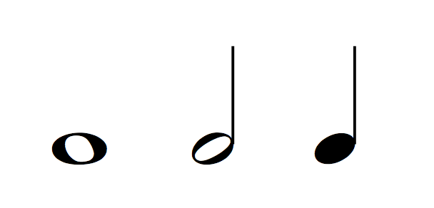
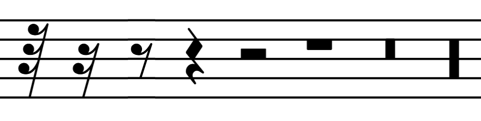
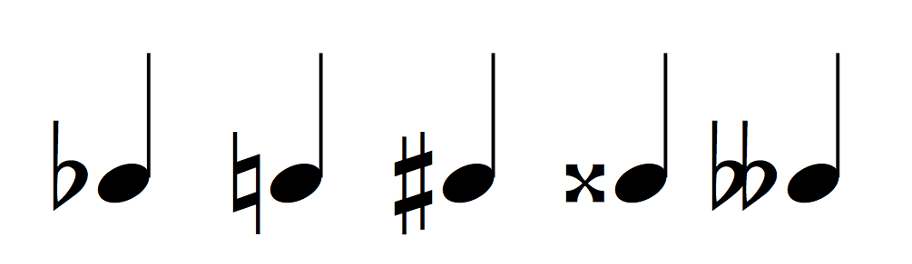
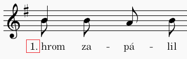

# Supported MuNG Classes

> **Last revision: March 7nd 2026**

> **Based on Annotation instructions from: [Feb 6th 2026](https://github.com/OmniOMR/mung/blob/7bddc87d61e19b62ac46834a66c88239dbfebdc5/docs/annotation-instructions/annotation-instructions.md)**

This document goes over classes from MuNG that are are implemented in ScoreGraph, the list is based on [Annotation Instructions](https://github.com/OmniOMR/mung/blob/main/docs/annotation-instructions/annotation-instructions.md). For potential limitations of **implemented** classes see [Exporter Limitations](./musicxml-exporter-limitations.md) and [MusicXML Limitations](./musicxml-limitations.md).

There are four levels of implementation:

- ✅ Implemented explicitly, an object in ScoreGraph.
- ☑️ Implemented as part of another object.
- 🚧 Partially implemented.
- ❌ Not implemented.

## Staves

- ☑️ `staffLine` - used to determine pitch.
- ☑️ `staffSpace` - used to determine pitch.
- ✅ `staff`

## Noteheads

- ✅ `noteheadWhole`
- ✅ `noteheadHalf`
- ✅ `noteheadBlack`

  

## Grace Noteheads

Grace noteheads are partially implemented but, in this version, they cannot form chords. Slurs and ties that include grace notes are not supported.

- 🚧 `noteheadBlackSmall`
- 🚧 `noteheadWholeSmall`
- 🚧 `noteheadHalfSmall`
- ❌ `graceNoteSlashStemUp`
- ❌ `graceNoteSlashStemDown`

  

## Noteheads attachments

- ✅ `augmentationDot`

  

- ☑️ `stem` - property of a notehead.

  
  

- ☑️ `flag(number)th(Up/Down)` - used to determine duration.

  

- ✅ `beam`

  

- ☑️ `legerLine` - used to determine pitch.

  

- ✅ `slur`

  

- ✅ `tie`

  

## Rests

- ✅ `rest32nd`
- ✅ `rest16th`
- ✅ `rest8th`
- ✅ `restQuarter`
- ✅ `restHalf`
- ✅ `restWhole`
- ✅ `restLonga`
- ✅ `restDoubleWhole`

  

- 🚧 `restHBar`
- ❌ `restText`

## Accidentals

Accidentals are implemented via `Pitch` and its property `Alter` and also as a separate object `Accidental`.

- ✅ `accidentalFlat`
- ✅ `accidentalNatural`
- ✅ `accidentalSharp`
- ✅ `accidentalDoubleSharp`
- ✅ `accidentalDoubleFlat`

  

## Clefs

ScoreGraph makes no difference between clefs at the starf of a system (`{g,f,c}Clef`) and other clefs (`{g,f,c}ClefChange`).

- ✅ `gClef`
- ✅ `gClefChange`

  

- ✅ `fClef`
- ✅ `fClefChange`

  

- ✅ `cClef`
- ✅ `cClefChange`

  

## Key signature

- ✅ `keySignature`

  

## Time Signatures

- ✅ `timeSignature`

  

- ✅ `timeSig[0..9]`
- ✅ `timeSigCommon`

  

- ✅ `mensuralProlationCombiningDot`

  

- ✅ `timeSigCutCommon`

  

- ✅ `timeSigSlash`

  

- ✅ `timeSigFractionalSlash`

  

- ❌ `timeSigPlus`

  

- ❌ `timeSigEquals`

  

## Lyrics

- ✅ `lyricsText`

  

- ✅ `verseNumber`

  

- ✅ `lyricsUnisono` - for more info see [MusicXML Limitations](./musicxml-limitations.md#lyrics-unisono).

  

## Tempo

- ✅ `tempoText`

  

- ✅ `tempoRitardando`

  

- ❌ `tempoRitardandoSpanner`
- ✅ `tempoAccelerando`

  

- ❌ `tempoAccelerandoSpanner`
- ✅ `tempoATempo`

  

## Text

- ✅ `interpretationText`
- ❌ `metadataText`
- ❌ `measureNumber`

  

- ❌ `pageNumber`
- ❌ `otherText`

## Barlines

- ✅ `barlineSingle`.

  

- ✅ `barlineHeavy`.

  

- ✅ `barlineFinal` - resolved into barline `heavy-heavy`, for more info see [MusicXML Limitations](./musicxml-limitations.md#barline-final)

 
  

- ☑️ `barlineWing` - property of a repeat barline.

 
  

- ☑️ `measureSeparator` - separator contains individual barlines that are resolved into `BarStyle` (`regular`, `light-heavy`, ...).

## Staff Brackets and Dividers

`brace` and `bracket` are properties of instrument groupings. `staffGrouping` is used to determine systems, instrument groups and grand staffs.

- ✅ `brace`

 
  

- ✅ `bracket`

 
  

- ☑️ `staffGrouping`
- ❌ `systemDivider`

  

## Articulation

- ✅ `articAccentAbove`
- ✅ `articAccentBelow`

  

- ✅ `articStaccatoAbove`
- ✅ `articStaccatoBelow`

  

- ✅ `articTenutoAbove`
- ✅ `articTenutoBelow`

  

- ✅ `articStaccatissimoAbove`
- ✅ `articStaccatissimoBelow`

  

- ✅ `articMarcatoAbove`
- ✅ `articMarcatoBelow`

  

## Dynamics

- ✅ `dynamicsText`
- ✅ `dynamicPiano`

  

- ✅ `dynamicMezzo`

  

- ✅ `dynamicForte`

  

- ✅ `dynamicRinforzando`

  

- ✅ `dynamicSforzando`

  

- ✅ `dynamicZ`

  

- ✅ `dynamicNiente`

  

- ✅ `dynamicDiminuendo`

  

- ✅ `dynamicCrescendo`

  

- ✅ `dynamicCrescendoHairpin`
- ✅ `dynamicDiminuendoHairpin`

  

- ❌ `dynamicNienteForHairpin`

  

## Repeats

Repeats are supported, but, some the possible bar styles are not supported by MSS4. We default to using those compatible with MSS4. For more info see [MuseScore Limitations](./musescore-limitations.md#unable-to-display-other-than-light-heavy-repeats---potentially-). MSS4 cannot import repeats that are located in the middle of a measure, see [MuseScore Limitation](./musescore-limitations.md#repeat-in-the-middle-of-a-measure-).

- ✅ `repeatLeft`
- ✅ `repeatRight`

  

- ☑️ `repeatDot` - there is not way in MusicXML to specify number of dots for a repeat, it is part of the repeat objects.

  

- ❌ `volta`

  

- ❌ `voltaText`

  

- ❌ `segno`

  

- ❌ `coda`

  

- ❌ `segnoSerpent`

  

- ❌ `repeatText`
- 🚧 `repeat1Bar` - for more info see [Exporter Limitations](./musicxml-exporter-limitations.md).

  

## Unisono

- ❌ `unisonoText`
- ❌ `unisonoContinuation`

## Tuplets

- ✅ `tuplet` - for more info see [Exporter Limitations](./musicxml-exporter-limitations.md).

  

- ☑️ `tuplet[0..9]` - used to determine tuplet effect on linked durables.
- ☑️ `tupletBracket` - property of tuplet.
- ❌ `tupletColon`

## Tremolo

- ✅ `tremolo[1..5]`

  

- ✅ `tremoloBeam`

  

## Fermata

- ✅ `fermataAbove`
- ✅ `fermataBelow`

  

## Ornaments

- ❌ `ornamentTrill`
- ❌ `wiggleTrill`

  

- ❌ `ornamentTurn`

  

- ❌ `ornamentTurnInverted`

  

- ❌ `ornamentShortTrill`

  

- ❌ `custos`

  

## Unclassified

- ❌ `unclassified`
- ❌ `UFO`
