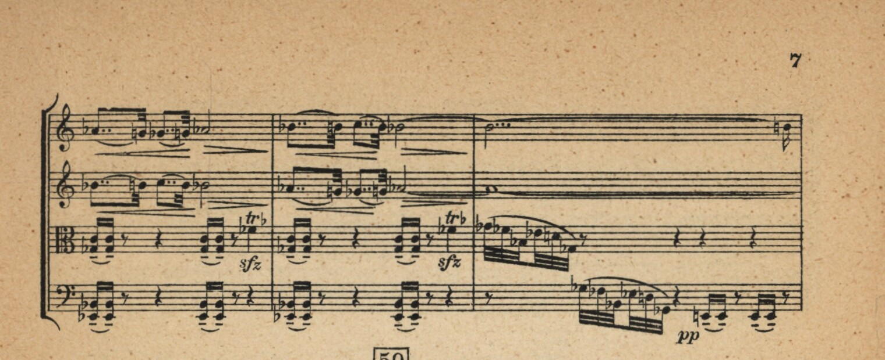
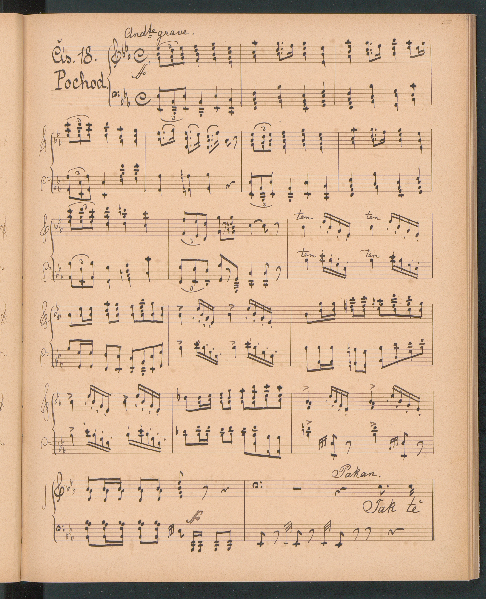
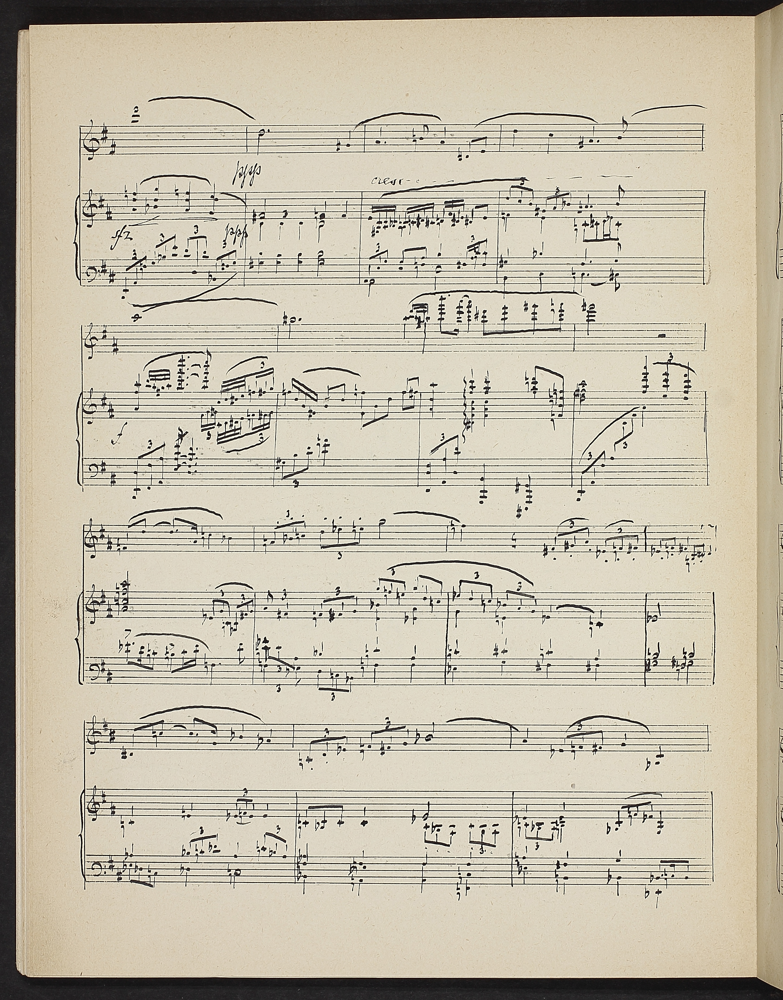

# Assets

Directory containing real-life examples of scores annotated in MuNG used for library tests. These examples can contain only a part of the MuNG, usually a single system.

## Examples

### Example 0

- ``30d6c780-c8fe-11e7-9c14-005056827e51_36058ae0-f593-11e7-b30f-5ef3fc9ae867``
- cropped

### Example 1

- ``5895c292-1b64-41d6-acdf-c2cc77c18f71_5fbc84f2-6a4b-4f2c-b6fc-2403453c1e3d``

### Example 2

- ``48788ad8-de8b-4d01-ace1-4adffc7ed0ad_ea864792-7020-47e7-bb7b-3a48477202cf``

### Example 3

- ``13abc7f9-5e3f-4e85-b753-0dab090728fe_9d4412a1-0cf3-4475-a022-9f37984272fb``

